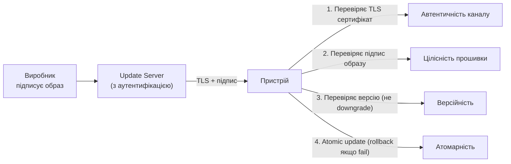
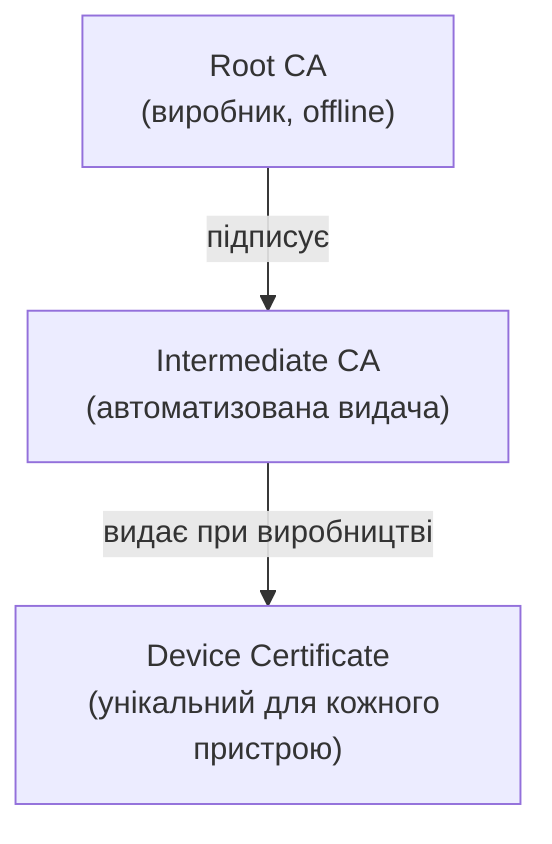
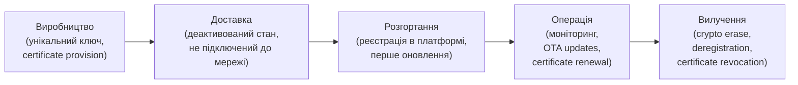

# 8.6. IoT-безпека: автентифікація, прошивки та PKI

Більшість IoT-вразливостей мають одну спільну риску: вони були відомі десятиліттями для традиційних комп'ютерних систем. Дефолтні паролі, відсутність оновлень, незашифрована комунікація — все це давно вирішено у корпоративних середовищах, але знову з'явилось разом з мільярдами нових підключених пристроїв. Різниця лише в масштабі і ресурсних обмеженнях IoT-обладнання.

> 📖 Ключові терміни — у [глосарії модуля](00-glosariy.md).

## Проблема дефолтних облікових даних

**Найпоширеніша вразливість IoT** — незмінений пароль адміністратора. Mirai зібрав ботнет з 600 000 пристроїв використовуючи лише 61 дефолтну пару логін/пароль.

**Типові дефолтні паролі:**
```
admin/admin      admin/password   admin/1234
root/root        user/user        admin/[blank]
support/support  administrator/administrator
```

**Вимоги до зміни дефолтних паролів:**

| Регіон | Регуляція | Вимога |
|---|---|---|
| Великобританія | Product Security and Telecommunications Infrastructure Act (2022) | Заборона дефолтних паролів для всіх IoT пристроїв |
| США | IoT Cybersecurity Improvement Act | Обов'язкові security standards для федеральних закупівель |
| EU | Cyber Resilience Act (2024) | Обов'язкові security requirements для підключених пристроїв |
| Україна | ЗУ «Про основні засади забезпечення кібербезпеки» | Регуляція для критичної інфраструктури |

**Технічна реалізація унікальних паролів:**

```python
# Генератор унікальних паролів для пристрою при виробництві
import secrets
import hashlib

def generate_device_password(device_serial: str, secret_salt: bytes) -> str:
    """
    Генерує унікальний пароль для кожного пристрою на основі серійного номера.
    secret_salt — секрет виробника, не вбудований у пристрій.
    """
    combined = f"{device_serial}:{secret_salt.hex()}".encode()
    digest = hashlib.sha256(combined).hexdigest()
    # Перші 12 символів у читабельному форматі (для друку на корпусі)
    return f"{digest[:4]}-{digest[4:8]}-{digest[8:12]}".upper()

# Друкується на наклейці пристрою і у документації
serial = "CAM-2024-001234"
salt = secrets.token_bytes(32)
password = generate_device_password(serial, salt)
# Наприклад: "A3F7-B2C1-9E4D"
```

---

## Оновлення прошивок (OTA Updates)

**Відсутність механізму оновлень** — друга за поширеністю IoT-проблема. Пристрій із вразливістю 2018 року досі в мережі у 2024 через відсутність або відключені оновлення.

### Вимоги до безпечного OTA (Over-the-Air) оновлення



**Протокол SWUpdate / Mender / RAUC** — відкриті фреймворки для безпечних OTA оновлень вбудованих Linux-систем.

**Приклад перевірки підпису прошивки (C pseudocode):**
```c
// На пристрої: перевірка підпису перед встановленням прошивки
bool verify_firmware(const uint8_t *firmware, size_t fw_size,
                     const uint8_t *signature, size_t sig_size) {
    // Публічний ключ виробника прошитий у ROM при виробництві
    const uint8_t *vendor_public_key = get_rom_public_key();

    // Хеш прошивки
    uint8_t hash[32];
    sha256(firmware, fw_size, hash);

    // Перевірка підпису Ed25519
    return ed25519_verify(signature, sig_size, hash, sizeof(hash),
                          vendor_public_key);
}
```

### Проблема "Forever Day Vulnerabilities"

Багато IoT-пристроїв отримують оновлення лише 2–3 роки після випуску (як смартфони). Пристрій розумного дому 2019 року у 2024 може мати невиправлені CVE — і виробник більше не підтримує його.

**Вимоги до виробників (EU Cyber Resilience Act):**
- Надавати оновлення безпеки весь час, поки пристрій вважається підтримуваним.
- Повідомляти дату закінчення підтримки.
- Відповідати за вразливості у власних і третіх компонентах.

---

## PKI для IoT: ідентифікація пристроїв

У масштабованих IoT-рішеннях кожен пристрій потребує унікальної ідентифікації — аналогічно TLS-сертифікатам для серверів.

### X.509 сертифікати для IoT



**AWS IoT Core: автентифікація через X.509:**
```python
# Python: підключення IoT пристрою через mutual TLS з X.509
import ssl, paho.mqtt.client as mqtt

# Кожен пристрій має унікальний сертифікат і приватний ключ
ssl_context = ssl.create_default_context()
ssl_context.load_verify_locations('root_ca.pem')           # CA сертифікат
ssl_context.load_cert_chain('device_cert.pem', 'device_key.pem')  # пристрій

client = mqtt.Client(client_id=f"device_{DEVICE_SERIAL}")
client.tls_set_context(ssl_context)
client.connect("xxxxxxx.iot.eu-west-1.amazonaws.com", 8883)
```

### Secure Element і TPM для IoT

**Secure Element (SE)** — виділений мікросхема для зберігання ключів і виконання криптографічних операцій. Аналог Secure Enclave для IoT.

- **ATECC608A (Microchip)** — поширений SE для Arduino і Raspberry Pi.
- **TPM 2.0** — для потужніших IoT-плат (Raspberry Pi, промислові ПК).
- **Google Titan M** — у Pixel телефонах і Coral Dev Board.

Ключі в SE не можуть бути витягнуті навіть при повному зламі основного процесора.

---

## Secure Boot для IoT

**Secure Boot** — верифікація кожного компонента завантаження до виконання (Boot ROM → Bootloader → Ядро → Застосунок).

```
Chain of Trust:
Boot ROM (незмінний, в кремнії)
   ↓ перевіряє підпис
Bootloader (flash, підписаний виробником)
   ↓ перевіряє підпис
Linux Kernel (flash, підписаний виробником)
   ↓
Application (верифікація при запуску)
```

**У ARM Cortex-M (MCU):** TrustZone-M дозволяє реалізувати Secure Boot навіть на мікроконтролерах.

**У Linux-based IoT:** U-Boot + fitImage з EVP-підписом або UEFI Secure Boot.

---

## Lifecycle Management: від виробництва до утилізації



**Crypto Erase (безпечне стирання):** при утилізації IoT-пристрою — шифровий ключ виробляється з master key і унікальної змінної. Для знищення даних достатньо знищити master key — і всі дані стають нечитабельними без фізичного перезапису.

## Міні-вправа

Якщо у вас є Raspberry Pi або будь-який інший IoT-пристрій:

```bash
# 1. Перевірити дефолтні/слабкі паролі (від свого пристрою!)
# Змінити пароль pi якщо ще не зроблено:
passwd pi

# 2. Перевірити відкриті порти
sudo ss -tlnp

# 3. Перевірити версію ОС і наявність оновлень
cat /etc/os-release
sudo apt list --upgradable 2>/dev/null | head -20

# 4. Перевірити активні сервіси
sudo systemctl list-units --type=service --state=running
```

Скільки невикористовуваних сервісів запущено? Чи є Telnet (порт 23)?

## Джерела та додаткові матеріали

- NIST SP 800-213A — IoT Device Cybersecurity Guidance for the Federal Government.
- ETSI EN 303 645 — Cyber Security for Consumer Internet of Things.
- AWS IoT Device Defender (docs.aws.amazon.com/iot/latest/developerguide).
- Mender.io — відкрита платформа OTA оновлень.

---

**Попередній розділ:** [8.5. IoT: архітектура](05-iot-arkhitektura.md)
**Далі:** [8.7. Industrial IoT і OT/SCADA Security](07-iot-industrial-scada.md)
**Назад до модуля:** [README модуля 08](README.md)
