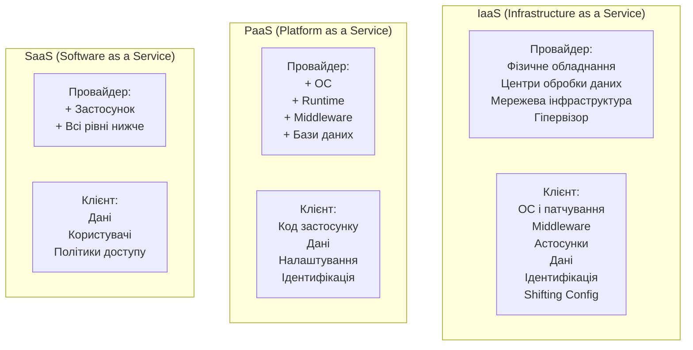

# 9.1. Хмарні моделі і Shared Responsibility Model

У 2023 році через неправильно налаштований хмарний акаунт стався один із найбільших витоків даних клієнтів Microsoft: зловмисники отримали доступ до 38 терабайт внутрішніх даних через надмірно широкий SAS-токен. Не вразливість Microsoft Azure — помилка конфігурації команди Microsoft AI. Це квінтесенція хмарної безпеки 2024 року: провайдер надав безпечний інструмент; клієнт використав його небезпечно. Зрозуміти де саме закінчується відповідальність провайдера і починається відповідальність клієнта — перший крок до побудови захищеного хмарного середовища.

> 📖 Ключові терміни — у [глосарії модуля](00-glosariy.md).

## Три моделі хмарних послуг



**IaaS** — оренда «заліза» у хмарі. Ви повністю контролюєте ОС, ПЗ і конфігурацію. AWS EC2, Azure VM, GCP Compute Engine.

**PaaS** — платформа для запуску застосунків без управління ОС. Google App Engine, AWS Elastic Beanstalk, Azure App Service, Heroku.

**SaaS** — готовий застосунок через браузер. Microsoft 365, Google Workspace, Salesforce, GitHub.

**FaaS (Serverless)** — виконання коду без управління серверами. AWS Lambda, Azure Functions, Google Cloud Functions. Клієнт відповідає лише за код і дані.

---

## Shared Responsibility Model

**Модель спільної відповідальності** — ключова концепція хмарної безпеки. Провайдер і клієнт несуть відповідальність за різні рівні безпеки залежно від моделі послуги.

```
Що ЗАВЖДИ захищає провайдер:
├── Фізична безпека центрів обробки даних
├── Мережева інфраструктура (backbone)
├── Обладнання (сервери, диски)
└── Гіпервізор (для IaaS)

Що ЗАВЖДИ захищає клієнт:
├── Дані (класифікація, шифрування)
├── Кінцеві пристрої (ноутбуки, смартфони)
├── Ідентифікація та доступ (IAM)
└── Конфігурація хмарних сервісів
```

**Найбільша проблема SRM** — «сіра зона»: клієнти думають що провайдер захищає більше, ніж він реально захищає.

| Рівень захисту | IaaS | PaaS | SaaS |
|---|---|---|---|
| Фізична безпека ЦОД | ☁️ Провайдер | ☁️ Провайдер | ☁️ Провайдер |
| Мережева інфраструктура | ☁️ Провайдер | ☁️ Провайдер | ☁️ Провайдер |
| Гіпервізор/Runtime | ☁️ Провайдер | ☁️ Провайдер | ☁️ Провайдер |
| Операційна система | 👤 Клієнт | ☁️ Провайдер | ☁️ Провайдер |
| Middleware / Runtime | 👤 Клієнт | ☁️ Провайдер | ☁️ Провайдер |
| Код застосунку | 👤 Клієнт | 👤 Клієнт | ☁️ Провайдер |
| Налаштування безпеки | 👤 Клієнт | 👤 Клієнт | 👤 Клієнт |
| Управління доступом (IAM) | 👤 Клієнт | 👤 Клієнт | 👤 Клієнт |
| Дані | 👤 Клієнт | 👤 Клієнт | 👤 Клієнт |
| Кінцеві пристрої | 👤 Клієнт | 👤 Клієнт | 👤 Клієнт |

---

## Типи хмарних розгортань

**Public Cloud** — інфраструктура спільна для багатьох клієнтів (multi-tenant). AWS, Azure, GCP. Найнижча вартість, найвища гнучкість.

**Private Cloud** — виділена інфраструктура для однієї організації. Або у власному ЦОД (OpenStack, VMware), або «приватна хмара» у провайдера (AWS GovCloud, Azure Government). Вища вартість, більше контролю.

**Hybrid Cloud** — поєднання private і public cloud з інтеграцією між ними. Чутливі дані — in private; burst capacity — in public.

**Multi-Cloud** — використання кількох хмарних провайдерів одночасно. Захист від vendor lock-in; збільшує складність управління безпекою.

**Community Cloud** — спільна хмара для організацій зі схожими вимогами (наприклад, державні установи). Ukraine.ia платформа для держорганів.

---

## Хмарні провайдери: ринок і сервіси безпеки

| Провайдер | Частка ринку | Ключові security сервіси |
|---|---|---|
| **AWS** | ~32% | IAM, GuardDuty, Security Hub, KMS, CloudTrail, WAF, Shield |
| **Microsoft Azure** | ~22% | Entra ID, Defender for Cloud, Key Vault, Sentinel, DDoS Protection |
| **Google Cloud** | ~11% | IAM, Security Command Center, Cloud KMS, Chronicle, Armor |
| **Oracle Cloud** | ~2% | IAM, Cloud Guard, Vault |
| **Alibaba Cloud** | ~4% | RAM, Security Center, KMS |

---

## Виклики хмарної безпеки

**1. Visibility Gap (брак видимості)** — у хмарі тисячі ресурсів можуть з'явитись і зникнути за хвилини. Традиційні інструменти безпеки не встигають.

**2. Configuration Drift** — початкова конфігурація безпечна, але поступово «дрейфує» через ручні зміни, DevOps-прискорення, помилки.

**3. Shared Tenancy** — у public cloud ваші дані на тих самих фізичних серверах, що й дані інших клієнтів. Side-channel attacks (Spectre/Meltdown) — реальна загроза.

**4. Shadow Cloud** — DevOps-команди створюють нові хмарні акаунти поза контролем безпеки («несанкціоновані» акаунти).

**5. Ephemeral Resources** — EC2-інстанція живе 5 хвилин; традиційне «журналювання на хості» не встигає. Потрібен cloud-native logging.

---

## Відповідність AWS Well-Architected Framework

AWS Well-Architected Framework визначає п'ять стовпів для побудови надійних хмарних систем, Security — один з них:

**Security Pillar принципи:**
1. Implement a strong identity foundation (IAM, PoLP).
2. Enable traceability (logging, monitoring, auditing).
3. Apply security at all layers (defense in depth).
4. Automate security best practices.
5. Protect data in transit and at rest.
6. Keep people away from data (автоматизація замість ручного доступу).
7. Prepare for security events (IR plan).

---

## Міні-вправа

Визначте модель відповідальності для кожного сценарію:

1. Компанія використовує AWS EC2 для свого веб-сервера. Хто відповідає за патчування ОС?
2. SaaS застосунок Salesforce зберігає дані клієнтів компанії. Якщо Salesforce зазнає зламу і дані витікають — хто несе відповідальність за їх класифікацію і шифрування?
3. Розробник розгортає застосунок на AWS Lambda. Хто відповідає за оновлення runtime (Python версії)?
4. Компанія використовує Google Workspace для пошти. Якщо співробітник надає надмірний доступ до Google Drive зовнішнім партнерам — хто відповідає?

## Джерела та додаткові матеріали

- AWS, *Shared Responsibility Model* (aws.amazon.com/compliance/shared-responsibility-model).
- Microsoft Azure, *Shared Responsibility in the Cloud* (docs.microsoft.com).
- NIST SP 800-145 — The NIST Definition of Cloud Computing.
- CSA (Cloud Security Alliance), *Cloud Controls Matrix* (cloudsecurityalliance.org).

---

**Далі:** [9.2. Хмарна мережева безпека](02-merezheva-bezpeka.md)
**Назад до модуля:** [README модуля 09](README.md)
