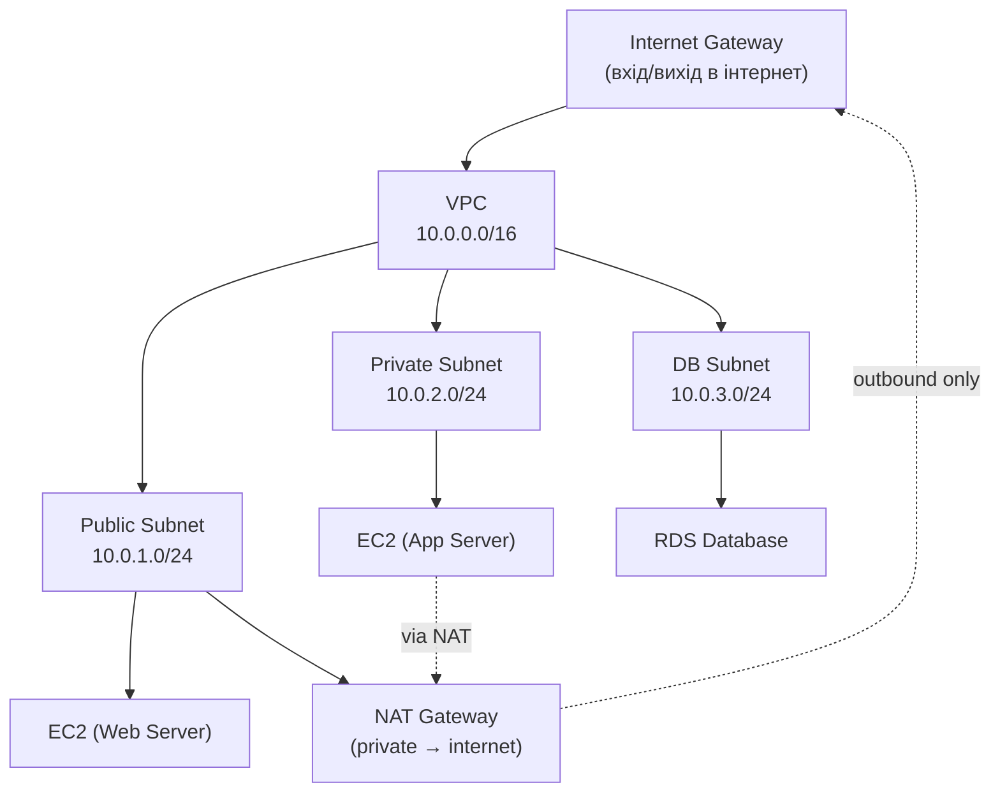

# 9.2. Хмарна мережева безпека

Хмарна мережа — це не просто «переїхала» корпоративна мережа. VPC, Security Groups і NACLs надають гнучкість, яку неможливо реалізувати з фізичними комутаторами — але ця гнучкість коштує складності. Мережеве правило, додане «тимчасово для тестування», залишається відкритим роками. Інстанція, запущена в публічній підмережі без необхідності, отримує публічну IP-адресу автоматично. Хмарна мережева безпека вимагає усвідомленого проектування від початку, а не накладання захисту поверх існуючої архітектури.

> 📖 Ключові терміни — у [глосарії модуля](00-glosariy.md).

## VPC: Virtual Private Cloud

**VPC** — ізольована мережева середа у хмарному провайдері, де ви повністю контролюєте топологію, IP-адресацію і маршрутизацію.

**Компоненти VPC (AWS):**



**Ключові принципи VPC-дизайну:**
- **Public Subnet** — для ресурсів з прямим доступом з інтернету (Load Balancer, Bastion Host).
- **Private Subnet** — для застосункового рівня (App Servers).
- **DB/Isolated Subnet** — для баз даних (жодного прямого інтернет-доступу).
- **NAT Gateway** — дозволяє ресурсам у Private Subnet ініціювати вихідні з'єднання (оновлення, API-виклики), але блокує вхідні.

---

## Security Groups vs Network ACLs

**Security Groups (SG)** — stateful firewall на рівні мережевого інтерфейсу (ENI):

```python
# AWS boto3: перевірка надмірно відкритих Security Groups
import boto3

def find_open_security_groups(region='us-east-1'):
    ec2 = boto3.client('ec2', region_name=region)
    issues = []

    response = ec2.describe_security_groups()
    for sg in response['SecurityGroups']:
        for rule in sg.get('IpPermissions', []):
            for cidr in rule.get('IpRanges', []):
                if cidr.get('CidrIp') == '0.0.0.0/0':
                    from_port = rule.get('FromPort', 'ALL')
                    to_port = rule.get('ToPort', 'ALL')
                    proto = rule.get('IpProtocol', '-1')

                    # Критичні відкриті порти
                    if from_port in [22, 3389, 3306, 5432, 27017] or proto == '-1':
                        issues.append({
                            'sg_id': sg['GroupId'],
                            'sg_name': sg['GroupName'],
                            'port': f"{from_port}-{to_port}",
                            'protocol': proto,
                            'severity': 'CRITICAL' if from_port in [22, 3389] else 'HIGH'
                        })
    return issues

issues = find_open_security_groups()
for issue in issues:
    print(f"[{issue['severity']}] {issue['sg_name']} ({issue['sg_id']}): "
          f"port {issue['port']} open to 0.0.0.0/0")
```

**Network ACLs (NACLs)** — stateless firewall на рівні підмережі:

| Аспект | Security Groups | NACLs |
|---|---|---|
| Рівень | Інстанція (ENI) | Підмережа |
| Стан | Stateful (відповідь автоматична) | Stateless (потрібні обидва напрямки) |
| Правила | Лише Allow | Allow і Deny |
| Застосування | Перший вибір | Додатковий захист |
| Default | Все заблоковано | Все дозволено |

**Best Practice:** SG як основний інструмент; NACL для блокування відомих шкідливих IP або підмереж.

---

## Web Application Firewall (WAF)

**WAF** — фільтрує HTTP/HTTPS трафік до вебзастосунків на рівні L7:

```yaml
# AWS WAF WebACL (CloudFormation/Terraform pseudo-config)
WebACL:
  Name: "ProductionWAF"
  DefaultAction: Allow

  Rules:
    # Блокування відомих атак (OWASP Core Rule Set)
    - Name: "AWSManagedRulesCommonRuleSet"
      Priority: 1
      Action: Block
      ManagedRuleGroupStatement:
        VendorName: "AWS"
        Name: "AWSManagedRulesCommonRuleSet"

    # SQL Injection захист
    - Name: "AWSManagedRulesSQLiRuleSet"
      Priority: 2
      Action: Block

    # Rate limiting (проти DDoS і brute force)
    - Name: "RateLimitRule"
      Priority: 10
      Action: Block
      RateBasedStatement:
        Limit: 2000        # 2000 запитів за 5 хвилин з однієї IP
        AggregateKeyType: IP

    # Geo-блокування
    - Name: "GeoBlockRule"
      Priority: 20
      Action: Block
      GeoMatchStatement:
        CountryCodes: ["RU", "BY", "KP", "IR"]  # Ризикові країни
```

**Хмарні WAF-рішення:**
- **AWS WAF** — нативна інтеграція з CloudFront, ALB, API Gateway.
- **Azure WAF** — для Application Gateway і Front Door.
- **Google Cloud Armor** — для GCP Load Balancer.
- **Cloudflare WAF** — мультихмарний; також захист від DDoS.

---

## DDoS захист у хмарі

**Розподілена атака типу «відмова в обслуговуванні»** — атака великим обсягом трафіку для перевантаження ресурсів.

**Рівні захисту:**

| Рівень | Інструмент | Що захищає |
|---|---|---|
| **L3/L4 (Network)** | AWS Shield Standard (безкоштовно) | Volumetric floods, UDP reflection |
| **L7 (Application)** | AWS WAF + Rate Limiting | HTTP floods, Slowloris |
| **Advanced** | AWS Shield Advanced ($3000/міс) | SLA, DDoS Response Team, cost protection |
| **CDN-рівень** | CloudFront, Cloudflare | Absorb attack capacity globally |

**Cloudflare як перша лінія захисту:**
```
Ваш DNS:
  www.example.com → Cloudflare IP (не ваш реальний IP)
  → Cloudflare фільтрує трафік
  → Легітимний трафік іде на ваш сервер
  Зловмисник не знає ваш реальний IP → DDoS неефективний
```

---

## Private Connectivity: PrivateLink і VPN

**VPC Peering** — пряме з'єднання між двома VPC без публічного інтернету. Не транзитивне (A↔B, B↔C не означає A↔C).

**AWS PrivateLink / Azure Private Link** — приватний ендпоінт для сервісів провайдера або партнерів всередині VPC:
```
Без PrivateLink: EC2 → Інтернет → S3
З PrivateLink:   EC2 → VPC Endpoint → S3 (S3 трафік ніколи не виходить в інтернет)
```

**VPN Gateway** — зашифрований тунель між on-premises і VPC:
- **Site-to-Site VPN** — для підключення корпоративної мережі до VPC.
- **Client VPN** — для підключення окремих користувачів до VPC.

**AWS Direct Connect / Azure ExpressRoute** — фізичне виділене з'єднання між корпоративним ЦОД і хмарою без публічного інтернету. Висока пропускна здатність, низька затримка, вища безпека (але дорожче).

---

## Flow Logs і мережевий моніторинг

**VPC Flow Logs** — детальні записи про всі IP-пакети у VPC:

```
# Формат VPC Flow Log запису:
version account-id interface-id srcaddr dstaddr srcport dstport protocol packets bytes start end action log-status

# Приклад підозрілого запису (сканування портів):
2 123456789012 eni-abc123 1.2.3.4 10.0.1.5 45678 22 6 1 40 1700000000 1700000060 REJECT OK
2 123456789012 eni-abc123 1.2.3.4 10.0.1.5 45678 23 6 1 40 1700000001 1700000061 REJECT OK
2 123456789012 eni-abc123 1.2.3.4 10.0.1.5 45678 80 6 1 40 1700000002 1700000062 ACCEPT OK
# Один IP пробує порти 22, 23, 80 підряд — сканування портів!
```

**Аналіз у AWS Athena:**
```sql
-- Знайти top-10 IP, що генерують відхилений трафік
SELECT srcaddr, COUNT(*) AS rejected_requests
FROM vpc_flow_logs
WHERE action = 'REJECT'
  AND start > (UNIX_TIMESTAMP() - 3600)
GROUP BY srcaddr
ORDER BY rejected_requests DESC
LIMIT 10;
```

---

## Міні-вправа

Для AWS (Free Tier достатньо):

```bash
# 1. Переглянути Security Groups і виявити надмірно відкриті
aws ec2 describe-security-groups \
  --query 'SecurityGroups[?IpPermissions[?IpRanges[?CidrIp==`0.0.0.0/0`]]].[GroupId,GroupName]' \
  --output table

# 2. Знайти публічно доступні EC2 інстанції
aws ec2 describe-instances \
  --query 'Reservations[*].Instances[?PublicIpAddress!=null].[InstanceId,PublicIpAddress,State.Name]' \
  --output table

# 3. Перевірити чи увімкнені VPC Flow Logs
aws ec2 describe-flow-logs --output table
```

## Джерела та додаткові матеріали

- AWS, *VPC Security Best Practices* (docs.aws.amazon.com/vpc/latest/userguide/vpc-security-best-practices.html).
- CIS AWS Foundations Benchmark, Section 4 — Networking.
- OWASP, *Cloud Security Guidance* (owasp.org).
- Cloudflare, *DDoS Threat Landscape Report*.

---

**Попередній розділ:** [9.1. Хмарні моделі](01-khmara-modeli.md)
**Далі:** [9.3. IAM у хмарі](03-iam-u-khmari.md)
**Назад до модуля:** [README модуля 09](README.md)
