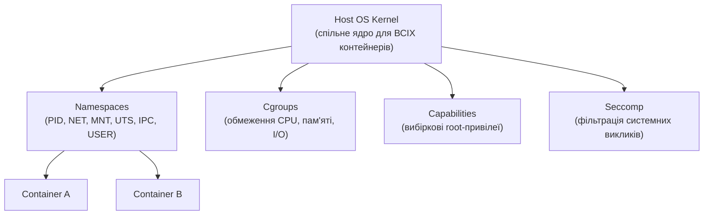

# 9.5. Безпека контейнерів і Kubernetes

Контейнер обіцяє ізоляцію — але ізоляція контейнера принципово слабша за ізоляцію віртуальної машини: всі контейнери на хості ділять одне ядро ОС. Вихід за межі контейнера (container escape) — не теоретична загроза, а задокументований клас вразливостей. Kubernetes додає ще один рівень складності: оркестратор з власною площиною управління, мережевою моделлю і системою прав, де помилка конфігурації може відкрити доступ до всього кластера. У 2024 році контейнеризовані середовища — стандарт продакшену, і їх неправильна конфігурація — стандартне джерело інцидентів.

> 📖 Ключові терміни — у [глосарії модуля](00-glosariy.md).

## Контейнерна ізоляція: що насправді захищає



**Namespaces** ізолюють: процеси (PID), мережу (NET), файлову систему (MNT), hostname (UTS), IPC, користувачів (USER).

**Cgroups** обмежують ресурси: CPU, пам'ять, I/O — захист від «шумного сусіда» і resource exhaustion DoS.

**Не справжня ізоляція:** на відміну від VM (де гіпервізор повністю розділяє), контейнери ділять одне ядро. Вразливість ядра Linux (наприклад, Dirty COW, CVE-2016-5195) може дозволити container escape.

---

## Docker Security: основи

### Небезпечні практики Docker

```dockerfile
# ❌ ВРАЗЛИВО: запуск від root (дефолт Docker!)
FROM ubuntu:22.04
COPY app /app
CMD ["/app"]
# Контейнер виконується від root → якщо є вразливість escape, зловмисник отримує root на хості

# ✅ Запуск від непривілейованого користувача
FROM ubuntu:22.04
RUN useradd -m -u 1000 appuser
COPY --chown=appuser:appuser app /app
USER appuser
CMD ["/app"]
```

```bash
# ❌ ВРАЗЛИВО: privileged режим (повний доступ до хоста!)
docker run --privileged my-image

# ❌ ВРАЗЛИВО: mount Docker socket (фактично root на хості)
docker run -v /var/run/docker.sock:/var/run/docker.sock my-image

# ✅ Принцип найменших привілеїв
docker run --cap-drop=ALL --cap-add=NET_BIND_SERVICE \
  --read-only \
  --security-opt no-new-privileges \
  my-image
```

### Сканування образів на вразливості

```bash
# Trivy — швидкий безкоштовний сканер
trivy image my-app:latest

# Приклад виводу:
# my-app:latest (alpine 3.18)
# Total: 12 (CRITICAL: 2, HIGH: 5, MEDIUM: 5)
# ┌──────────┬────────────────┬──────────┬───────────────┐
# │ Library  │ Vulnerability  │ Severity │ Fixed Version │
# ├──────────┼────────────────┼──────────┼───────────────┤
# │ openssl  │ CVE-2023-0286  │ CRITICAL │ 3.0.8-r3      │
# └──────────┴────────────────┴──────────┴───────────────┘

# Grype — альтернатива з SBOM підтримкою
grype my-app:latest

# Інтеграція в CI/CD: блокувати build при CRITICAL вразливостях
trivy image --exit-code 1 --severity CRITICAL my-app:latest
```

### Distroless і мінімальні образи

```dockerfile
# ❌ Великий attack surface: повна Ubuntu з shell, package manager, утилітами
FROM ubuntu:22.04

# ✅ Distroless: тільки runtime, без shell, без package manager
FROM gcr.io/distroless/python3-debian12
COPY app.py .
CMD ["app.py"]
# Зловмисник не може отримати shell навіть при RCE — немає /bin/sh
```

---

## Kubernetes RBAC

**RBAC у Kubernetes** контролює, хто може виконувати які дії над якими ресурсами кластера.

```yaml
# Role: дозволи в межах одного namespace
apiVersion: rbac.authorization.k8s.io/v1
kind: Role
metadata:
  namespace: production
  name: pod-reader
rules:
- apiGroups: [""]
  resources: ["pods"]
  verbs: ["get", "watch", "list"]

---
# RoleBinding: прив'язка Role до user/group/serviceaccount
apiVersion: rbac.authorization.k8s.io/v1
kind: RoleBinding
metadata:
  name: read-pods
  namespace: production
subjects:
- kind: User
  name: alice@example.com
  apiGroup: rbac.authorization.k8s.io
roleRef:
  kind: Role
  name: pod-reader
  apiGroup: rbac.authorization.k8s.io
```

**ClusterRole vs Role:** Role обмежений namespace; ClusterRole діє на весь кластер.

```bash
# Аудит надмірних прав у кластері
kubectl get clusterrolebindings -o json | \
  jq '.items[] | select(.roleRef.name=="cluster-admin") | .subjects'

# Хто має cluster-admin? (найвищий рівень привілеїв)
kubectl get clusterrolebindings -o jsonpath='{range .items[?(@.roleRef.name=="cluster-admin")]}{.subjects[*].name}{"\n"}{end}'
```

---

## Pod Security Standards

Kubernetes визначає три рівні безпеки Pod (замінили застарілий PodSecurityPolicy):

| Рівень | Опис |
|---|---|
| **Privileged** | Без обмежень (для системних компонентів) |
| **Baseline** | Запобігає відомим ескалаціям привілеїв |
| **Restricted** | Найсуворіший — поточна найкраща практика |

```yaml
# Namespace з Restricted рівнем
apiVersion: v1
kind: Namespace
metadata:
  name: production
  labels:
    pod-security.kubernetes.io/enforce: restricted
    pod-security.kubernetes.io/audit: restricted
    pod-security.kubernetes.io/warn: restricted

---
# Pod з безпечною конфігурацією (відповідає Restricted)
apiVersion: v1
kind: Pod
metadata:
  name: secure-app
spec:
  securityContext:
    runAsNonRoot: true
    runAsUser: 1000
    seccompProfile:
      type: RuntimeDefault
  containers:
  - name: app
    image: my-app:latest
    securityContext:
      allowPrivilegeEscalation: false
      readOnlyRootFilesystem: true
      capabilities:
        drop: ["ALL"]
    resources:
      limits:
        memory: "256Mi"
        cpu: "500m"
```

---

## Network Policies: мікросегментація в Kubernetes

За замовчуванням всі Pod у кластері можуть комунікувати один з одним — це небезпечно для багатоорендних кластерів.

```yaml
# Default Deny: заборонити весь трафік (потім дозволяти явно)
apiVersion: networking.k8s.io/v1
kind: NetworkPolicy
metadata:
  name: default-deny
  namespace: production
spec:
  podSelector: {}
  policyTypes: ["Ingress", "Egress"]

---
# Дозволити лише frontend → backend трафік
apiVersion: networking.k8s.io/v1
kind: NetworkPolicy
metadata:
  name: allow-frontend-to-backend
  namespace: production
spec:
  podSelector:
    matchLabels:
      app: backend
  ingress:
  - from:
    - podSelector:
        matchLabels:
          app: frontend
    ports:
    - protocol: TCP
      port: 8080
```

---

## Secrets у Kubernetes

```bash
# ❌ Kubernetes Secrets за замовчуванням ЛИШЕ base64-encoded (не зашифровано!)
kubectl create secret generic db-password --from-literal=password=mypassword
kubectl get secret db-password -o jsonpath='{.data.password}' | base64 -d
# mypassword ← легко декодується!

# ✅ Encryption at Rest для etcd (де зберігаються Secrets)
# kube-apiserver --encryption-provider-config=/etc/kubernetes/encryption-config.yaml

# ✅ Краще: зовнішній secrets manager + External Secrets Operator
apiVersion: external-secrets.io/v1beta1
kind: ExternalSecret
metadata:
  name: db-credentials
spec:
  secretStoreRef:
    name: aws-secrets-manager
  target:
    name: db-password
  data:
  - secretKey: password
    remoteRef:
      key: prod/myapp/db
```

---

## Service Mesh: mTLS між Pod'ами

**Istio / Linkerd** — service mesh, що автоматично шифрує трафік між Pod'ами через mutual TLS, без зміни коду застосунку:

```yaml
# Istio: примусовий mTLS для namespace
apiVersion: security.istio.io/v1beta1
kind: PeerAuthentication
metadata:
  name: default
  namespace: production
spec:
  mtls:
    mode: STRICT  # Всі з'єднання мають бути mTLS
```

---

## Kubernetes Security Checklist

| Захід | Інструмент перевірки |
|---|---|
| RBAC замість cluster-admin для всіх | `kubectl get clusterrolebindings` |
| Pod Security Standards = restricted | Namespace labels |
| Network Policies встановлені | `kubectl get networkpolicies -A` |
| Образи скановані на вразливості | Trivy/Grype в CI/CD |
| Secrets через зовнішній менеджер | External Secrets Operator |
| etcd зашифрований | `--encryption-provider-config` |
| API Server доступний лише з VPN/bastion | Network ACL на API endpoint |
| Admission Controllers увімкнені | OPA/Gatekeeper, Kyverno |
| Audit logging увімкнено | `--audit-log-path` |

## Міні-вправа

```bash
# Якщо у вас є доступ до Kubernetes кластера (minikube для тестування):

# 1. Перевірити Pod Security
kubectl get pods -A -o json | \
  jq '.items[] | select(.spec.securityContext.runAsNonRoot != true) | .metadata.name'

# 2. Знайти Pod'и без resource limits
kubectl get pods -A -o json | \
  jq '.items[] | select(.spec.containers[].resources.limits == null) | .metadata.name'

# 3. kube-bench — автоматизована перевірка CIS Kubernetes Benchmark
docker run --rm -v $(pwd):/host aquasec/kube-bench:latest --benchmark cis-1.8
```

## Джерела та додаткові матеріали

- CIS Kubernetes Benchmark (cisecurity.org).
- Kubernetes, *Pod Security Standards* (kubernetes.io/docs/concepts/security).
- Trivy (aquasecurity.github.io/trivy).
- OWASP Kubernetes Top 10.
- NSA/CISA, *Kubernetes Hardening Guide*.

---

**Попередній розділ:** [9.4. Безпека даних](04-bezpeka-danykh.md)
**Далі:** [9.6. DevSecOps і безпека CI/CD](06-devsecops.md)
**Назад до модуля:** [README модуля 09](README.md)
