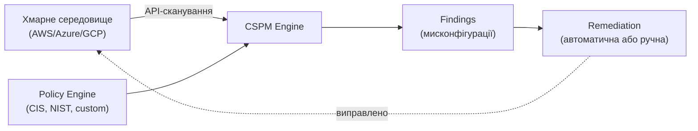
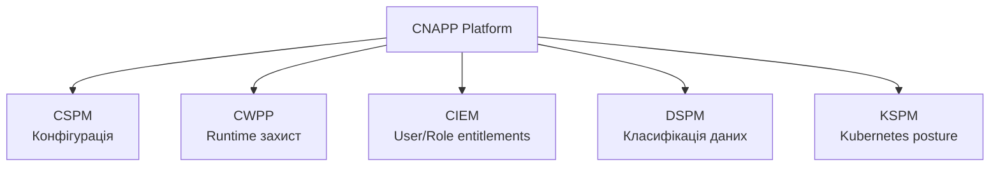

# 9.7. CSPM і Cloud Workload Protection

У хмарному акаунті середнього підприємства — тисячі ресурсів, що змінюються щодня: нові інстанції, оновлені IAM-політики, модифіковані Security Groups. Жодна людина не може вручну відстежувати конфігурацію такого масштабу. CSPM (Cloud Security Posture Management) автоматизує саме цю задачу — безперервно скануючи хмарне середовище на відхилення від безпечної конфігурації. Це не замінює архітектурне проектування безпеки, але є необхідним «запобіжником» проти configuration drift.

> 📖 Ключові терміни — у [глосарії модуля](00-glosariy.md).

## CSPM: Cloud Security Posture Management

**CSPM** автоматично виявляє мисконфігурації хмарної інфраструктури відносно встановлених стандартів (CIS Benchmarks, NIST, власні політики).



**Типові CSPM-знахідки:**

```
🔴 CRITICAL:
- S3 bucket публічно доступний для запису
- Security Group дозволяє 0.0.0.0/0 на порт 22 (SSH)
- IAM user з програмним доступом і AdministratorAccess
- RDS instance без шифрування at-rest
- Root account без MFA

🟠 HIGH:
- CloudTrail не увімкнений для всіх регіонів
- VPC Flow Logs вимкнені
- KMS ключ без ротації
- Незашифрований EBS volume

🟡 MEDIUM:
- Невикористовувані IAM credentials (>90 днів)
- Security Group з невикористовуваними правилами
- Відсутній tagging для cost allocation
```

### Нативні CSPM рішення

| Провайдер | Сервіс | Покриття |
|---|---|---|
| AWS | Security Hub + Config | AWS-native, інтеграція з GuardDuty |
| Azure | Defender for Cloud | Azure-native + multi-cloud (через connectors) |
| GCP | Security Command Center | GCP-native |

```bash
# AWS Config: безперервний моніторинг конфігурації
aws configservice put-config-rule --config-rule '{
  "ConfigRuleName": "s3-bucket-public-read-prohibited",
  "Source": {
    "Owner": "AWS",
    "SourceIdentifier": "S3_BUCKET_PUBLIC_READ_PROHIBITED"
  }
}'

# Перевірити статус compliance
aws configservice get-compliance-details-by-config-rule \
  --config-rule-name s3-bucket-public-read-prohibited
```

### Multi-Cloud CSPM рішення

Для організацій з кількома хмарними провайдерами — потрібен єдиний погляд:

- **Wiz** — провідне рішення 2023-2024; graph-based аналіз ризиків.
- **Prisma Cloud (Palo Alto)** — комплексна CNAPP-платформа.
- **Orca Security** — agentless сканування.
- **Microsoft Defender for Cloud** — multi-cloud через connectors до AWS/GCP.

---

## CWPP: Cloud Workload Protection Platform

**CWPP** захищає робочі навантаження (workloads) під час виконання — на відміну від CSPM, що перевіряє конфігурацію.

```
CSPM відповідає на питання: "Чи правильно НАЛАШТОВАНО?"
CWPP відповідає на питання: "Що відбувається ВСЕРЕДИНІ workload ЗАРАЗ?"
```

**Компоненти CWPP:**
- **Runtime Protection** — моніторинг процесів, файлових змін, мережевих з'єднань усередині контейнера/VM в реальному часі.
- **Vulnerability Management** — сканування образів і VM на CVE (перетинається з SCA).
- **Behavioral Analysis** — виявлення аномальної поведінки (несподіваний процес, незвичний мережевий трафік).
- **Application Control** — whitelist дозволених процесів усередині workload.

```yaml
# Falco — open-source runtime security для контейнерів і Kubernetes
# Приклад правила: виявлення shell у контейнері (підозріла активність)
- rule: Terminal shell in container
  desc: A shell was spawned in a container with attached terminal
  condition: >
    spawned_process and container
    and shell_procs and proc.tty != 0
    and container_entrypoint
  output: >
    Shell spawned in container
    (user=%user.name container=%container.name shell=%proc.name)
  priority: WARNING
```

**Провідні CWPP рішення:** CrowdStrike Falcon Cloud Security, Aqua Security, Sysdig Secure, Falco (відкритий).

---

## CNAPP: об'єднання CSPM, CWPP і більше

**CNAPP (Cloud-Native Application Protection Platform)** — еволюція, що об'єднує CSPM, CWPP, CIEM (Cloud Infrastructure Entitlement Management) і DSPM (Data Security Posture Management) у єдину платформу.



**CIEM (Cloud Infrastructure Entitlement Management)** — спеціалізується на аналізі надмірних IAM прав:

```
Приклад CIEM-знахідки:
User "john@company.com" має право s3:DeleteBucket,
але за останні 180 днів жодного разу не використав.
Рекомендація: видалити це право (Least Privilege Recommendation).
```

---

## Cloud Detection and Response (CDR)

**CDR** — спеціалізована SIEM/SOC функціональність для хмарних середовищ, що корелює сигнали з різних хмарних джерел.

**AWS GuardDuty** — нативний threat detection сервіс:

```bash
# Увімкнути GuardDuty
aws guardduty create-detector --enable

# Переглянути findings
aws guardduty list-findings --detector-id <detector-id> \
  --finding-criteria '{"Criterion":{"severity":{"Gte":7}}}'

# Приклади типів findings GuardDuty:
# - UnauthorizedAccess:EC2/SSHBruteForce
# - CryptoCurrency:EC2/BitcoinTool.B
# - Recon:IAMUser/MaliciousIPCaller
# - Exfiltration:S3/AnomalousBehavior
# - PrivilegeEscalation:IAMUser/AnomalousBehavior
```

**Azure Sentinel** — нативний SIEM/SOAR для Azure:
```kql
// KQL запит для виявлення підозрілих входів
SigninLogs
| where ResultType == "0"  // успішний вхід
| where Location != "Ukraine"
| where TimeGenerated > ago(1h)
| summarize count() by UserPrincipalName, Location
| where count_ > 1
```

---

## Практичний CSPM-аудит без комерційних інструментів

```python
"""
basic_cspm_check.py — спрощений CSPM-аудит для AWS через boto3.
Перевіряє ключові CIS AWS Foundations Benchmark контролі.
"""
import boto3

def check_cis_controls():
    findings = []

    # CIS 1.1: Root account MFA
    iam = boto3.client('iam')
    summary = iam.get_account_summary()['SummaryMap']
    if not summary.get('AccountMFAEnabled'):
        findings.append({'severity': 'CRITICAL', 'check': 'CIS 1.1',
                         'finding': 'Root account без MFA'})

    # CIS 2.1: CloudTrail увімкнено для всіх регіонів
    cloudtrail = boto3.client('cloudtrail')
    trails = cloudtrail.describe_trails()['trailList']
    multi_region = any(t.get('IsMultiRegionTrail') for t in trails)
    if not multi_region:
        findings.append({'severity': 'HIGH', 'check': 'CIS 2.1',
                         'finding': 'CloudTrail не покриває всі регіони'})

    # CIS 2.6: S3 bucket для CloudTrail logging увімкнено
    for trail in trails:
        if not trail.get('LogFileValidationEnabled'):
            findings.append({'severity': 'MEDIUM', 'check': 'CIS 2.6',
                             'finding': f'Log file validation вимкнено для {trail["Name"]}'})

    # CIS 4.1/4.2: Security Groups без 0.0.0.0/0 на 22/3389
    ec2 = boto3.client('ec2')
    sgs = ec2.describe_security_groups()['SecurityGroups']
    for sg in sgs:
        for rule in sg.get('IpPermissions', []):
            for ip_range in rule.get('IpRanges', []):
                if ip_range.get('CidrIp') == '0.0.0.0/0':
                    if rule.get('FromPort') in [22, 3389]:
                        findings.append({'severity': 'CRITICAL', 'check': 'CIS 4.1/4.2',
                                         'finding': f'SG {sg["GroupId"]} відкритий на порт {rule["FromPort"]} для всього інтернету'})

    return findings


if __name__ == "__main__":
    print("=== Базовий CSPM аудит (CIS AWS Foundations) ===\n")
    findings = check_cis_controls()
    if not findings:
        print("✅ Критичних знахідок не виявлено")
    for f in findings:
        icon = {'CRITICAL': '🔴', 'HIGH': '🟠', 'MEDIUM': '🟡'}.get(f['severity'], '?')
        print(f"{icon} [{f['check']}] {f['finding']}")
```

## Міні-вправа

1. Якщо маєте AWS Free Tier акаунт — увімкніть AWS Security Hub і AWS Config. Перегляньте перші 10 знахідок.
2. Запустіть `basic_cspm_check.py` з прикладу вище на власному акаунті (потребує AWS credentials з ReadOnlyAccess).
3. Порівняйте результат з повним CIS AWS Foundations Benchmark — скільки з ~50 контролів покрито цим спрощеним скриптом?

## Джерела та додаткові матеріали

- CIS AWS Foundations Benchmark (cisecurity.org).
- AWS Security Hub Documentation.
- Falco (falco.org) — open-source runtime security.
- Gartner, *Market Guide for Cloud-Native Application Protection Platforms*.

---

**Попередній розділ:** [9.6. DevSecOps і CI/CD](06-devsecops.md)
**Далі:** [9.8. Відповідність і аудит у хмарі](08-compliance-audit.md)
**Назад до модуля:** [README модуля 09](README.md)
