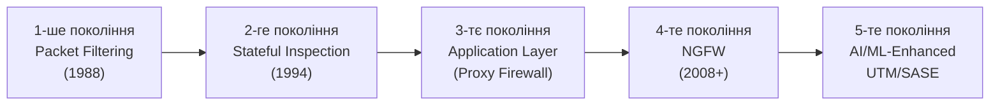
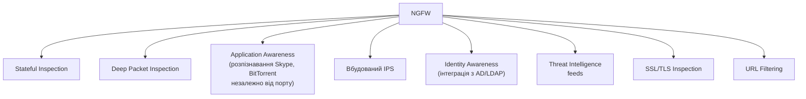
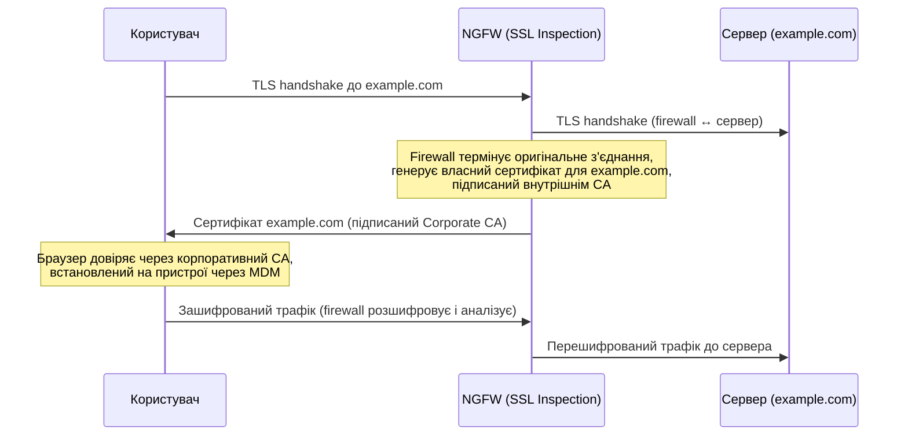
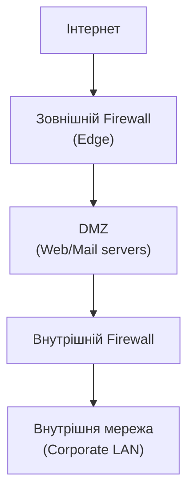

# 10.1. Firewalls: від пакетної фільтрації до NGFW

Перший комерційний firewall з'явився у 1988 році — простий пакетний фільтр, що перевіряв заголовки IP-пакетів проти статичного списку правил. Сьогоднішній Next-Generation Firewall розпізнає конкретний застосунок усередині зашифрованого трафіку, ідентифікує користувача через інтеграцію з Active Directory і блокує загрози на основі репутаційних баз даних, що оновлюються щохвилини. Це не просто «більше функцій» — кожне покоління firewall з'явилось як відповідь на конкретний клас атак, що попереднє покоління не могло зупинити.

> 📖 Ключові терміни — у [глосарії модуля](00-glosariy.md).

## Покоління Firewall



## Packet Filtering Firewall (1-ше покоління)

Перевіряє лише заголовки пакету: source/destination IP, порт, протокол. Не має поняття «з'єднання» — кожен пакет оцінюється незалежно.

```
Правило: Allow TCP from any to 192.168.1.10 port 80
→ Перевіряється КОЖЕН пакет окремо, без контексту
→ Не розрізняє "новий запит" від "відповідь на наш запит"
```

**Проблема:** для двосторонньої комунікації (запит-відповідь) потрібні правила в обох напрямках, що відкриває входящі порти статично — зловмисник може встановити з'єднання, прикинувшись «відповіддю».

**Linux iptables (концептуально пакетна фільтрація з розширеннями):**
```bash
# Базове stateless-подібне правило
iptables -A INPUT -p tcp --dport 80 -j ACCEPT
iptables -A INPUT -p tcp --sport 80 -j ACCEPT  # Потрібно явно для відповідей!
```

## Stateful Inspection Firewall (2-ге покоління)

Відстежує стан з'єднання (Connection State Table): NEW, ESTABLISHED, RELATED, INVALID. Дозволяє визначити, що вхідний пакет є легітимною відповіддю на вихідний запит, без явного дозволяючого правила для зворотного напрямку.

```bash
# iptables stateful: дозволити вихідні + автоматично дозволити відповіді
iptables -A OUTPUT -p tcp --dport 80 -m state --state NEW,ESTABLISHED -j ACCEPT
iptables -A INPUT -p tcp --sport 80 -m state --state ESTABLISHED,RELATED -j ACCEPT
# RELATED: пов'язані з'єднання (наприклад, FTP data channel після control channel)
```

**Connection State Table приклад:**

| Source IP:Port | Dest IP:Port | Protocol | State |
|---|---|---|---|
| 10.0.0.5:54321 | 93.184.216.34:443 | TCP | ESTABLISHED |
| 10.0.0.5:54322 | 8.8.8.8:53 | UDP | NEW |
| 203.0.113.5:445 | 10.0.0.5:139 | TCP | INVALID ← блокується |

**Перевага над пакетною фільтрацією:** значно безпечніше, бо вхідний трафік дозволений лише як відповідь на вихідний запит — зловмисник не може просто надіслати пакет з підробленими прапорами і отримати доступ.

## Application Layer / Proxy Firewall (3-тє покоління)

Виступає посередником (proxy) для конкретних протоколів: повністю термінує з'єднання клієнта, аналізує вміст на рівні застосунку, потім встановлює нове з'єднання до сервера.

```
Клієнт ←→ [Proxy Firewall: повна термінація + аналіз] ←→ Сервер
         (HTTP заголовки, методи, URL перевіряються)
```

**Переваги:** глибока інспекція протоколу (HTTP, FTP, SMTP), може блокувати конкретні команди (наприклад, FTP `PUT` дозволено, `DELETE` заборонено).

**Недоліки:** продуктивність (повна термінація і реконструкція з'єднання), потребує окремого proxy-модуля для кожного протоколу.

## Next-Generation Firewall (NGFW)

NGFW об'єднує stateful inspection з можливостями, що раніше вимагали окремих пристроїв:



**Application Awareness — ключова відмінність:** традиційний firewall дозволяє/блокує за портом (443 = HTTPS). NGFW «знає», що саме всередині шифрованого з'єднання — Facebook, YouTube, корпоративний застосунок — через сигнатури протоколу і поведінковий аналіз, незалежно від використовуваного порту.

```
Правило традиційного firewall:
  Block port 6881-6889 (BitTorrent default ports)
  → BitTorrent клієнт просто змінює порт → правило неефективне

Правило NGFW (Application-based):
  Block Application: BitTorrent
  → NGFW розпізнає протокол BitTorrent незалежно від порту → ефективно
```

**Провідні NGFW:** Palo Alto Networks, Fortinet FortiGate, Cisco Firepower, Check Point, Juniper SRX.

## SSL/TLS Inspection: компроміс приватності і безпеки

NGFW не може аналізувати зашифрований трафік без розшифрування. **SSL Inspection (SSL Forward Proxy)** вирішує це через контрольований MITM:



**Вимоги для роботи SSL Inspection:**
- Корпоративний CA-сертифікат встановлений на всіх кінцевих пристроях (через MDM/GPO).
- Виключення для банківських, медичних сайтів (regulatory/privacy причини — certificate pinning все одно заблокує inspection).
- Прозоре повідомлення співробітникам (юридичні і етичні вимоги).

**Ризики SSL Inspection:** єдина точка довіри — компрометація firewall означає можливість MITM усього корпоративного трафіку; неправильна конфігурація може послабити перевірку сертифікатів (приймати недійсні сертифікати від справжніх серверів).

## UTM: Unified Threat Management

**UTM** — «все в одному» пристрій для малого/середнього бізнесу: firewall + IPS + antivirus gateway + VPN + web filtering + spam filtering в одному пристрої.

| Аспект | NGFW | UTM |
|---|---|---|
| Цільова аудиторія | Enterprise, дата-центри | SMB, філії |
| Продуктивність | Висока (виділені ASIC для DPI) | Помірна |
| Гнучкість конфігурації | Висока | Спрощена |
| Вартість | Висока | Низька-помірна |

## Архітектурне розміщення Firewall



**DMZ (Demilitarized Zone)** — буферна зона між інтернетом і внутрішньою мережею для публічно доступних сервісів (вебсервер, поштовий сервер). Якщо сервер у DMZ скомпрометований, внутрішній firewall перешкоджає прямому переходу у внутрішню мережу.

## Firewall Rule Best Practices

```
Принципи побудови правил:

1. Default Deny: все заборонено, дозволяється явно
2. Найспецифічніші правила — першими (top-down evaluation)
3. Логування для всіх Deny-правил (виявлення спроб атак)
4. Регулярний аудит: видалення невикористовуваних правил
5. Документування: кожне правило має задокументовану причину/власника
6. Принцип найменших привілеїв: конкретні IP/порти, не "any-any"
```

```bash
# Приклад правильної структури правил (iptables)
# 1. Дозволити встановлені з'єднання (найчастіше — першим для продуктивності)
iptables -A INPUT -m state --state ESTABLISHED,RELATED -j ACCEPT

# 2. Дозволити специфічні легітимні сервіси
iptables -A INPUT -p tcp --dport 22 -s 203.0.113.0/24 -j ACCEPT  # SSH лише з офісу
iptables -A INPUT -p tcp --dport 443 -j ACCEPT                    # HTTPS публічно

# 3. Логування відхилених спроб (для аналізу атак)
iptables -A INPUT -j LOG --log-prefix "IPTABLES-DROPPED: "

# 4. Default Deny (останнім правилом)
iptables -A INPUT -j DROP
```

## Міні-вправа

Якщо у вас є доступ до Linux-системи (включно з WSL):

```bash
# 1. Переглянути поточні правила iptables (потрібен sudo)
sudo iptables -L -v -n

# 2. Перевірити стан з'єднань (Connection Tracking)
sudo cat /proc/net/nf_conntrack | head -20

# 3. Якщо є UFW (Ubuntu Firewall) — простіший інтерфейс:
sudo ufw status verbose
```

Перегляньте: чи є правила без логування? Чи є надмірно широкі правила (`0.0.0.0/0` на чутливі порти)?

## Джерела та додаткові матеріали

- NIST SP 800-41 Rev.1 — Guidelines on Firewalls and Firewall Policy.
- Cisco, *Next-Generation Firewall: A Buyer's Guide*.
- Gartner, *Magic Quadrant for Network Firewalls*.
- iptables/netfilter documentation (netfilter.org).

---

**Далі:** [10.2. IDS/IPS](02-ids-ips.md)
**Назад до модуля:** [README модуля 10](README.md)
