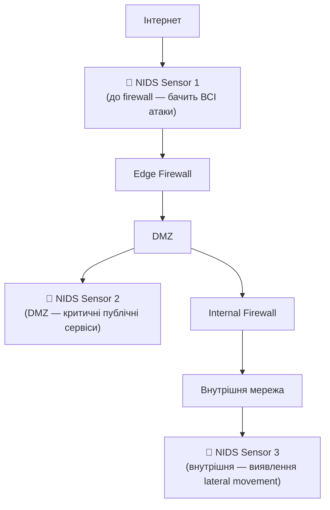

# 10.2. IDS/IPS: виявлення і запобігання вторгненням

Firewall вирішує питання «хто може підключитись». IDS/IPS вирішує наступне питання: «що відбувається всередині дозволеного трафіку». Зловмисник, що отримав легітимний доступ через відкритий порт 443, може приховувати SQL-ін'єкцію або C2-трафік усередині дозволеного HTTPS-з'єднання — і firewall це пропустить. IDS/IPS аналізує вміст трафіку на ознаки атаки незалежно від того, чи порт дозволений правилами firewall.

> 📖 Ключові терміни — у [глосарії модуля](00-glosariy.md).

## IDS vs IPS: фундаментальна різниця

```
IDS (Intrusion Detection System):
  Трафік → [Tap/Span Port — копія трафіку] → IDS аналізує → Alert
  Розташування: ПОЗА основним шляхом трафіку (passive)
  Дія: ВИЯВЛЯЄ і повідомляє, не блокує

IPS (Intrusion Prevention System):
  Трафік → [IPS у розриві мережі] → аналіз → Block/Allow → далі
  Розташування: В ОСНОВНОМУ шляху трафіку (inline)
  Дія: ЗАПОБІГАЄ — може заблокувати пакет в реальному часі
```

**Компроміс IPS:** false positive в IPS блокує легітимний трафік (доступність постраждала). False positive в IDS лише генерує зайвий alert (доступність не страждає). Тому IPS вимагає вищої впевненості у правилах перед deployment у блокуючому режимі.

## Методи виявлення

### Сигнатурне виявлення (Signature-Based)

Порівнює трафік із базою відомих патернів атак (аналогічно антивірусним сигнатурам).

```
Snort Rule приклад:
alert tcp any any -> $HOME_NET 80 (
  msg:"SQL Injection Attempt - UNION SELECT";
  content:"UNION"; nocase;
  content:"SELECT"; nocase; distance:0; within:50;
  sid:1000001; rev:1;
)
```

**Переваги:** дуже точне виявлення відомих атак, низький false positive rate для добре написаних сигнатур.

**Недоліки:** не виявляє нові (zero-day) атаки; потребує постійного оновлення бази сигнатур; обходиться через обфускацію/кодування payload.

### Аномальне виявлення (Anomaly-Based)

Будує базову модель «нормальної» поведінки мережі через машинне навчання, потім позначає відхилення.

```
Baseline (нормальна поведінка):
- Сервер X зазвичай отримує 50-100 запитів/хвилину
- Трафік переважно з внутрішньої мережі
- DNS-запити в середньому 60 байт

Аномалія:
- Сервер X отримав 5000 запитів за хвилину → можлива DDoS
- DNS-запит розміром 4000 байт → можливий DNS tunneling
- Нове з'єднання з країною, звідки ніколи не було трафіку
```

**Переваги:** може виявити zero-day і невідомі атаки за відхиленням від норми.

**Недоліки:** вищий false positive rate (легітимна, але незвична активність позначається); потребує періоду навчання («baseline period»); чутливий до зміни нормальної поведінки мережі (сезонність, нові сервіси).

### Гібридний підхід

Сучасні рішення (Suricata, комерційні NGIPS) комбінують обидва методи: сигнатури для відомих атак + поведінковий аналіз для аномалій + threat intelligence feeds для контексту репутації IP/доменів.

## NIDS vs HIDS

| Аспект | NIDS (Network) | HIDS (Host) |
|---|---|---|
| Розташування | На мережевому рівні (span port, tap) | На конкретному хості (агент) |
| Видимість | Весь мережевий трафік сегмента | Системні виклики, файли, процеси конкретного хоста |
| Виявляє | Сканування портів, exploit-спроби, DDoS | Зміна файлів, privilege escalation, malware на хості |
| Зашифрований трафік | Не бачить вміст без SSL inspection | Бачить дані ПІСЛЯ розшифрування на хості |
| Приклади | Snort, Suricata, Zeek | OSSEC, Wazuh, Tripwire |

**Доповнюваність, не альтернатива:** NIDS виявляє атаку на шляху до хоста; HIDS виявляє, що сталось ПІСЛЯ того, як трафік досяг хоста (включно з тим, що відбувається у зашифрованому трафіку, бо HIDS бачить розшифровані дані на самому хості).

## Snort: класичний сигнатурний IDS/IPS

**Snort** — найвідоміший відкритий IDS/IPS, створений у 1998 році (зараз під Cisco).

```bash
# Встановлення та базовий запуск Snort у режимі IDS
sudo apt install snort

# Тестування правил
snort -T -c /etc/snort/snort.conf

# Запуск у IDS-режимі (passive, alert only)
snort -A console -q -c /etc/snort/snort.conf -i eth0

# Запуск у IPS-режимі (inline, через NFQUEUE)
snort -Q --daq nfq -c /etc/snort/snort.conf
```

**Структура Snort-правила:**
```
дія протокол джерело_IP джерело_порт -> призначення_IP призначення_порт (опції)

alert tcp $EXTERNAL_NET any -> $HOME_NET 22 (
    msg:"SSH Brute Force Attempt";
    flow:to_server,established;
    detection_filter:track by_src, count 5, seconds 60;
    sid:1000010; rev:1;
)
```

## Suricata: сучасна альтернатива

**Suricata** — багатопотоковий IDS/IPS з кращою продуктивністю на багатоядерних системах і нативною підтримкою сучасних протоколів (HTTP/2, TLS 1.3).

```yaml
# suricata.yaml: базова конфігурація
af-packet:
  - interface: eth0
    threads: 4
    cluster-id: 99
    cluster-type: cluster_flow

# Правило Suricata (синтаксис схожий на Snort)
alert dns any any -> any any (
    msg:"Possible DNS Tunneling - Long Subdomain";
    dns.query;
    content:".tunnel.evil.com"; nocase;
    sid:2000001; rev:1;
)
```

```bash
# Запуск Suricata
suricata -c /etc/suricata/suricata.yaml -i eth0

# Аналіз eve.json логів (структуровані JSON-події)
tail -f /var/log/suricata/eve.json | jq 'select(.event_type=="alert")'
```

**Suricata vs Snort:**

| Аспект | Snort | Suricata |
|---|---|---|
| Багатопотоковість | Обмежена (Snort 3 покращив) | Нативна |
| Продуктивність на multi-core | Нижча | Вища |
| Підтримка протоколів | Широка | Ширша (HTTP/2, новіші TLS) |
| Формат логів | Власний / unified2 | EVE JSON (легше інтегрувати з SIEM) |
| Спільнота правил | Emerging Threats, Snort Community | Emerging Threats, ETOpen |

## Zeek (раніше Bro): аналіз на рівні протоколів

**Zeek** — не сигнатурний IDS у класичному сенсі, а потужний фреймворк для глибокого протокольного аналізу і генерації детальних логів усіх мережевих транзакцій.

```bash
# Zeek генерує структуровані логи для кожного протоколу
zeek -i eth0

# Типи логів:
# conn.log    — всі мережеві з'єднання
# dns.log     — всі DNS-запити
# http.log    — всі HTTP-транзакції
# ssl.log     — TLS handshake metadata
# files.log   — файли, передані через мережу

# Приклад аналізу: всі DNS-запити з незвичною довжиною
cat dns.log | zeek-cut query | awk '{print length, $0}' | sort -rn | head -20
```

Zeek часто використовується разом із Suricata: Suricata для виявлення відомих сигнатур атак, Zeek для глибокого розслідування і threat hunting через детальні логи.

## NIDS Placement: де розміщувати датчики



**Sensor 1 (поза firewall):** бачить усі спроби атак, включно з тими, що firewall заблокував — корисно для розуміння загального ландшафту загроз, але генерує багато «шуму» (постійні автоматизовані сканування інтернету).

**Sensor 2 (DMZ):** найкритичніше розміщення — публічні сервіси найчастіше атакуються.

**Sensor 3 (внутрішня мережа):** виявляє lateral movement після того, як периметр вже подолано — критично для виявлення APT, що вже всередині.

## Threat Intelligence Feeds

IDS/IPS значно ефективніший з актуальними даними репутації:

```bash
# Suricata: інтеграція з threat intel feeds (IP reputation)
# /etc/suricata/threshold.config

# Завантаження списків відомих C2-серверів, Tor exit nodes, malware IP
# Emerging Threats, AlienVault OTX, abuse.ch feeds

# Приклад автоматизованого оновлення через suricata-update
suricata-update update-sources
suricata-update enable-source et/open
suricata-update
```

## Чек-лист впровадження IDS/IPS

- [ ] Визначені критичні сегменти мережі для розміщення сенсорів.
- [ ] Початковий розгортання у IDS-режимі (passive) для калібрування перед переходом в IPS (blocking).
- [ ] Базова лінія («baseline») нормального трафіку зібрана перед увімкненням anomaly detection.
- [ ] Threat Intelligence feeds підключені і регулярно оновлюються.
- [ ] Alerts інтегровані в SIEM для кореляції з іншими джерелами.
- [ ] Процес тюнінгу false positives задокументований.
- [ ] Регулярний review правил/сигнатур (видалення застарілих, додавання нових).

## Міні-вправа

```bash
# Встановіть Suricata локально (Linux/WSL) у test-режимі

# 1. Завантажте тестовий PCAP з відомою атакою
# (наприклад, з github.com/SuricataExtreme/suricata-pcaps або власний)

# 2. Запустіть Suricata в офлайн-режимі проти PCAP
suricata -r test.pcap -c /etc/suricata/suricata.yaml -l ./output

# 3. Перегляньте знайдені alerts
cat ./output/eve.json | jq 'select(.event_type=="alert") | {time:.timestamp, signature:.alert.signature, severity:.alert.severity}'

# 4. Спробуйте написати власне правило для виявлення конкретного патерну
# (наприклад, HTTP-запит з підозрілим User-Agent)
```

## Джерела та додаткові матеріали

- Snort Documentation (snort.org/documents).
- Suricata User Guide (docs.suricata.io).
- Zeek Documentation (docs.zeek.org).
- Emerging Threats Rules (rules.emergingthreats.net).
- NIST SP 800-94 — Guide to Intrusion Detection and Prevention Systems.

---

**Попередній розділ:** [10.1. Firewalls](01-firewalls.md)
**Далі:** [10.3. VPN-технології](03-vpn-tekhnolohii.md)
**Назад до модуля:** [README модуля 10](README.md)
