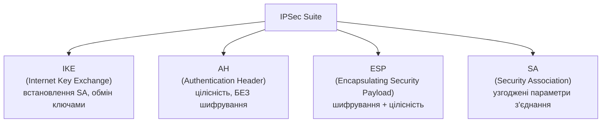
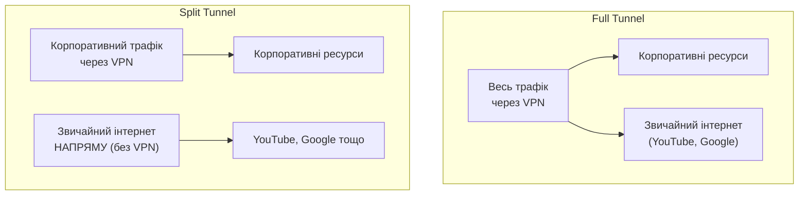
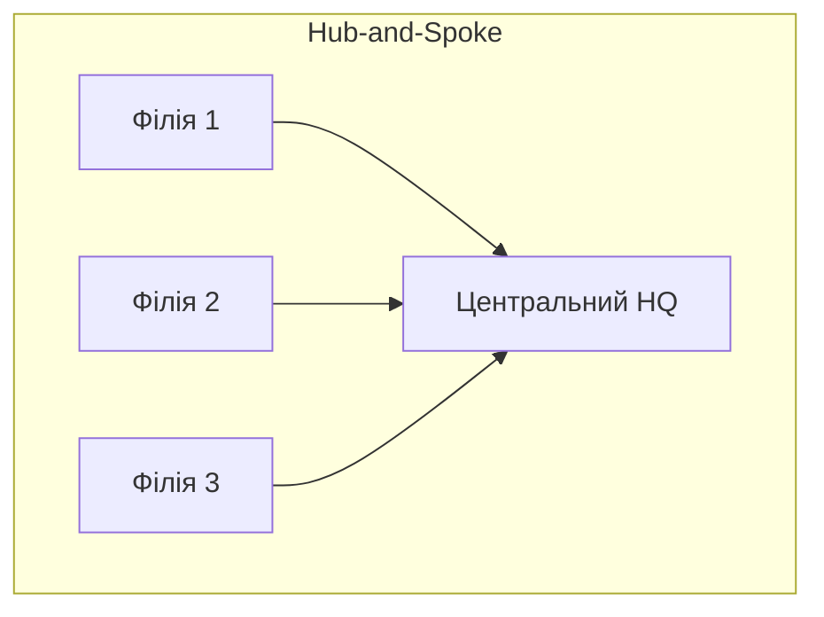
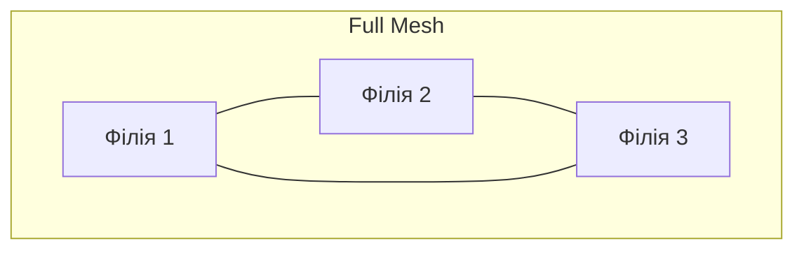

# 10.3. VPN-технології глибоко

Модуль 04 розглянув IPSec на рівні криптографічного протоколу — алгоритми шифрування, обмін ключами, режими роботи. Цей розділ дивиться на VPN з іншого боку: архітектурні рішення, чому WireGuard за 4000 рядків коду витіснив IPSec, який потребує 400 000+ рядків у Linux-ядрі, і як правильно проектувати VPN-інфраструктуру для організації — від split tunneling до always-on політик.

> 📖 Ключові терміни — у [глосарії модуля](00-glosariy.md).

## IPSec: архітектура глибше

**IPSec** — не один протокол, а фреймворк з кількох взаємодіючих компонентів:



**IKEv2 Negotiation (спрощено):**
```
Phase 1 (IKE_SA_INIT): встановлення захищеного каналу для подальших переговорів
  → Обмін DH public keys, nonce, узгодження алгоритмів (cipher suite)

Phase 2 (IKE_AUTH): автентифікація сторін + встановлення IPSec SA
  → Сертифікати, PSK, або EAP (для мобільних клієнтів)
  → Узгодження параметрів для трафіку даних (ESP/AH, шифри)
```

**AH vs ESP:**

| Аспект | AH | ESP |
|---|---|---|
| Шифрування | Ні | Так |
| Цілісність | Так | Так |
| Автентифікація | Так | Так |
| NAT-проходження | Проблематично (хеш включає IP-заголовок) | Працює (NAT-T) |
| Використання сьогодні | Рідко | Стандарт |

**Режими IPSec:**

```
Transport Mode (host-to-host):
  [IP Header] [ESP Header] [TCP/UDP+Data encrypted] [ESP Trailer]
  Оригінальний IP-заголовок зберігається — лише payload шифрується

Tunnel Mode (gateway-to-gateway, найпоширеніший для VPN):
  [New IP Header] [ESP Header] [Original IP+TCP/UDP+Data encrypted] [ESP Trailer]
  Весь оригінальний пакет (включно з IP-заголовком) інкапсулюється і шифрується
```

**Чому IPSec складний:** комбінація IKEv1/IKEv2, AH/ESP, Transport/Tunnel mode, десятки можливих cipher suites, NAT-Traversal як додатковий шар — створює величезну поверхню для помилок конфігурації і складність аудиту.

## WireGuard: модерна простота

**WireGuard** (2015, Jason Donenfeld) — спроектований з нуля з філософією мінімалізму: один cipher suite (без узгодження, без legacy-підтримки), весь код вміщується в ~4000 рядків (Linux IPSec-стек — сотні тисяч рядків).

```
WireGuard Cryptographic Choices (фіксовані, без negotiation):
- ChaCha20 для симетричного шифрування
- Poly1305 для автентифікації
- Curve25519 для ECDH
- BLAKE2s для хешування
- SipHash24 для хеш-таблиць

Філософія: "Cryptographic agility вважається АНТИ-патерном"
(на відміну від TLS/IPSec, де гнучкість cipher suite — джерело вразливостей
типу downgrade attacks)
```

**Конфігурація WireGuard:**

```ini
# Сервер: /etc/wireguard/wg0.conf
[Interface]
PrivateKey = <server_private_key>
Address = 10.0.0.1/24
ListenPort = 51820

[Peer]
# Клієнт 1
PublicKey = <client1_public_key>
AllowedIPs = 10.0.0.2/32

[Peer]
# Клієнт 2
PublicKey = <client2_public_key>
AllowedIPs = 10.0.0.3/32
```

```ini
# Клієнт: /etc/wireguard/wg0.conf
[Interface]
PrivateKey = <client_private_key>
Address = 10.0.0.2/32
DNS = 1.1.1.1

[Peer]
PublicKey = <server_public_key>
Endpoint = vpn.example.com:51820
AllowedIPs = 0.0.0.0/0      # Весь трафік через VPN (full tunnel)
PersistentKeepalive = 25     # Для роботи через NAT
```

```bash
# Запуск і управління
wg-quick up wg0
wg show              # Статус підключень
wg-quick down wg0

# Генерація ключової пари (Curve25519)
wg genkey | tee privatekey | wg pubkey > publickey
```

**WireGuard vs IPSec vs OpenVPN:**

| Аспект | WireGuard | IPSec/IKEv2 | OpenVPN |
|---|---|---|---|
| Розмір коду | ~4 000 рядків | ~400 000+ рядків | ~100 000 рядків |
| Швидкість | Найвища | Висока (apparatне прискорення) | Помірна |
| Криптографія | Фіксована (сучасна) | Гнучка (ризик слабких cipher) | Гнучка |
| Підтримка в ОС | Linux kernel (5.6+), всі основні | Вбудована в більшість ОС | Потрібен клієнт |
| NAT traversal | Нативно простий | Складніше (NAT-T) | Простий |
| Аудит безпеки | Формально верифікований | Численні CVE за роки | Залежить від реалізації |
| Мобільність (roaming) | Відмінна (без переустановлення) | Складніше | Помірна |

## SSL/TLS VPN

**SSL VPN** використовує TLS (як для HTTPS) для тунелювання — не потребує спеціального VPN-клієнта на рівні ОС, може працювати через браузер.

```
Два типи SSL VPN:

1. Clientless (Web-based):
   Браузер → HTTPS → SSL VPN Gateway → внутрішні веб-ресурси
   Обмежено: лише веб-застосунки, доступні через портал

2. Client-based (Full tunnel, наприклад Cisco AnyConnect, OpenVPN):
   VPN-клієнт встановлює tun/tap інтерфейс, весь IP-трафік тунелюється
   Функціонально аналогічно IPSec/WireGuard, але через TLS
```

**Переваги SSL VPN:** порт 443 рідко блокується фаєрволами (на відміну від специфічних VPN-портів), легше проходить через corporate proxy.

## Split Tunneling vs Full Tunneling



**Full Tunnel переваги:** весь трафік користувача проходить через корпоративний моніторинг і захист (DLP, web filtering); безпечніше для compliance.

**Full Tunnel недоліки:** вища навантаженість на VPN-інфраструктуру; повільніший доступ до загального інтернету (трафік робить «гак» через корпоративну мережу); конфіденційність — компанія бачить весь трафік користувача.

**Split Tunnel переваги:** менше навантаження, швидший доступ до non-corporate ресурсів.

**Split Tunnel недоліки:** компрометований домашній Wi-Fi може атакувати пристрій паралельно з VPN-з'єднанням (DNS rebinding, локальна мережа доступна одночасно з корпоративною); складніше застосовувати DLP-політики.

```bash
# WireGuard Split Tunneling: конкретні підмережі замість 0.0.0.0/0
AllowedIPs = 10.0.0.0/8, 172.16.0.0/12   # Лише корпоративні мережі
# Інтернет-трафік йде напряму, не через VPN
```

## Always-On VPN

**Always-On VPN** — VPN автоматично активується при підключенні пристрою до мережі і блокує весь не-VPN трафік до встановлення з'єднання.

```
Mobile Device Management конфігурація (iOS приклад):
- VPN On Demand: автоматичне підключення при певних умовах
- Block all traffic if VPN connection fails (kill switch)
- Per-app VPN: лише конкретні корпоративні застосунки через VPN
```

## VPN для масштабованих організацій

**Site-to-Site VPN** — постійне з'єднання між офісами/датацентрами:

```
Офіс А (10.1.0.0/16) ←─[IPSec Tunnel]─→ Офіс B (10.2.0.0/16)
                              │
                         AWS VPC (10.3.0.0/16)
                    (через AWS VPN Gateway, розділ 9.2)
```

**Hub-and-Spoke vs Mesh топологія:**





Hub-and-Spoke простіший в управлінні, але створює single point of failure і затримку для філія-філія трафіку (через HQ). Mesh складніший (N×(N-1)/2 з'єднань), але стійкіший і швидший для прямих з'єднань.

## VPN Vulnerabilities і Best Practices

**Поширені вразливості VPN-інфраструктури:**

```
🔴 Реальні CVE останніх років:
- Pulse Secure CVE-2019-11510: pre-auth arbitrary file read
- Fortinet FortiGate CVE-2018-13379: path traversal, credential theft
- Citrix NetScaler CVE-2019-19781: RCE без автентифікації

Урок: VPN-концентратори — критична зовнішня поверхня атаки.
Регулярне патчування VPN-пристроїв — пріоритет №1.
```

**Best Practices:**
- MFA обов'язкова для VPN-доступу (детально — модуль 05).
- Регулярне патчування VPN gateway (часто ціль для exploit).
- Логування і моніторинг VPN-сесій (незвичайний час, геолокація).
- Сертифікат-базована автентифікація замість лише PSK для site-to-site.
- Розгляд переходу на ZTNA (модуль 10.4) замість традиційного "повного доступу" VPN.

## Міні-вправа

```bash
# Розгорнути власний WireGuard сервер для тестування (Linux)
sudo apt install wireguard

# Згенерувати ключі
wg genkey | tee server_private.key | wg pubkey > server_public.key
wg genkey | tee client_private.key | wg pubkey > client_public.key

# Створити конфігурацію сервера (адаптуйте IP/інтерфейс)
sudo nano /etc/wireguard/wg0.conf

# Запустити і перевірити
sudo wg-quick up wg0
sudo wg show
```

Порівняйте швидкість підключення і latency WireGuard з будь-яким наявним IPSec/OpenVPN з'єднанням (якщо доступне).

## Джерела та додаткові матеріали

- WireGuard Whitepaper (wireguard.com/papers/wireguard.pdf).
- RFC 7296 — Internet Key Exchange Protocol Version 2 (IKEv2).
- NIST SP 800-77 Rev.1 — Guide to IPsec VPNs.
- OpenVPN Documentation (openvpn.net/community-resources).

---

**Попередній розділ:** [10.2. IDS/IPS](02-ids-ips.md)
**Далі:** [10.4. Сегментація мережі і Zero Trust Networking](04-segmentatsiia-merezhi.md)
**Назад до модуля:** [README модуля 10](README.md)
