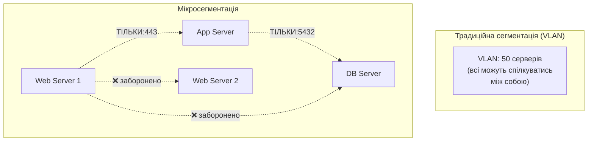
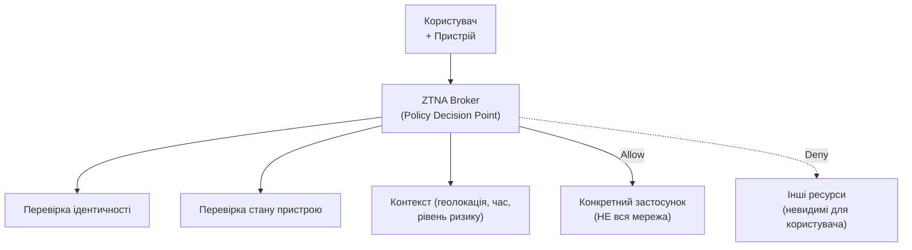
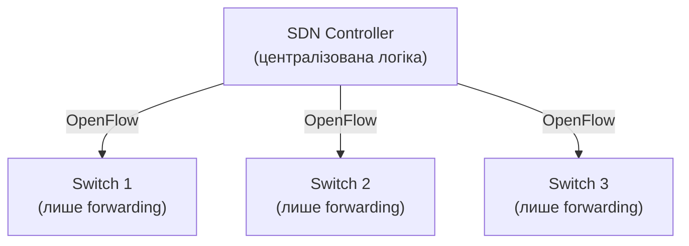
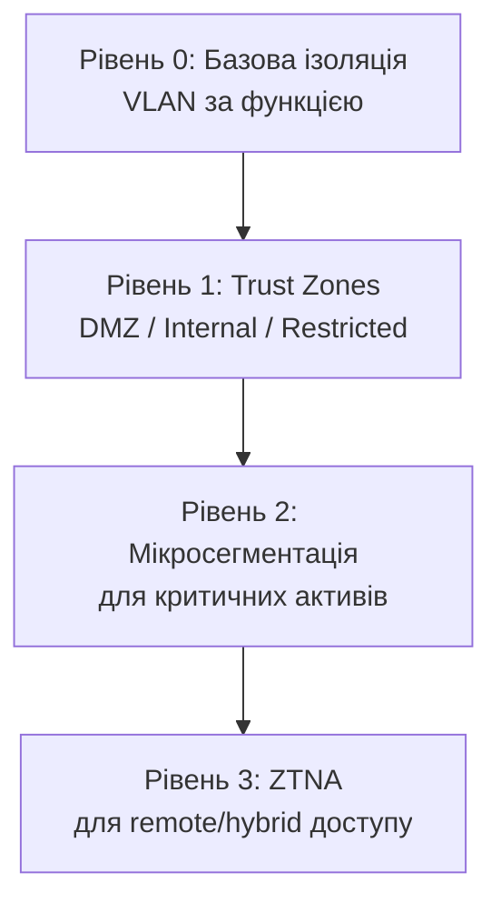

# 10.4. Сегментація мережі і Zero Trust Networking

NotPetya (2017) поширився мережею Maersk за лічені хвилини — не тому, що периметр компанії був слабким, а тому, що внутрішня мережа була плоскою: один скомпрометований хост міг безпосередньо «бачити» і атакувати тисячі інших. Збитки склали $300+ мільйонів. Сегментація мережі — найдешевший і водночас найбільш ігнорований контроль: розділити мережу так, щоб компрометація однієї частини не означала компрометацію всього.

> 📖 Ключові терміни — у [глосарії модуля](00-glosariy.md).

## VLAN: основа сегментації

**VLAN (Virtual LAN)** — логічний поділ фізичної мережі на ізольовані широкомовні домени на рівні комутатора (детально технічна реалізація розглянута в модулі 08 для IoT-контексту; тут — загальний принцип і стратегія для всієї організації).

```
Класична VLAN-стратегія для організації:

VLAN 10: Management   (мережеве обладнання, адмін-доступ)
VLAN 20: Servers       (внутрішні сервери, бази даних)
VLAN 30: Corporate     (робочі станції співробітників)
VLAN 40: Guest         (гостьовий Wi-Fi)
VLAN 50: IoT/OT        (IP-камери, принтери, промислові пристрої)
VLAN 60: DMZ           (публічно доступні сервіси)
VLAN 70: Voice         (VoIP-телефонія, QoS-пріоритет)
```

**Inter-VLAN Routing і контроль:**

```
VLAN A ←─[Router/L3 Switch з ACL]─→ VLAN B

Без ACL: VLAN-розділення лише ізолює broadcast domain,
         але маршрутизатор за замовчуванням пропускає весь трафік між VLAN

З ACL: явний контроль — які VLAN можуть спілкуватись, по яких портах
```

```cisco
! Cisco IOS: Access Control List для міжVLAN трафіку
ip access-list extended VLAN30-to-VLAN20
 permit tcp 192.168.30.0 0.0.0.255 192.168.20.0 0.0.0.255 eq 443
 permit tcp 192.168.30.0 0.0.0.255 192.168.20.0 0.0.0.255 eq 1433
 deny   ip 192.168.30.0 0.0.0.255 192.168.20.0 0.0.0.255 log
 permit ip any any

interface Vlan30
 ip access-group VLAN30-to-VLAN20 out
```

## Мікросегментація: за межами VLAN

**Мікросегментація** йде значно глибше за VLAN — ізоляція на рівні окремого хоста або навіть процесу, незалежно від мережевої топології.



**Чому мікросегментація важлива:** у плоскій VLAN-структурі, якщо зловмисник компрометує Web Server 1, він може безпосередньо атакувати Web Server 2, DB Server та все інше в тій самій VLAN. Мікросегментація обмежує комунікацію навіть між хостами в одному сегменті до явно дозволених патернів.

**Технології мікросегментації:**

```
Host-based Firewall Rules (найпростіший рівень):
- Windows Defender Firewall з GPO-керованими правилами
- iptables/nftables per-host policies

Software-Defined мікросегментація:
- VMware NSX: policy-based segmentation для віртуалізованих середовищ
- Illumio: agent-based, vendor-agnostic мікросегментація
- Cisco ACI: Application Centric Infrastructure

Kubernetes Network Policies (розділ 9.5):
- Мікросегментація на рівні Pod у контейнеризованих середовищах
```

```yaml
# Приклад декларативної мікросегментації (концептуально, схоже на NSX policy)
policy:
  name: "web-to-app-only"
  source: tag:web-tier
  destination: tag:app-tier
  action: allow
  ports: [8443]
---
policy:
  name: "deny-web-to-db-direct"
  source: tag:web-tier
  destination: tag:db-tier
  action: deny
```

## Zero Trust Network Access (ZTNA)

Модуль 05 (розділ 5.8) вже розглядав Zero Trust концептуально через призму ідентифікації. Тут — фокус на мережевій реалізації.



**ZTNA vs традиційний VPN (детальніше порівняння):**

| Аспект | Traditional VPN | ZTNA |
|---|---|---|
| Модель довіри | Один раз увійшов → довіра всій мережі | Кожен запит перевіряється окремо |
| Видимість мережі | Користувач "у мережі" (network-centric) | Користувач бачить лише дозволені застосунки (app-centric) |
| Lateral movement | Можливий (вся мережа доступна) | Заблокований (мережа невидима) |
| Масштабованість | Concentrator-bottleneck | Розподілена, cloud-native архітектура |
| User Experience | VPN-клієнт, повільніше | Часто прозоріше, швидше |

**SDP (Software-Defined Perimeter)** — архітектурна основа ZTNA, що базується на принципі "Default Deny" і "Need-to-know" доступі:

```
Традиційна модель: "Authenticate then Connect"
  (підключаєшся до мережі, потім перевіряється хто ти)

SDP/ZTNA модель: "Authenticate then Connect" → інвертовано:
  "Connect only if authenticated AND authorized for THIS specific resource"
  (мережа невидима, доки не пройдена повна перевірка для конкретного ресурсу)
```

## SDN: Software-Defined Networking

**SDN** відокремлює Control Plane (логіка прийняття рішень про маршрутизацію) від Data Plane (фактична передача пакетів) — дозволяє централізовано програмувати поведінку всієї мережі.



**Безпекові переваги SDN:**
- Централізована видимість і політика для всієї мережі.
- Динамічна мікросегментація (програмована, не статична конфігурація на кожному пристрої).
- Швидка ізоляція скомпрометованого сегмента через централізовану команду.

**Приклади:** VMware NSX, Cisco ACI, OpenDaylight (open-source).

## SD-WAN: безпека розподілених мереж

**SD-WAN (Software-Defined WAN)** оптимізує з'єднання між філіями і хмарою, часто інтегруючи функції безпеки безпосередньо в WAN-edge пристрої.

```
Традиційна WAN: Філія → MPLS → Центральний ЦОД → Інтернет
                (весь трафік "робить гак" через центр для перевірки безпеки)

SD-WAN: Філія → Локальний інтернет-вихід (з вбудованим SWG/Firewall)
                АБО маршрутизація через MPLS для критичного трафіку
                (intelligent path selection based on application + policy)
```

**SD-WAN + Security Service Edge = SASE** (детально розглянуто в модулі 05.8): об'єднання мережевої оптимізації з безпековими функціями (SWG, CASB, ZTNA, FWaaS) у єдину хмарну платформу.

## Практична стратегія сегментації для організації



**Поетапний план впровадження:**

1. **Інвентаризація:** що є в мережі, які потоки трафіку легітимні (детально модуль 08.9 для IoT-контексту).
2. **Базова VLAN-сегментація:** розділення за функцією (servers/users/IoT/guest).
3. **Trust Zones:** DMZ, Internal, Restricted (для PCI/HIPAA-критичних систем).
4. **Мікросегментація критичних активів:** бази даних, файлові сервери з конфіденційними даними.
5. **ZTNA для remote access:** заміна традиційного VPN там, де можливо.
6. **Безперервний моніторинг:** Flow logs, NIDS на ключових точках сегментації.

## Міні-вправа

Намалюйте (на папері або в Mermaid) сегментацію мережі для гіпотетичної організації з:
- 50 робочих станцій співробітників
- 5 внутрішніх серверів (файловий, БД, AD)
- 2 публічні вебзастосунки
- 10 IP-камер відеоспостереження
- Гостьовий Wi-Fi для відвідувачів

Визначте: скільки VLAN потрібно? Які правила міжVLAN-комунікації необхідні? Де потрібна мікросегментація?

## Джерела та додаткові матеріали

- NIST SP 800-207 — Zero Trust Architecture.
- Cloud Security Alliance, *Software-Defined Perimeter Specification*.
- VMware, *Micro-segmentation for Dummies*.
- Maersk NotPetya Case Study (численні публічні post-mortem аналізи).

---

**Попередній розділ:** [10.3. VPN-технології](03-vpn-tekhnolohii.md)
**Далі:** [10.5. NAC: контроль доступу до мережі](05-nac.md)
**Назад до модуля:** [README модуля 10](README.md)
