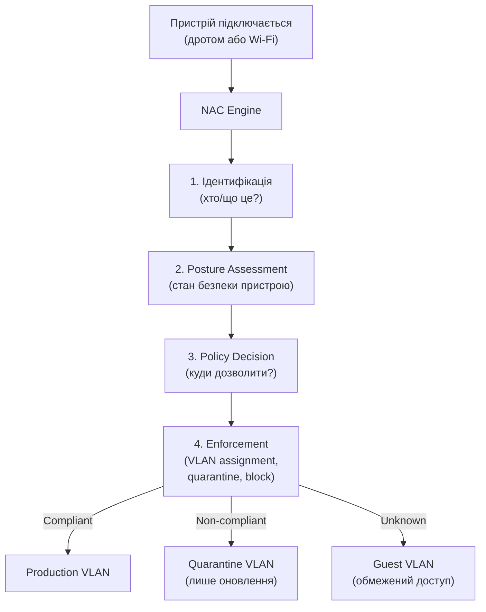
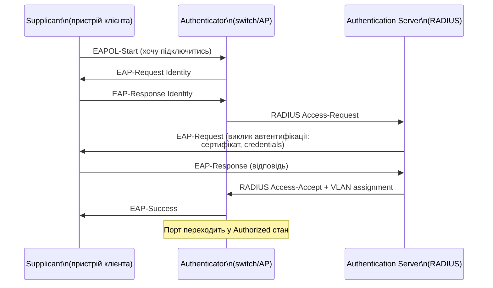
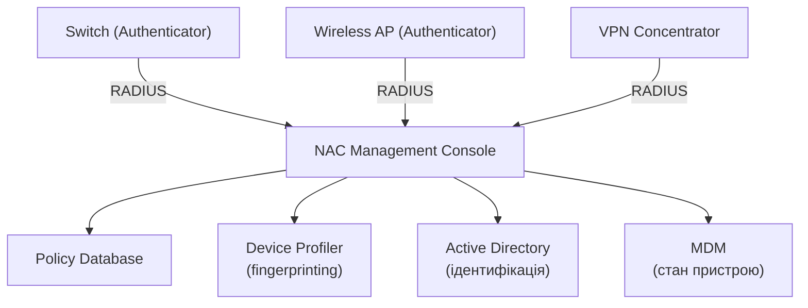
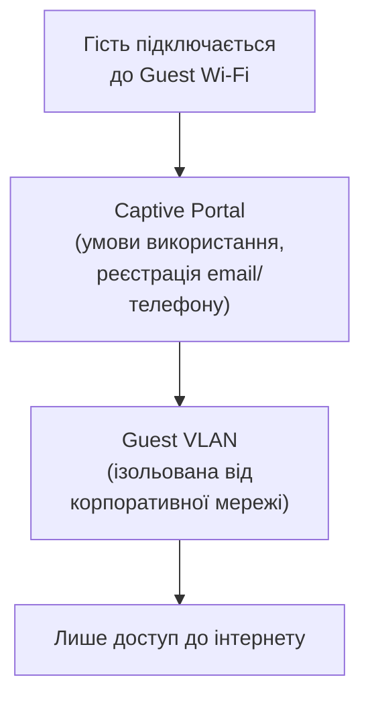

# 10.5. NAC: контроль доступу до мережі

Будь-хто, хто фізично під'єднав кабель до порту мережевого комутатора в неконтрольованій переговорній кімнаті, традиційно отримував доступ до внутрішньої мережі. Гість, контрактор з власним непідтримуваним ноутбуком, навіть зловмисник з соціально-інженерним приводом потрапити в офіс — усі вони могли просто увімкнутись у порт і опинитись «всередині». NAC (Network Access Control) вирішує саме цю проблему: мережевий доступ не повинен бути привілеєм фізичного підключення, а результатом перевірки.

> 📖 Ключові терміни — у [глосарії модуля](00-glosariy.md).

## Концепція NAC



## 802.1X: стандарт port-based автентифікації

**802.1X** — IEEE-стандарт автентифікації на рівні порту комутатора або точки доступу Wi-Fi, до отримання IP-адреси чи мережевого доступу.



**Три ролі 802.1X:**
- **Supplicant** — клієнтський пристрій, що хоче підключитись (вбудований клієнт в Windows/macOS/Linux).
- **Authenticator** — мережевий пристрій (switch, Wireless AP), що контролює доступ до порту.
- **Authentication Server** — зазвичай RADIUS-сервер, що перевіряє credentials.

**Конфігурація Cisco Switch для 802.1X:**

```cisco
! Глобальне увімкнення 802.1X
aaa new-model
aaa authentication dot1x default group radius
dot1x system-auth-control

! RADIUS сервер
radius server ISE-PRIMARY
 address ipv4 10.1.1.10 auth-port 1812 acct-port 1813
 key SharedSecretKey123

! Налаштування порту для 802.1X
interface GigabitEthernet1/0/5
 switchport mode access
 authentication port-control auto
 dot1x pae authenticator
 authentication order dot1x mab    ! Спочатку 802.1X, потім MAB як fallback
```

## MAB: MAC Authentication Bypass

Не всі пристрої підтримують 802.1X (принтери, IP-камери, старі IoT-пристрої). **MAB** дозволяє автентифікацію за MAC-адресою як fallback-механізм.

```
Послідовність: 802.1X спочатку → якщо немає відповіді (Supplicant не існує) → MAB fallback

Ризик MAB: MAC-адреса легко підробляється (MAC spoofing)
Мітигація: MAB-пристрої отримують суворіші мережеві політики
           (обмежений VLAN, додатковий моніторинг)
```

## RADIUS: основа автентифікаційної інфраструктури

**RADIUS (Remote Authentication Dial-In User Service)** — протокол централізованої автентифікації, авторизації і обліку (AAA), що використовується 802.1X, VPN, Wi-Fi.

```
RADIUS Components:
├── NAS (Network Access Server) — клієнт RADIUS (switch, AP, VPN concentrator)
├── RADIUS Server — перевіряє credentials (FreeRADIUS, Cisco ISE, Microsoft NPS)
└── User Database — AD, LDAP, локальна база, або сертифікати
```

```bash
# FreeRADIUS: базова конфігурація клієнта (NAS)
# /etc/freeradius/3.0/clients.conf
client switch_floor1 {
    ipaddr = 10.1.1.5
    secret = SharedSecretKey123
    shortname = sw-floor1
}

# Тестування RADIUS автентифікації
radtest username password localhost 0 testing123
```

**TACACS+ vs RADIUS:** TACACS+ (Cisco-orientований) розділяє Authentication, Authorization, Accounting на окремі процеси і шифрує весь пакет (не лише пароль як RADIUS); частіше використовується для адміністративного доступу до мережевого обладнання, тоді як RADIUS домінує для 802.1X/VPN/Wi-Fi.

## Posture Assessment: перевірка стану пристрою

NAC не обмежується автентифікацією користувача — перевіряється і стан самого пристрою перед наданням повного доступу.

```
Типові Posture Checks:
☐ Антивірус встановлений і оновлений
☐ ОС має актуальні security patches
☐ Firewall на хості увімкнений
☐ Диск зашифрований (BitLocker/FileVault)
☐ Пристрій є частиною домену / MDM-керований
☐ Заборонені застосунки (P2P, hacking tools) відсутні
☐ USB-порти контрольовані (DLP policy)
```

```
Результат Posture Assessment визначає рівень доступу:

✅ Fully Compliant → Production VLAN, повний доступ
⚠️  Partially Compliant → Remediation VLAN
    (доступ лише до Windows Update, antivirus update servers)
❌ Non-Compliant / Unknown → Quarantine VLAN
    (мінімальний доступ, captive portal з інструкціями)
```

## Архітектура NAC-рішень



**Провідні NAC-рішення:**
- **Cisco ISE (Identity Services Engine)** — enterprise-стандарт, глибока інтеграція з Cisco-обладнанням.
- **Aruba ClearPass** — кросвендорна альтернатива, сильна в multi-vendor середовищах.
- **ForeScout** — agentless підхід, сильний device profiling.
- **PacketFence** — відкритий код, безкоштовна альтернатива для SMB.

## Device Profiling: ідентифікація типу пристрою

Сучасний NAC автоматично визначає тип пристрою без явної реєстрації — через комбінацію сигналів:

```
Профілювання через:
- MAC OUI (перші 3 байти MAC = виробник)
- DHCP fingerprinting (опції DHCP-запиту специфічні для ОС)
- HTTP User-Agent (для пристроїв з веб-інтерфейсом)
- mDNS/Bonjour broadcasts (Apple-пристрої)
- SNMP (для мережевого обладнання, принтерів)
- Nmap-подібне активне сканування (опційно)

Результат: автоматична класифікація
  "Це HP LaserJet принтер" → IoT VLAN автоматично
  "Це Windows 11 laptop, домен-член" → Corporate VLAN
  "Невідомий пристрій, Android" → Guest VLAN з обмеженнями
```

## Guest Network: безпечний доступ для відвідувачів



```
Принципи безпечної Guest-мережі:

1. Повна ізоляція від Corporate VLAN (жодного inter-VLAN routing)
2. Client Isolation: гості не бачать один одного (захист від атак між гостями)
3. Bandwidth throttling (запобігання зловживанню)
4. Time-limited access (сесія закінчується через N годин)
5. Captive portal з прийняттям Acceptable Use Policy
6. Логування для юридичної відповідності (хто, коли, який трафік)
```

## Чек-лист впровадження NAC

- [ ] Інвентаризація всіх типів пристроїв у мережі (BYOD, IoT, корпоративні).
- [ ] 802.1X увімкнено на критичних портах (поетапно, не одночасно скрізь).
- [ ] MAB налаштовано як fallback для не-802.1X пристроїв з відповідними обмеженнями.
- [ ] Posture Assessment політики визначені для кожної категорії пристроїв.
- [ ] Guest Network повністю ізольована від внутрішньої мережі.
- [ ] Device Profiling налаштовано для автоматичної класифікації IoT.
- [ ] Quarantine VLAN з captive portal для non-compliant пристроїв.
- [ ] Моніторинг і алерти для незвичних спроб автентифікації (можливий атакуючий).

## Міні-вправа

Якщо у вас є доступ до керованого комутатора (навіть домашнього з підтримкою VLAN):

1. Перевірте чи підтримує ваш роутер/комутатор Guest Network з ізоляцією.
2. Якщо є можливість — увімкніть Client Isolation для Guest Wi-Fi.
3. Перевірте: чи можете ви, підключившись до Guest мережі, побачити інші пристрої в основній мережі (через `arp -a` або `nmap`)?

## Джерела та додаткові матеріали

- IEEE 802.1X-2020 Standard.
- RFC 2865/2866 — RADIUS Authentication and Accounting.
- Cisco ISE Documentation (cisco.com/go/ise).
- PacketFence (packetfence.org) — open-source NAC.
- NIST SP 800-153 — Guidelines for Securing WLAN.

---

**Попередній розділ:** [10.4. Сегментація мережі](04-segmentatsiia-merezhi.md)
**Далі:** [10.6. DNS-безпека](06-dns-bezpeka.md)
**Назад до модуля:** [README модуля 10](README.md)
