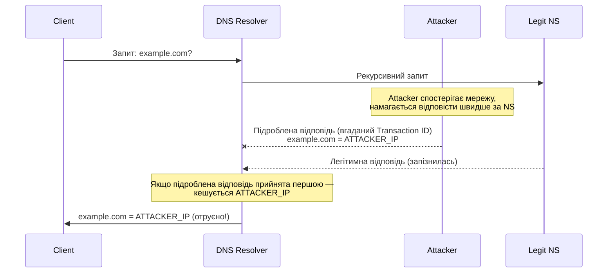
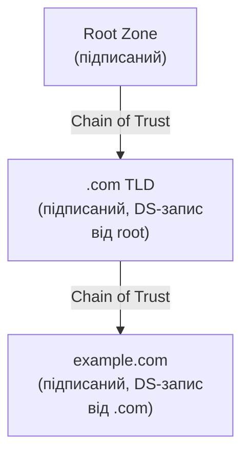
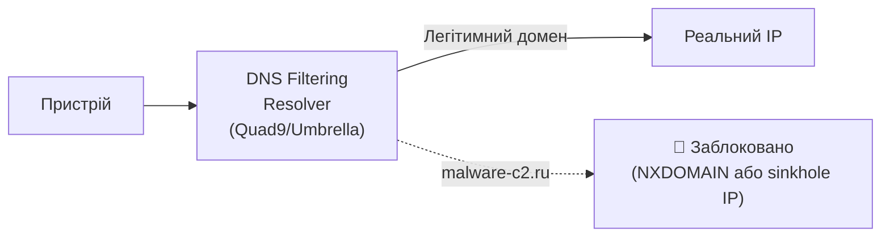

# 10.6. DNS-безпека

DNS — перший протокол, що бере участь практично у кожному мережевому з'єднанні, і водночас один з найменш захищених за замовчуванням. Оригінальна специфікація DNS (1983 рік) не мала жодного механізму перевірки автентичності відповіді — будь-хто, спроможний підробити UDP-пакет, міг скерувати жертву на шкідливий сервер. DNS також став улюбленим каналом ексфільтрації даних для зловмисників: трафік на порт 53 рідко перевіряється так ретельно, як HTTP чи HTTPS.

> 📖 Ключові терміни — у [глосарії модуля](00-glosariy.md).

## Чому DNS вразливий за дизайном

```
Оригінальний DNS-протокол (1983):
- UDP (без встановлення з'єднання, легко підробити джерело)
- Без автентифікації відповіді (будь-яка відповідь з правильним Transaction ID приймається)
- Без шифрування (весь запит/відповідь у відкритому вигляді)
- Transaction ID лише 16 біт (65536 можливих значень — підбірне за секунди)
```

## DNS Cache Poisoning / Spoofing

**DNS Cache Poisoning** — впровадження підробленого DNS-запису в кеш резолвера, перенаправляючи майбутні запити на IP зловмисника.



**Kaminsky Attack (2008)** — найвідоміша демонстрація DNS cache poisoning, що показала практичну можливість підбору Transaction ID за секунди через паралельні запити. Призвела до широкого впровадження Source Port Randomization як пом'якшення.

## DNSSEC: криптографічна автентифікація DNS

**DNSSEC (DNS Security Extensions)** додає цифрові підписи до DNS-записів, дозволяючи резолверу криптографічно перевірити автентичність відповіді.



**Ключові типи DNSSEC-записів:**

| Тип запису | Призначення |
|---|---|
| **RRSIG** | Цифровий підпис для набору записів |
| **DNSKEY** | Публічний ключ зони |
| **DS** | Delegation Signer — хеш DNSKEY дочірньої зони, підписаний батьківською |
| **NSEC/NSEC3** | Авторитетне підтвердження НЕІСНУВАННЯ запису (захист від заперечення) |

```bash
# Перевірка DNSSEC-статусу домену
dig +dnssec example.com

# Перевірка ланцюжка довіри
delv example.com  # Validating resolver tool

# Приклад відповіді з DNSSEC:
# example.com.  300  IN  A  93.184.216.34
# example.com.  300  IN  RRSIG  A 13 2 300 ... (підпис)
```

**Чому DNSSEC не повсюдний:** складність розгортання (управління ключами, ротація), продуктивність (більші відповіді, більше обчислень), і відсутність end-to-end переваги без DoH/DoT (DNSSEC захищає від підробки кешу резолвера, але не від прослуховування запиту користувач→резолвер).

## DoH і DoT: шифрування DNS-запитів

**DNS over HTTPS (DoH)** і **DNS over TLS (DoT)** вирішують іншу проблему: конфіденційність і цілісність запиту між клієнтом і резолвером (DNSSEC цього не робить).

```
DNS (традиційний): Клієнт --UDP:53, відкритий текст--> Резолвер
DoT: Клієнт --TLS:853, шифровано--> Резолвер
DoH: Клієнт --HTTPS:443, шифровано, виглядає як звичайний HTTPS--> Резолвер
```

| Аспект | DoT | DoH |
|---|---|---|
| Порт | 853 (легко блокується корпоративним firewall) | 443 (зливається зі звичайним HTTPS) |
| Видимість для IT | Легко ідентифікувати і блокувати/моніторити | Складно відрізнити від звичайного HTTPS-трафіку |
| Корпоративний контроль | Простіше зберегти DNS-фільтрацію | Складніше — браузери можуть обходити корпоративний DNS |

**Дилема DoH для підприємств:** браузери (Firefox, Chrome) можуть автоматично використовувати DoH до публічних резолверів (Cloudflare 1.1.1.1, Google 8.8.8.8), обходячи корпоративний DNS-фільтр і моніторинг. Підприємства часто змушені явно блокувати відомі DoH-ендпоінти або налаштовувати Group Policy для примусового використання корпоративного DNS.

```bash
# Тестування DoH запиту
curl -H 'accept: application/dns-json' \
  'https://cloudflare-dns.com/dns-query?name=example.com&type=A'

# Тестування DoT запиту
kdig -d @1.1.1.1 +tls example.com
```

## DNS Filtering: проактивний захист

**DNS Filtering** блокує доступ до шкідливих/небажаних доменів на рівні DNS-резолюції — пристрій ніколи не отримує IP шкідливого сервера, тому з'єднання неможливе.



**Категорії блокування:**
- Відомі C2-домени (з threat intelligence feeds).
- Фішингові домени.
- Malware-доставка.
- Опційно: контент-фільтрація (gambling, adult content) для compliance.

**Провідні DNS Filtering сервіси:**
- **Quad9 (9.9.9.9)** — безкоштовний, фокус на безпеці, без логування.
- **Cisco Umbrella** — enterprise, інтеграція з threat intelligence Cisco Talos.
- **Cloudflare for Teams / Gateway** — частина SASE-пропозиції Cloudflare.
- **NextDNS** — гнучкий, з детальною аналітикою для SMB/особистого використання.

```bash
# Швидке тестування: чи блокує ваш DNS відомий шкідливий домен
dig @9.9.9.9 malware-test-domain.com  # Quad9 заблокує відомі шкідливі домени
dig @8.8.8.8 malware-test-domain.com  # Google DNS не фільтрує за замовчуванням
```

## DNS Tunneling: прихований канал ексфільтрації

**DNS Tunneling** використовує DNS-запити для передачі даних, що не є DNS-трафіком — обходячи фаєрволи, що дозволяють DNS (порт 53) майже завжди.

```
Механізм:
1. Зловмисник контролює авторитетний NS для домену attacker-c2.com
2. Скомпрометований хост кодує дані у вигляді subdomain:
   base64(stolen_data_chunk).attacker-c2.com
3. DNS-запит проходить через корпоративний резолвер (виглядає як звичайний DNS)
4. Резолвер пересилає запит до авторитетного NS зловмисника
5. NS зловмисника отримує дані з subdomain, відповідає (можливо з командами для C2)

Приклад закодованого запиту:
dGhpcyBpcyBzdG9sZW4gZGF0YQ.attacker-c2.com
↑ base64-encoded chunk of exfiltrated data
```

**Ознаки DNS Tunneling для виявлення:**

```python
# Характерні патерни DNS tunneling:
indicators = {
    'long_subdomain': 'Незвично довгі subdomain (>50 символів)',
    'high_entropy': 'Високий рівень ентропії в subdomain (base64/hex виглядає випадково)',
    'unusual_record_types': 'Часті TXT/NULL запити (більше пропускної здатності на запит)',
    'high_query_volume': 'Аномально велика кількість запитів до одного домену',
    'consistent_query_size': 'Запити близькі до максимального розміру (255 байт label)',
}
```

```bash
# Suricata-правило для виявлення потенційного DNS tunneling
alert dns any any -> any any (
    msg:"Possible DNS Tunneling - High Entropy Subdomain";
    dns.query;
    pcre:"/^[a-zA-Z0-9+\/=]{50,}\./";
    threshold: type threshold, track by_src, count 20, seconds 60;
    sid:2000002; rev:1;
)
```

**Інструменти DNS tunneling (для розуміння загрози, не для зловживання):** iodine, dnscat2 — використовуються як легітимними penetration testers, так і зловмисниками.

## Чек-лист DNS-безпеки

- [ ] DNSSEC увімкнено для власних доменів (якщо керуєте DNS-зоною).
- [ ] DNS Filtering сервіс впроваджено для всієї організації (Quad9/Umbrella/NextDNS).
- [ ] DoH від невідомих/неконтрольованих резолверів заблоковано на рівні firewall (де неможливо force corporate DNS).
- [ ] Моніторинг на ознаки DNS tunneling (обсяг запитів, ентропія, рідкісні типи записів).
- [ ] Логування DNS-запитів централізоване (для forensics і threat hunting).
- [ ] Внутрішній DNS-сервер не доступний з інтернету (запобігання DNS amplification atak).
- [ ] Split-horizon DNS для розділення внутрішніх і зовнішніх записів.

## Міні-вправа

```bash
# 1. Перевірити чи ваш поточний DNS підтримує DNSSEC validation
dig +dnssec cloudflare.com | grep "ad;"  # "ad" flag = Authenticated Data

# 2. Порівняти швидкість і фільтрацію різних DNS-резолверів
for dns in 8.8.8.8 1.1.1.1 9.9.9.9; do
  echo "=== $dns ==="
  time dig @$dns example.com +short
done

# 3. Перевірити чи DoH активний у вашому браузері
# Firefox: about:preferences#general → Network Settings → DNS over HTTPS
# Chrome: chrome://settings/security → Use secure DNS
```

## Джерела та додаткові матеріали

- RFC 4033-4035 — DNS Security Extensions (DNSSEC).
- RFC 8484 — DNS Queries over HTTPS (DoH).
- RFC 7858 — DNS over Transport Layer Security (DoT).
- Quad9 (quad9.net) — безкоштовний фільтруючий резолвер.
- Cisco Talos, *DNS Tunneling Detection Techniques*.

---

**Попередній розділ:** [10.5. NAC](05-nac.md)
**Далі:** [10.7. Проксі та Secure Web Gateway](07-proxy-swg.md)
**Назад до модуля:** [README модуля 10](README.md)
