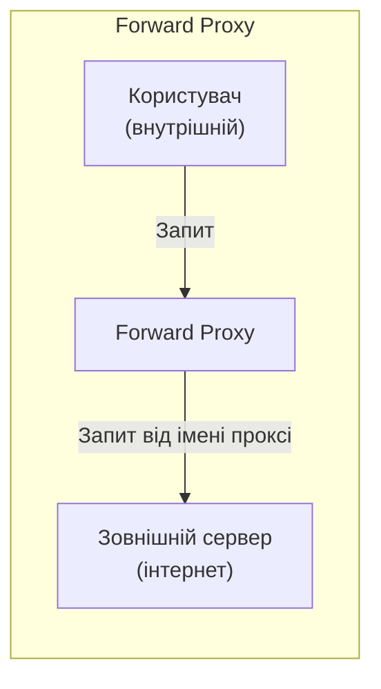
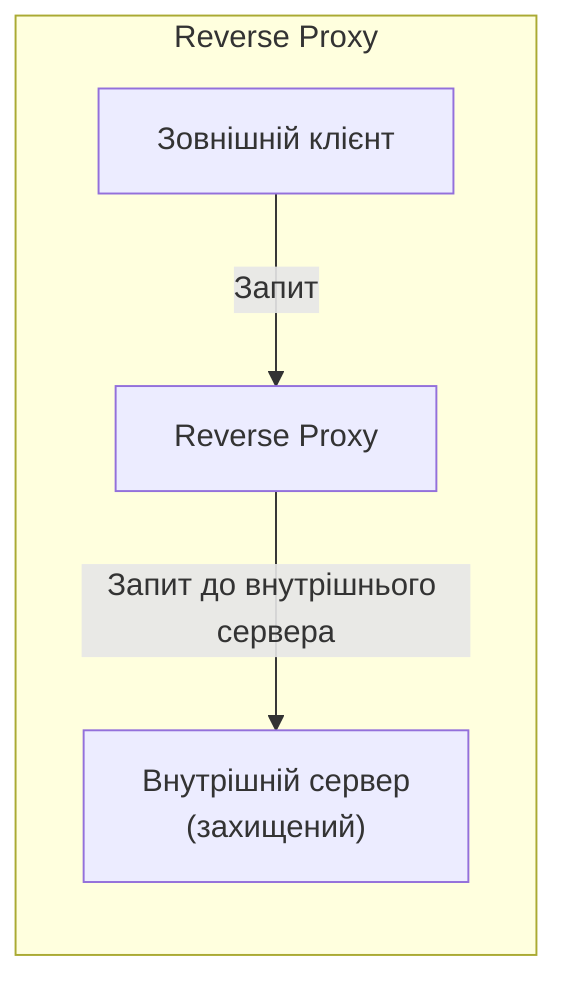
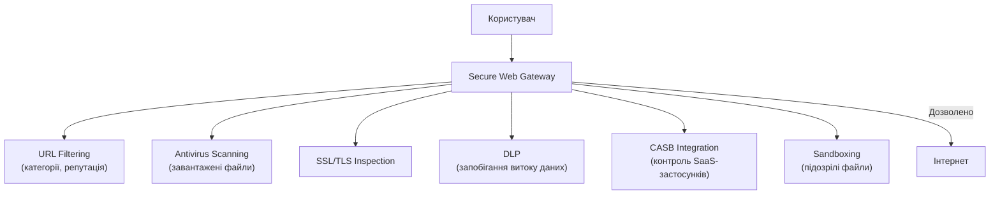
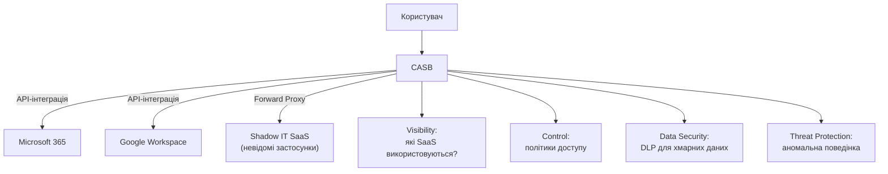
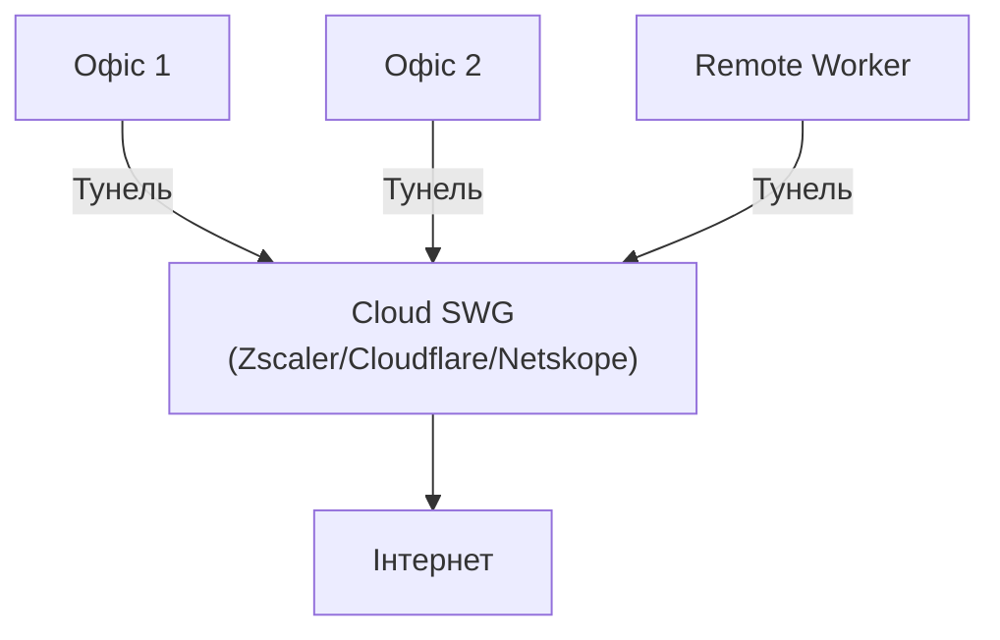

# 10.7. Проксі та Secure Web Gateway

Кожен запит співробітника до інтернету — потенційна точка ризику: завантаження шкідливого файлу, перехід на фішинговий сайт, ексфільтрація даних через хмарне сховище. Проксі-сервер дає організації архітектурну можливість бути «посередником» у кожному такому запиті — точкою, де можна інспектувати, фільтрувати і контролювати трафік до того, як він покине або увійде в мережу.

> 📖 Ключові терміни — у [глосарії модуля](00-glosariy.md).

## Forward Proxy vs Reverse Proxy





**Forward Proxy** — діє від імені внутрішніх клієнтів, що звертаються до зовнішніх ресурсів. Зовнішній сервер бачить лише IP проксі, не клієнта.

**Reverse Proxy** — діє від імені внутрішніх серверів, приймаючи зовнішні запити. Клієнт бачить лише IP проксі, не реальний сервер. (NGINX, Cloudflare, Load Balancers — типові reverse proxy).

| Аспект | Forward Proxy | Reverse Proxy |
|---|---|---|
| Захищає | Клієнтів (приховує їх від інтернету) | Сервери (приховує їх від інтернету) |
| Типове застосування | Корпоративний веб-фільтр | Web Application Firewall, Load Balancer |
| Хто конфігурує клієнт | Так (явно вказує проксі) | Ні (прозоро для клієнта) |

## Secure Web Gateway (SWG)

**SWG** — спеціалізований forward proxy з повним набором функцій безпеки веб-трафіку.



**URL Filtering за категоріями:**

```
Типові категорії блокування/моніторингу:
🔴 Заблоковано завжди: malware, phishing, botnet C2
🟠 Заблоковано за політикою: gambling, adult content, P2P/torrent
🟡 Моніторинг: social media (дозволено, але логується)
🟢 Без обмежень: бізнес-категорії (новини, документація, SaaS)
```

```python
# Концептуальний приклад логіки URL Filtering
def check_url_policy(url: str, user_group: str) -> str:
    domain = extract_domain(url)
    category = threat_intel_lookup(domain)  # malware, gambling, business, etc.

    if category in BLOCKED_CATEGORIES['always']:
        return 'BLOCK'
    if category in BLOCKED_CATEGORIES.get(user_group, []):
        return 'BLOCK'
    if category in MONITORED_CATEGORIES:
        log_access(url, user_group)
        return 'ALLOW_LOGGED'
    return 'ALLOW'
```

## Explicit vs Transparent Proxy

```
Explicit Proxy:
  Клієнт ЗНАЄ про проксі і явно надсилає запити через нього
  (налаштування в браузері/ОС: proxy server IP:port)
  + Простіша автентифікація користувача
  - Потребує конфігурації кожного пристрою (або через GPO/MDM)

Transparent Proxy:
  Клієнт НЕ знає про проксі — трафік перехоплюється мережею прозоро
  (через policy-based routing на firewall/router)
  + Не потребує конфігурації клієнта
  - Складніша автентифікація користувача (потрібна інтеграція з NAC/IP-to-user mapping)
```

```bash
# PAC файл (Proxy Auto-Configuration) для explicit proxy
function FindProxyForURL(url, host) {
    if (isInNet(host, "10.0.0.0", "255.0.0.0")) {
        return "DIRECT";  // Внутрішні ресурси — напряму
    }
    if (shExpMatch(host, "*.microsoft.com")) {
        return "DIRECT";  // Виключення для O365 (продуктивність)
    }
    return "PROXY swg.company.com:8080; DIRECT";  // Решта через SWG
}
```

## SSL/TLS Inspection у SWG-контексті

Детально механізм SSL Inspection розглянуто в розділі 10.1 (NGFW); у SWG-контексті — та сама технологія, але застосована конкретно до веб-трафіку для глибокої HTTP-інспекції контенту, антивірусного сканування завантажень, DLP-аналізу вихідних даних.

```
Без SSL Inspection: SWG бачить лише
  - Domain name (через SNI у TLS ClientHello)
  - Розмір трафіку
  → URL Filtering за доменом можливий, але вміст сторінки невидимий

З SSL Inspection: SWG бачить
  - Повний URL (включно з параметрами запиту)
  - Тіло запиту/відповіді (DLP-аналіз можливий)
  - Завантажені файли (антивірусне сканування)
```

## CASB: Cloud Access Security Broker

**CASB** розширює функціональність SWG на хмарні SaaS-застосунки — видимість і контроль того, як співробітники використовують Office 365, Google Workspace, Dropbox, Slack тощо.



**Чотири «стовпи» CASB (Gartner):**
1. **Visibility** — виявлення Shadow IT (невідомих SaaS-застосунків, що використовують співробітники без відома IT).
2. **Compliance** — забезпечення дотримання регуляторних вимог для хмарних даних.
3. **Data Security** — DLP для хмарних сховищ, контроль sharing-налаштувань.
4. **Threat Protection** — виявлення компрометованих облікових записів, аномальної активності.

```
Приклад CASB Policy:
"Заборонити завантаження файлів з тегом 'Confidential'
 на персональний Google Drive (не корпоративний Google Workspace),
 дозволити на корпоративний OneDrive з DLP-скануванням"
```

## Інспекція TLS і Certificate Pinning: обмеження

```
Проблема для SWG SSL Inspection:
Деякі застосунки/API використовують Certificate Pinning
(детально розглянуто в модулі 08.3 для мобільних застосунків)
→ Якщо застосунок очікує конкретний сертифікат сервера,
  а SWG підміняє його власним (для inspection) —
  застосунок ВІДМОВЛЯЄТЬСЯ працювати (connection failed)

Рішення:
- Bypass-список для відомих pinned-застосунків (Dropbox, банківські API)
- Категорійні винятки (фінансові, медичні сайти — з юридичних причин)
```

## Архітектура: Cloud-delivered SWG (частина SASE)

Традиційний SWG вимагав фізичного або віртуального пристрою в кожному офісі. Сучасний підхід (детально SASE розглянуто в модулі 05.8) переносить SWG у хмару:



**Переваги Cloud SWG:** єдина політика незалежно від локації (офіс/remote/мобільний), не потребує бекхолінгу трафіку через центральний ЦОД (детально SD-WAN розглянуто в розділі 10.4), глобальне покриття точок присутності для низької латентності.

## Чек-лист впровадження Proxy/SWG

- [ ] URL Filtering налаштовано з категоріями, релевантними організації.
- [ ] SSL Inspection увімкнено з відповідним повідомленням співробітників (юридична/етична вимога).
- [ ] Виключення для банківських/медичних сайтів задокументовані.
- [ ] Антивірусне сканування завантажуваних файлів активне.
- [ ] DLP-політики налаштовані для запобігання витоку даних.
- [ ] CASB інтегрований для видимості Shadow IT.
- [ ] Логи проксі централізовані для SIEM-кореляції.
- [ ] Регулярний перегляд заблокованих/дозволених категорій (актуальність політики).

## Міні-вправа

```bash
# Перевірити чи ваш браузер використовує проксі
# Chrome: chrome://net-internals/#proxy
# Firefox: about:preferences#general → Network Settings

# Перевірити PAC-файл (якщо використовується)
curl -s http://your-pac-server/proxy.pac

# Тестування доступу через явний проксі
curl -x http://proxy.company.com:8080 https://example.com -v
```

## Джерела та додаткові матеріали

- Gartner, *Magic Quadrant for Secure Web Gateways*.
- Gartner, *Magic Quadrant for Cloud Access Security Brokers*.
- NIST SP 800-95 — Guide to Secure Web Services.
- Cloudflare, *What is a Forward Proxy?* (cloudflare.com/learning).

---

**Попередній розділ:** [10.6. DNS-безпека](06-dns-bezpeka.md)
**Далі:** [10.8. Безпека бездротових мереж](08-bezdrotovi-merezhi.md)
**Назад до модуля:** [README модуля 10](README.md)
