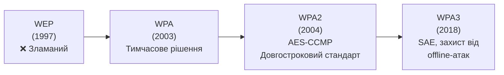
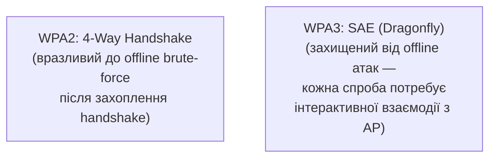
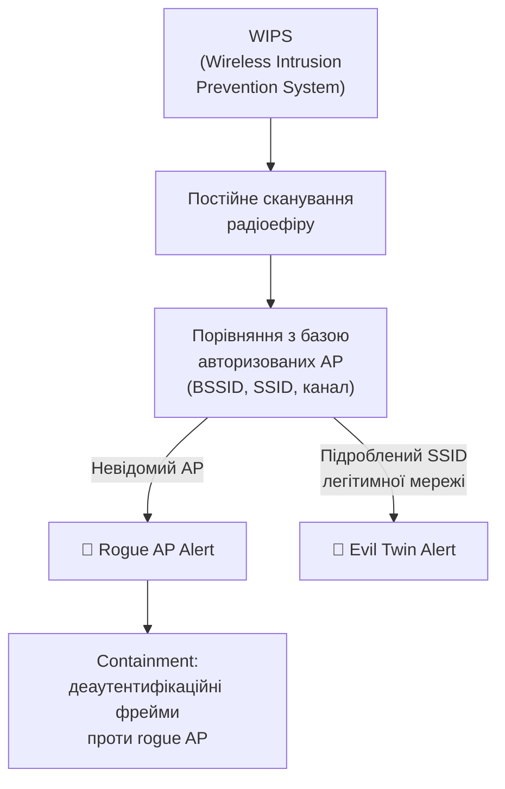

# 10.8. Безпека бездротових мереж

Wi-Fi — єдина частина корпоративної мережі, що навмисно «витікає» за фізичні межі будівлі: сигнал точки доступу досягає паркінгу, сусіднього офісу, вулиці під вікнами. Це фундаментальна архітектурна різниця з дротовою мережею, де для підключення потрібен фізичний доступ до порту. Безпека Wi-Fi компенсує цю відкритість криптографічними механізмами — і історія WEP, WPA, WPA2, WPA3 — це історія постійного «доганяння» зловмисників, що знаходили способи обійти кожне попереднє покоління захисту.

> 📖 Ключові терміни — у [глосарії модуля](00-glosariy.md).

## Еволюція Wi-Fi безпеки



### WEP: чому зламаний назавжди

**WEP (Wired Equivalent Privacy)** використовував RC4 з 24-бітним IV (Initialization Vector) — занадто малим простором значень, що неминуче повторюється при достатньому обсязі трафіку.

```
Проблема WEP:
- IV лише 24 біти = 16 мільйонів можливих значень
- При активній мережі IV повторюється протягом годин
- Повторення IV дозволяє статистичний криптоаналіз (FMS attack, 2001)
- Сучасні інструменти (aircrack-ng) зламують WEP за хвилини

WEP більше не повинен використовуватись НІКОЛИ, незалежно від довжини ключа.
```

### WPA: перехідний пластир

**WPA (Wi-Fi Protected Access)** запроваджено як швидке тимчасове рішення (2003) до завершення розробки повного стандарту 802.11i. Використовував TKIP (Temporal Key Integrity Protocol) поверх існуючого WEP-обладнання через оновлення прошивки.

**TKIP вразливості:** Michael MIC attack (2008) дозволяв обмежену ін'єкцію пакетів; TKIP офіційно застарілий і не повинен використовуватись.

### WPA2: довгостроковий стандарт (з застереженнями)

**WPA2** запровадив CCMP (Counter Mode CBC-MAC Protocol) на основі AES — криптографічно надійний симетричний шифр.

```
WPA2-Personal (PSK):
  Спільний пароль для всіх пристроїв мережі
  Слабкість: офлайн-атака на 4-way handshake (захоплений через деаутентифікацію)
            дозволяє брутфорс пароля поза мережею

WPA2-Enterprise (802.1X):
  Індивідуальна автентифікація через RADIUS (детально розділ 10.5)
  Кожен користувач має власні credentials/сертифікат
  Значно безпечніший для організацій
```

**KRACK Attack (2017)** — критична вразливість у самому протоколі WPA2 (не в реалізації), що дозволяла Key Reinstallation через маніпуляцію 4-way handshake. Вплинула практично на всі WPA2-пристрої до патчування.

### WPA3: сучасний стандарт

**WPA3** (2018) вирішує фундаментальні проблеми WPA2-Personal через **SAE (Simultaneous Authentication of Equals)** — заміну PSK-методу.



**Ключові покращення WPA3:**

| Функція | Призначення |
|---|---|
| **SAE** | Замінює PSK; захищає від offline dictionary/brute-force атак |
| **Forward Secrecy** | Компрометація поточного пароля не розкриває минулий трафік |
| **192-bit Security Suite** | Для WPA3-Enterprise, відповідність CNSA (державний/військовий рівень) |
| **Wi-Fi Easy Connect** | Спрощене безпечне підключення IoT-пристроїв без екрану (QR-код) |
| **Protected Management Frames (PMF)** | Обов'язкові в WPA3, захист від деаутентифікаційних атак |

```bash
# Перевірка підтримки WPA3 на Linux
iw list | grep -A 10 "Supported Ciphers"

# Конфігурація hostapd для WPA3-Personal (SAE)
# /etc/hostapd/hostapd.conf
wpa=2
wpa_key_mgmt=SAE
rsn_pairwise=CCMP
ieee80211w=2  # Обов'язкові Protected Management Frames
sae_password=YourStrongPassphrase
```

## Rogue Access Point Detection

**Rogue AP** — несанкціонована точка доступу в мережі: або зловмисна (Evil Twin, детально модуль 08.2), або легітимний співробітник, що підключив домашній роутер для «кращого сигналу» без відома IT (теж серйозний ризик — обходить корпоративні security policies).



**WIPS (Wireless Intrusion Prevention System)** — спеціалізовані датчики (часто вбудовані в enterprise AP), що безперервно сканують радіоефір і виявляють:
- Несанкціоновані точки доступу (Rogue AP).
- Підроблені SSID, що імітують легітимну мережу (Evil Twin, KARMA attacks).
- Атаки деаутентифікації (DoS проти легітимних клієнтів).
- Bluetooth-пристрої поза політикою.

```bash
# Базове виявлення rogue AP через airodump-ng (для авторизованого аудиту власної мережі)
airmon-ng start wlan0
airodump-ng wlan0mon

# Порівняти BSSID/SSID з відомим списком авторизованих точок доступу
# Будь-який невідомий AP з SSID вашої організації = потенційний Evil Twin
```

## Enterprise Wi-Fi: 802.1X для бездротового доступу

Детально 802.1X розглянуто в розділі 10.5 (NAC); для Wi-Fi специфічно:

```
EAP-методи для WPA2/3-Enterprise:

EAP-TLS:
  Сертифікат на клієнті ТА сервері — найбезпечніший, складніший у розгортанні
  
PEAP (Protected EAP):
  TLS-тунель + внутрішня автентифікація (зазвичай MSCHAPv2 з паролем)
  Простіший у розгортанні (лише сертифікат сервера потрібен)

EAP-TTLS:
  Аналогічно PEAP, гнучкіший вибір внутрішнього методу автентифікації
```

```
Рекомендація для організацій:
- EAP-TLS для пристроїв з MDM (сертифікати розгортаються автоматично)
- PEAP-MSCHAPv2 для BYOD без MDM (простіше для користувача — username/password)
```

## Bluetooth-безпека

Bluetooth — ще один бездротовий вектор, що часто ігнорується в корпоративній безпеці.

```
Відомі Bluetooth-атаки:

BlueBorne (2017): набір вразливостей, що дозволяли RCE
  без жодної взаємодії користувача (zero-click) через Bluetooth stack

BlueSnarfing: несанкціонований доступ до даних пристрою
  через Bluetooth (контакти, повідомлення) при незахищеному з'єднанні

BlueJacking: надсилання небажаних повідомлень через Bluetooth
  (менш небезпечний, переважно спам/непокоєння)

KNOB Attack (2019): примусове зниження ентропії ключа шифрування
  Bluetooth з'єднання, полегшуючи брутфорс
```

**Захист:**
```
☐ Bluetooth вимкнений, коли не використовується
☐ Пристрій НЕ у режимі "Discoverable" за замовчуванням
☐ Pairing лише в довірених, контрольованих умовах (не публічних місцях)
☐ Регулярне оновлення прошивки (патчі для BlueBorne-подібних вразливостей)
☐ Корпоративна політика: заборона невідомих Bluetooth-периферії (BadUSB-подібний ризик)
```

## Wi-Fi для гостей і BYOD у контексті бездротової безпеки

Детально NAC-аспект розглянуто в розділі 10.5; специфічно для Wi-Fi:

```
Багатий SSID-дизайн для організації:

SSID: "Company-Corp"     → WPA3-Enterprise, повний доступ через VLAN 30
SSID: "Company-Guest"    → Captive portal, ізольований VLAN 40, лише інтернет
SSID: "Company-IoT"      → WPA2/3-Personal з унікальним паролем, VLAN 50

Кожен SSID мапиться на окремий VLAN (детально розділ 10.4) з відповідними
правилами міжмережевого доступу.
```

## Чек-лист бездротової безпеки

- [ ] WEP і WPA (TKIP) повністю виключені з мережі.
- [ ] WPA3 (або мінімум WPA2-AES) для всіх корпоративних SSID.
- [ ] WPA3-Enterprise/802.1X для корпоративного доступу (не Personal/PSK для організацій).
- [ ] Protected Management Frames (PMF) увімкнено.
- [ ] WIPS розгорнуто для виявлення Rogue AP/Evil Twin.
- [ ] Гостьова мережа повністю ізольована (детально розділ 10.5).
- [ ] Bluetooth-політика задокументована і застосовується через MDM.
- [ ] Регулярний бездротовий аудит (wireless site survey) для виявлення rogue-пристроїв.

## Міні-вправа

```bash
# Перевірити захист поточної Wi-Fi мережі (Linux)
iwconfig wlan0  # або iw dev wlan0 link
nmcli dev wifi list  # Перегляд видимих мереж і їх типу безпеки

# Перевірити чи увімкнено PMF (Protected Management Frames)
iw dev wlan0 link

# macOS: System Preferences → Wi-Fi → деталі підключеної мережі
# Windows: netsh wlan show interfaces
```

Перевірте: яким стандартом захищена ваша поточна мережа (WPA2 чи WPA3)? Чи увімкнено PMF?

## Джерела та додаткові матеріали

- IEEE 802.11i-2004 — оригінальна специфікація WPA2.
- Wi-Fi Alliance, *WPA3 Specification* (wi-fi.org).
- KRACK Attack details (krackattacks.com).
- NIST SP 800-153 — Guidelines for Securing Wireless Local Area Networks.
- Aircrack-ng documentation (для авторизованого аудиту власних мереж).

---

**Попередній розділ:** [10.7. Проксі та SWG](07-proxy-swg.md)
**Далі:** [10.9. Моніторинг мережі та аналіз трафіку](09-monitorynh-merezhi.md)
**Назад до модуля:** [README модуля 10](README.md)
