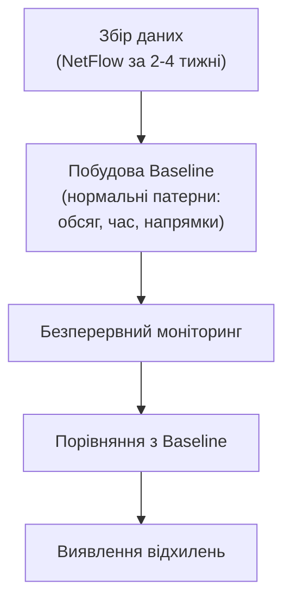

# 10.9. Моніторинг мережі та аналіз трафіку

Жоден з інструментів попередніх розділів — firewall, IDS/IPS, NAC — не дає повної картини без здатності побачити, що насправді відбувається в мережі. Моніторинг мережевого трафіку — це різниця між «ми думаємо, що мережа в порядку» і «ми знаємо, що відбувається прямо зараз». Для аналітика SOC уміння читати NetFlow-дані і пакетні захоплення — базова навичка, без якої неможливо ні виявити інцидент, ні розслідувати його після факту.

> 📖 Ключові терміни — у [глосарії модуля](00-glosariy.md).

## NetFlow / IPFIX: метадані без вмісту

**NetFlow** (Cisco) і його стандартизований наступник **IPFIX** записують метадані про мережеві потоки — без захоплення повного вмісту пакетів, що робить його значно масштабованішим за повний packet capture.

```
NetFlow Record містить:
├── Source/Destination IP
├── Source/Destination Port
├── Protocol (TCP/UDP/ICMP)
├── Кількість пакетів і байтів
├── Timestamp початку/кінця потоку
└── TCP flags (для TCP-потоків)

НЕ містить:
└── Вміст пакету (payload) — лише метадані "хто з ким, скільки, коли"
```

```bash
# Аналіз NetFlow через nfdump
nfdump -r netflow_capture.nf -s ip/bytes -n 20  # Топ-20 за обсягом трафіку

# Виявлення потенційного сканування портів через NetFlow
nfdump -r netflow_capture.nf \
  'proto tcp and flags S and not flags AF' \
  -s ip/flows -n 10
# Багато SYN без ACK = ознака сканування або SYN flood
```

**Чому NetFlow важливий для безпеки:**
- Базова лінія («baseline») нормального трафіку — швидко виявляються відхилення.
- Виявлення сканування портів (багато коротких з'єднань до різних портів одного хоста).
- Виявлення ексфільтрації даних (незвично великий вихідний трафік до зовнішнього IP).
- Forensics: реконструкція мережевої активності за період часу без потреби зберігати повні pcap.

## Packet Capture: повний аналіз вмісту

**Packet Capture (PCAP)** записує повний вміст пакетів — необхідний, коли метаданих NetFlow недостатньо для розуміння природи трафіку.

```bash
# tcpdump: захоплення трафіку
tcpdump -i eth0 -w capture.pcap                    # Все на інтерфейсі
tcpdump -i eth0 host 192.168.1.100 -w host.pcap    # Конкретний хост
tcpdump -i eth0 port 443 -w https.pcap              # Конкретний порт
tcpdump -i eth0 'tcp[tcpflags] & tcp-syn != 0' -w syn.pcap  # Лише SYN-пакети

# Читання захопленого файлу
tcpdump -r capture.pcap -nn                         # Без DNS-резолюції (швидше)
tcpdump -r capture.pcap -A | grep -i "password"     # Пошук тексту "password" у ASCII
```

## Wireshark: глибокий аналіз

**Wireshark** — стандартний GUI-інструмент для детального аналізу захоплених пакетів.

```
Корисні Display Filters Wireshark:

http.request                          # Всі HTTP-запити
http contains "password"              # HTTP з текстом "password" (виявлення plaintext credentials)
dns.qry.name contains "tunnel"        # Підозрілі DNS-запити
tcp.flags.syn==1 && tcp.flags.ack==0  # Лише SYN-пакети (сканування)
tcp.analysis.retransmission           # TCP-ретрансмісії (проблеми мережі)
tls.handshake.type==1                 # TLS ClientHello (SNI видно навіть у TLS)
ip.addr==192.168.1.100                # Весь трафік конкретного хоста
```

```
Follow TCP Stream — реконструкція повної розмови:
Right-click на пакеті → Follow → TCP Stream
→ Показує весь обмін даними сесії як читабельний текст/HTML
→ Критично корисно для forensics: побачити, що саме передавалось
```

**Statistics → Conversations:** агрегований погляд на всі з'єднання у захопленні — швидкий спосіб побачити «хто з ким спілкувався найбільше».

**Statistics → Protocol Hierarchy:** розподіл трафіку за протоколами — допомагає швидко помітити аномалії (наприклад, неочікувано великий відсоток DNS-трафіку може вказувати на tunneling).

## Baseline і виявлення аномалій



**Типові метрики для baseline:**

```
Обсяг трафіку:
  - Середній обсяг за годину/день для кожного сегмента
  - Пікові періоди (наприклад, ранкова синхронізація email)

Патерни з'єднань:
  - Типові destination IP/порти для кожного хоста
  - Звичайна тривалість сесій

Часові патерни:
  - Робочі години vs неробочі (активність о 3:00 ночі для офісного ПК — підозріло)
  - День тижня (вихідні vs будні)
```

**Приклади аномалій, що варто розслідувати:**

```python
# Псевдокод логіки виявлення аномалій
anomaly_indicators = {
    'volume_spike': 'Обсяг трафіку хоста >300% від baseline',
    'new_destination': 'З\'єднання з IP/доменом, що ніколи раніше не спостерігався',
    'off_hours_activity': 'Значна активність поза робочими годинами',
    'unusual_protocol': 'Протокол, нетиповий для цього хоста (наприклад, SSH з принтера)',
    'beaconing_pattern': 'Регулярні, періодичні з\'єднання до одного IP\n(типова ознака C2-комунікації malware)',
    'data_exfiltration_pattern': 'Великий вихідний обсяг до зовнішнього IP\nза короткий період',
}
```

**Beaconing Detection** — особливо важлива техніка для виявлення malware C2-комунікації: шкідливе ПЗ часто «дзвонить додому» через регулярні інтервали (кожні 60 секунд, кожні 5 хвилин).

```python
# Концептуальне виявлення beaconing через аналіз інтервалів з'єднань
def detect_beaconing(connections: list[dict], threshold_variance: float = 0.1) -> bool:
    """
    connections: список з'єднань до одного IP з timestamp
    Повертає True якщо інтервали між з'єднаннями підозріло регулярні
    """
    intervals = [
        connections[i+1]['timestamp'] - connections[i]['timestamp']
        for i in range(len(connections)-1)
    ]
    if not intervals:
        return False

    avg_interval = sum(intervals) / len(intervals)
    variance = sum((i - avg_interval)**2 for i in intervals) / len(intervals)
    coefficient_of_variation = (variance ** 0.5) / avg_interval if avg_interval else 0

    # Низька варіація = висока регулярність = підозра на beaconing
    return coefficient_of_variation < threshold_variance
```

## Network Traffic Analysis (NTA) платформи

Комерційні рішення автоматизують описані вище техніки в масштабі підприємства:

```
Provідні NTA-рішення:
- Darktrace: AI/ML-базоване виявлення аномалій, "Enterprise Immune System"
- Vectra AI: фокус на виявленні атак за моделлю Cyber Kill Chain
- ExtraHop: повна видимість на основі packet-level аналізу в реальному часі
- Corelight: комерційна платформа на основі Zeek (детально розділ 10.2)
```

**Encrypted Traffic Analysis (ETA):** оскільки більшість трафіку зараз зашифрована (HTTPS, TLS 1.3), сучасний NTA дедалі більше покладається на аналіз метаданих з'єднання без розшифрування — розмір пакетів, час, послідовність, JA3-фінгерпринтинг TLS-клієнта.

```
JA3 Fingerprinting:
  Аналізує параметри TLS ClientHello (cipher suites, extensions, версії)
  для створення "відбитку" клієнтського застосунку/бібліотеки —
  дозволяє ідентифікувати malware-сімейства за характерним TLS-почерком,
  навіть не розшифровуючи трафік
```

## Логування мережевих пристроїв

```
Syslog-джерела для централізованого збору:

Firewall logs: дозволені/заблоковані з'єднання
Router/Switch logs: зміни конфігурації, port flapping
VPN logs: автентифікація, тривалість сесій
DHCP logs: прив'язка MAC-IP-hostname (критично для forensics атрибуції)
DNS query logs: всі резолюції доменів (детально розділ 10.6)
```

```bash
# Централізація через rsyslog (приклад конфігурації клієнта)
# /etc/rsyslog.d/50-remote.conf
*.* @@siem.company.com:514  # TCP (@@) для надійної доставки

# На SIEM-стороні: кореляція firewall + DNS + DHCP логів
# дозволяє повну атрибуцію: який САМЕ користувач/пристрій
# (за hostname через DHCP) ініціював з'єднання (за firewall log)
# до якого домену (за DNS log)
```

## Чек-лист мережевого моніторингу

- [ ] NetFlow/IPFIX експорт увімкнено на ключових маршрутизаторах/комутаторах.
- [ ] Централізований колектор NetFlow з достатнім retention period (мінімум 90 днів).
- [ ] Packet capture можливість для критичних сегментів (за потребою, не постійно — обсяг даних).
- [ ] Baseline нормального трафіку задокументовано і періодично оновлюється.
- [ ] Beaconing detection або еквівалентна функціональність NTA впроваджена.
- [ ] Syslog централізовано з усіх мережевих пристроїв до SIEM.
- [ ] Кореляція DHCP+DNS+Firewall логів для атрибуції активності.
- [ ] Регулярний review аномалій (не лише автоматичні алерти, а й проактивний threat hunting).

## Міні-вправа

```bash
# Захопити і проаналізувати трафік власної машини за 5 хвилин

# 1. Захопити трафік (потрібен sudo)
sudo tcpdump -i any -w my_traffic.pcap &
sleep 300  # 5 хвилин звичайної роботи
sudo kill %1

# 2. Базовий аналіз через tshark (CLI Wireshark)
tshark -r my_traffic.pcap -q -z conv,ip | head -20  # Top conversations
tshark -r my_traffic.pcap -q -z io,phs              # Protocol hierarchy

# 3. Знайти всі унікальні домени, до яких зверталась ваша машина
tshark -r my_traffic.pcap -Y "dns.flags.response==0" -T fields -e dns.qry.name | sort -u
```

Перегляньте: скільки унікальних доменів виявлено? Чи всі вони очікувані? Чи є щось незнайоме?

## Джерела та додаткові матеріали

- Wireshark User Guide (wireshark.org/docs).
- Cisco, *Introduction to Cisco IOS NetFlow*.
- Zeek Documentation (docs.zeek.org) — для глибокого протокольного логування.
- SANS, *Network Traffic Analysis Cheat Sheet*.
- JA3 Project (github.com/salesforce/ja3).

---

**Попередній розділ:** [10.8. Безпека бездротових мереж](08-bezdrotovi-merezhi.md)
**Далі:** [10.10. Практична лабораторна на Python](10-praktychna-laboratorna.md)
**Назад до модуля:** [README модуля 10](README.md)
