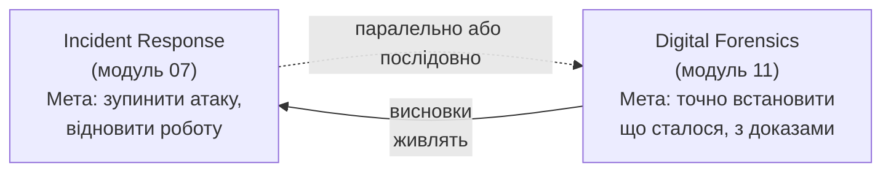
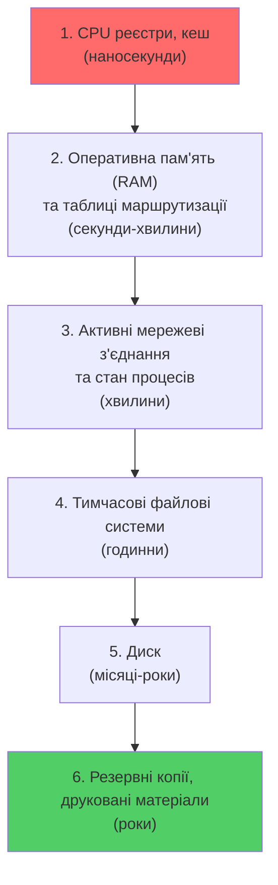
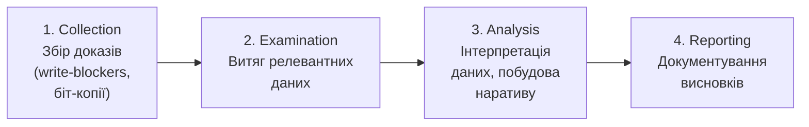

# 11.1. Основи цифрової криміналістики

У 2002 році британський апеляційний суд скасував обвинувальний вирок у справі про дитячу порнографію, бо захист довів: знайдені файли потрапили на комп'ютер через трояна, встановленого без відома власника, а не через його дії. Цей випадок — Caffrey case і подібні — назавжди змінили підхід до цифрових доказів: недостатньо «знайти файл на диску», потрібно довести, як він там опинився, хто мав до нього доступ і чи не була порушена цілісність доказів під час самого розслідування. Цифрова криміналістика — дисципліна, що поєднує технічну глибину з методологічною строгістю, необхідною там, де висновки можуть визначити чиюсь свободу або долю мільйонної компанії.

> 📖 Ключові терміни — у [глосарії модуля](00-glosariy.md).

## Що таке цифрова криміналістика

**Цифрова криміналістика (Digital Forensics)** — застосування наукових методів для збору, збереження, аналізу і представлення цифрових доказів у спосіб, що зберігає їх доказову цінність.

Ключова відмінність від звичайного «технічного розслідування інциденту» (Incident Response, модуль 07): форензика орієнтована на доказову строгість — кожна дія документується, кожен висновок обґрунтовується, результат має витримати незалежну перевірку (і, за потреби, судовий розгляд).



На практиці IR і форензика часто відбуваються паралельно: команда стримує атаку, водночас форензичний аналітик зберігає докази для подальшого глибокого аналізу.

## Принципи цифрової криміналістики

### ACPO Principles (Association of Chief Police Officers, Великобританія)

Чотири принципи, що стали міжнародним де-факто стандартом:

```
Принцип 1: Жодна дія правоохоронних органів або їх агентів
           не повинна змінювати дані, що зберігаються на
           комп'ютері чи носії, якщо ці дані можуть бути
           пізніше використані в суді.

Принцип 2: У обставинах, коли особа вважає за необхідне
           отримати доступ до оригінальних даних на комп'ютері
           чи носії, ця особа має бути компетентною і здатною
           дати свідчення, що пояснюють релевантність і
           наслідки своїх дій.

Принцип 3: Має вестись аудиторський слід або інший запис всіх
           процесів, застосованих до цифрових доказів. Незалежна
           третя сторона має мати можливість дослідити ці процеси
           і досягти того самого результату.

Принцип 4: Особа, відповідальна за розслідування, несе загальну
           відповідальність за дотримання закону і цих принципів.
```

### Order of Volatility (Порядок волатильності)

**Найважливіший практичний принцип:** збирати докази в порядку від найбільш «летких» (volatile) — тих, що зникають найшвидше — до найменш летких.



**Практичний наслідок:** якщо потрібно і дамп пам'яті, і образ диска — спочатку RAM (вимикання живлення знищує її миттєво), потім диск. Вимкнення комп'ютера для «безпечного» збору доказів — класична помилка початківця: вона знищує весь вміст RAM, включно з ключами шифрування, мережевими з'єднаннями, запущеними процесами malware.

## Типи цифрової криміналістики

| Тип | Об'єкт дослідження | Деталізовано в розділі |
|---|---|---|
| **Disk Forensics** | Жорсткі диски, SSD, USB-носії | 11.3 |
| **Memory Forensics** | Оперативна пам'ять (RAM) | 11.4 |
| **Network Forensics** | Мережевий трафік, логи | 11.5 |
| **Mobile Forensics** | Смартфони, планшети | 11.6 |
| **Cloud Forensics** | Хмарні ресурси, контейнери | 11.7 |
| **Email Forensics** | Електронна пошта, заголовки | (модуль 07, поглиблено тут) |
| **Database Forensics** | Бази даних, транзакційні логи | — |
| **IoT Forensics** | Вбудовані пристрої | (модуль 08, форензичний аспект) |

## Методологія NIST SP 800-86

NIST визначає чотирифазний процес форензичного дослідження:



**Collection (збір)** — отримання даних способом, що зберігає їх цілісність. Використання write-blockers (апаратні пристрої, що фізично забороняють запис на досліджуваний носій), створення біт-копій (bit-for-bit images), а не роботи з оригіналом.

**Examination (дослідження)** — застосування технічних і автоматизованих методів для виявлення і витягу потенційно релевантних даних з великого обсягу зібраної інформації.

**Analysis (аналіз)** — використання технічних і слідчих методів для побудови висновків з даних — найбільш творча і експертна фаза.

**Reporting (звітування)** — представлення результатів аналізу способом, зрозумілим аудиторії (технічній команді, керівництву, юристам, суду).

## Типи доказів: Locard's Exchange Principle

**Принцип обміну Локара** (1910, криміналістика загалом, але застосовний і до цифрового світу): «Кожен контакт залишає слід». У цифровому контексті: будь-яка взаємодія зловмисника з системою залишає артефакти — у логах, реєстрі, файловій системі, мережевому трафіку, навіть якщо зловмисник намагається їх видалити (детально — anti-forensics, розділ 11.8).

**Класифікація доказів за надійністю:**

```
Найнадійніші:
├── Bit-for-bit образи дисків (з хешем для верифікації)
├── Дампи пам'яті (зібрані правильним інструментом)
└── Мережеві захоплення (PCAP з повним вмістом)

Середньої надійності:
├── Логи (можуть бути неповними, ротуються, можуть бути видалені)
└── Журнали подій ОС (можуть бути відключені або очищені)

Найменш надійні (потребують підтвердження іншими джерелами):
├── Свідчення користувачів («я нічого не робив»)
└── Метадані файлів без додаткової верифікації (легко підробити)
```

## Гіпотезо-орієнтований підхід (Scientific Method у форензиці)

Якісне форензичне розслідування слідує науковому методу, а не підтверджує заздалегідь прийняте рішення:

```
1. Спостереження: що ми бачимо? (аномальний трафік, зашифровані файли)
2. Гіпотеза: що могло це спричинити? (декілька можливих сценаріїв)
3. Перевірка: які дані підтвердять або спростують кожну гіпотезу?
4. Аналіз: збір і аналіз цих даних
5. Висновок: яка гіпотеза найкраще пояснює ВСІ зібрані докази?
6. Документування: чіткий, відтворюваний звіт
```

**Confirmation Bias (упередження підтвердження)** — найнебезпечніша пастка форензичного аналітика: схильність шукати лише докази, що підтверджують першу гіпотезу, ігноруючи протилежні. Дисципліноване розслідування активно шукає докази, що могли б спростувати поточну теорію.

## Міні-вправа

Уявіть сценарій: ви виявили, що на сервері з'явився новий файл `backdoor.php` о 03:14 ночі.

1. Які джерела доказів ви б зібрали в порядку Order of Volatility?
2. Сформулюйте мінімум три альтернативні гіпотези щодо того, як файл потрапив на сервер (не лише «зловмисник зламав сервер»).
3. Які конкретні докази дозволили б підтвердити чи спростувати кожну гіпотезу?

## Джерела та додаткові матеріали

- NIST SP 800-86 — Guide to Integrating Forensic Techniques into Incident Response.
- ACPO, *Good Practice Guide for Digital Evidence* (College of Policing, UK).
- Casey E., *Digital Evidence and Computer Crime* — класична настільна книга.
- SANS, *Digital Forensics and Incident Response* (FOR508 course materials).

---

**Далі:** [11.2. Chain of Custody і правові аспекти](02-chain-of-custody.md)
**Назад до модуля:** [README модуля 11](README.md)
