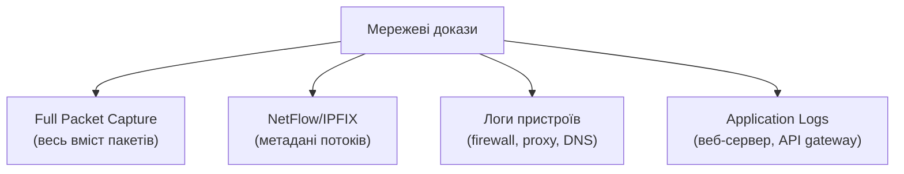

# 11.5. Мережева форензика

Модуль 10 розглядав мережевий моніторинг як превентивний інструмент — виявлення аномалій у реальному часі. Мережева форензика — інша задача: реконструкція того, що вже сталося, з фрагментів захопленого трафіку, NetFlow-записів і логів мережевих пристроїв. На відміну від диска чи пам'яті, мережевий трафік не можна «зібрати заднім числом» — якщо в момент атаки не велося захоплення, ці докази втрачені назавжди. Це робить превентивне налаштування мережевого логування (модуль 10) прямою передумовою якісної мережевої форензики.

> 📖 Ключові терміни — у [глосарії модуля](00-glosariy.md).

## Джерела мережевих доказів



**Ієрархія деталізації:** Full Packet Capture дає найбільше деталей (повний вміст), але вимагає величезного сховища. NetFlow дає менше деталей, але масштабується на весь трафік організації роками. Логи пристроїв — проміжний рівень, специфічний для кожного типу пристрою.

## Поглиблений аналіз PCAP

Модуль 10 (розділ 10.10) дав основи Wireshark. Тут — форензичні техніки для реконструкції повної картини інциденту.

### Реконструкція TCP-сесій

```bash
# Wireshark: Follow TCP Stream — реконструює повний обмін даними сесії
# File → Export Objects → HTTP (автоматично витягує файли, передані через HTTP)

# tshark (CLI-версія Wireshark) для автоматизації
tshark -r capture.pcap -Y "http.request" -T fields \
  -e frame.time -e ip.src -e http.host -e http.request.uri

# Витяг переданих файлів через HTTP
tshark -r capture.pcap --export-objects http,extracted_files/

# Реконструкція повного TCP stream у текстовому вигляді
tshark -r capture.pcap -q -z follow,tcp,ascii,0
```

### Виявлення ексфільтрації даних

```bash
# Пошук великих вихідних передач (потенційна ексфільтрація)
tshark -r capture.pcap -q -z conv,tcp | sort -k7 -rn | head -20
# Сортує TCP-розмови за обсягом переданих байт

# Виявлення DNS tunneling (модуль 10, розділ 10.7) у захопленому трафіку
tshark -r capture.pcap -Y "dns" -T fields -e dns.qry.name | \
  awk '{ print length, $0 }' | sort -rn | head -20
# Незвично довгі DNS-запити — ознака тунелювання даних

# Виявлення передачі через нестандартні порти (обхід firewall)
tshark -r capture.pcap -Y "http && !(tcp.port == 80 || tcp.port == 443)"
```

### Аналіз TLS/SSL трафіку без розшифрування

Навіть без приватного ключа сервера (а отже без можливості розшифрувати вміст), TLS-метадані дають форензичну цінність:

```bash
# SNI (Server Name Indication) — домен, до якого підключався клієнт,
# видно навіть у зашифрованому TLS handshake
tshark -r capture.pcap -Y "tls.handshake.extensions_server_name" \
  -T fields -e ip.src -e tls.handshake.extensions_server_name

# JA3/JA3S fingerprinting — унікальний "відбиток" TLS-клієнта
# на основі параметрів ClientHello; дозволяє ідентифікувати
# конкретний інструмент/malware навіть у зашифрованому трафіку
tshark -r capture.pcap -Y "tls.handshake.type==1" \
  -T fields -e ip.src -e tls.handshake.ja3
```

**JA3 fingerprinting** особливо цінний у форензиці: певні інструменти (Cobalt Strike, Metasploit, конкретні родини malware) мають характерні, відомі JA3-відбитки TLS ClientHello — навіть якщо домен призначення невідомий, JA3 може ідентифікувати інструмент атаки.

## NetFlow Forensics: аналіз у масштабі

Коли PCAP недоступний (типова ситуація — організації рідко зберігають full packet capture місяцями через обсяг), NetFlow-архіви стають основним джерелом ретроспективного аналізу.

```python
"""
Демонстрація принципу NetFlow forensic аналізу.
Реальний аналіз зазвичай виконується через nfdump/SiLK або SIEM.
"""
import csv
from collections import defaultdict
from datetime import datetime

def analyze_netflow_for_incident(flow_file: str, suspect_ip: str,
                                   start_time: str, end_time: str):
    """Реконструює мережеву активність конкретного хоста за період."""
    start = datetime.fromisoformat(start_time)
    end = datetime.fromisoformat(end_time)

    connections = []
    total_bytes_out = 0
    unique_destinations = set()

    with open(flow_file) as f:
        reader = csv.DictReader(f)
        for row in reader:
            flow_time = datetime.fromisoformat(row['timestamp'])
            if not (start <= flow_time <= end):
                continue
            if row['src_ip'] == suspect_ip:
                connections.append(row)
                total_bytes_out += int(row['bytes'])
                unique_destinations.add(row['dst_ip'])

    return {
        'total_connections': len(connections),
        'total_bytes_exfiltrated': total_bytes_out,
        'unique_destinations': len(unique_destinations),
        'destinations': sorted(unique_destinations),
        'connections': connections,
    }
```

```bash
# nfdump: реальний інструмент аналізу NetFlow-архівів
# Знайти всі з'єднання конкретного хоста за період
nfdump -R /netflow/archive -t 2024/01/15.00:00:00-2024/01/16.00:00:00 \
  'host 10.0.1.50'

# Топ-розмовники за обсягом даних (потенційна ексфільтрація)
nfdump -R /netflow/archive -s record/bytes -n 20

# Виявлення сканування портів (багато коротких з'єднань до різних портів)
nfdump -R /netflow/archive 'host 10.0.1.50' -a -A srcip,dstport
```

## Реконструкція хронології через кореляцію джерел

Найпотужніша мережева форензика об'єднує кілька джерел доказів для побудови повної картини:

```
Приклад кореляції для інциденту SSRF→Credential Theft (модуль 09):

1. WAF Log:        14:23:01 — Blocked suspicious request pattern
2. Web Server Log: 14:23:05 — POST /api/fetch?url=http://169.254.169.254/...
3. PCAP:           14:23:05 — TCP SYN до 169.254.169.254:80 з контейнера
4. CloudTrail:      14:23:08 — GetCallerIdentity using stolen credentials
5. CloudTrail:      14:24:15 — S3 ListBucket з нової невідомої IP
6. NetFlow:         14:24:20 — Великий вихідний трафік (2.3 ГБ) до зовнішньої IP

Висновок: SSRF-вразливість використана для крадіжки IAM-credentials
через metadata service о 14:23, credentials використані для доступу
до S3 і ексфільтрації даних протягом наступної хвилини.
```

## Логи мережевих пристроїв як форензичне джерело

```
Firewall logs:
├── Дозволені/заблоковані з'єднання з timestamp
├── NAT-трансляції (важливо для атрибуції в мережах з NAT)
└── VPN-сесії (хто, коли, з якої IP підключався)

Proxy/SWG logs:
├── Повна історія веб-запитів користувачів
├── Категорія заблокованого/дозволеного контенту
└── User-Agent, що може ідентифікувати інструмент атаки

DHCP logs:
├── Прив'язка MAC-адреси до IP в конкретний момент часу
└── Критично для атрибуції: "хто мав IP X.X.X.X о 14:23"

DNS logs:
├── Всі DNS-запити (включно з резолюцією C2-доменів)
└── Часто перше джерело виявлення компрометації
    (запит до відомого malicious domain)
```

**Важливість DHCP-логів для атрибуції:** у великій мережі з динамічними IP-адресами, без DHCP-логів неможливо точно встановити, який фізичний пристрій мав конкретну IP-адресу в момент інциденту — IP могла бути перепризначена іншому пристрою вже за кілька годин.

## Антифорензичні виклики мережевої форензики

```
Типові перешкоди:
├── Зашифрований трафік (TLS) приховує вміст
│   (метадані — SNI, JA3, обсяг, timing — все ще доступні)
├── VPN/Tor приховує справжнє джерело трафіку
├── Динамічні IP/CDN ускладнюють атрибуцію інфраструктури
│   зловмисника
├── Логи з обмеженим retention (типово 30-90 днів)
│   можуть вже бути перезаписані на момент розслідування
└── Domain Fronting та подібні техніки маскують справжній
    пункт призначення трафіку
```

## Міні-вправа

```bash
# Завантажте тестовий PCAP-файл (наприклад, з malware-traffic-analysis.net —
# навчальний ресурс з реальними (безпечними для аналізу) зразками)

# 1. Базовий огляд
tshark -r sample.pcap -q -z io,phs  # Protocol Hierarchy Statistics

# 2. Топ розмовників
tshark -r sample.pcap -q -z conv,ip

# 3. Витяг DNS-запитів
tshark -r sample.pcap -Y "dns.flags.response == 0" -T fields -e dns.qry.name | sort -u

# 4. Пошук підозрілих User-Agent
tshark -r sample.pcap -Y "http.request" -T fields -e http.user_agent | sort -u
```

## Джерела та додаткові матеріали

- malware-traffic-analysis.net — навчальні PCAP-зразки реального malware-трафіку.
- Wireshark Network Forensics documentation.
- SANS FOR572 — Advanced Network Forensics course materials.
- nfdump/NFSEN documentation (nfdump.sourceforge.net).
- JA3 Fingerprinting (github.com/salesforce/ja3).

---

**Попередній розділ:** [11.4. Memory Forensics](04-memory-forensics.md)
**Далі:** [11.6. Форензика мобільних пристроїв](06-mobilna-kryminalistyka.md)
**Назад до модуля:** [README модуля 11](README.md)
