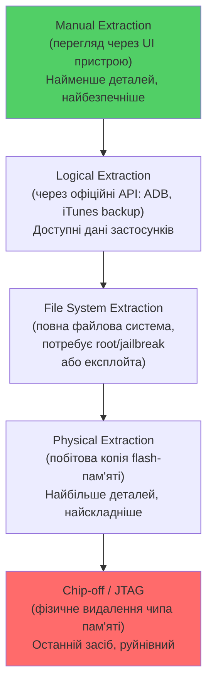

# 11.6. Форензика мобільних пристроїв

Модуль 08 розглядав мобільну безпеку з погляду захисту — Secure Enclave, App Sandbox, шифрування FBE. Ці самі механізми, що захищають дані користувача від зловмисника, створюють фундаментальну проблему для форензичного дослідника: сучасний смартфон спроєктований так, щоб бути практично недослідним без співпраці власника або експлуатації вразливості. Мобільна форензика — постійна гонка між механізмами захисту виробників і техніками доступу дослідників, де навіть державні правоохоронні органи регулярно стикаються з пристроями, які не можуть розблокувати.

> 📖 Ключові терміни — у [глосарії модуля](00-glosariy.md).

## Рівні доступу до мобільних даних



**Logical Extraction** — найпоширеніший рівень для більшості розслідувань: дані застосунків, контакти, повідомлення, історія дзвінків через офіційні API виробника.

```bash
# Android: Logical extraction через ADB (Android Debug Bridge)
adb devices  # переконатись що пристрій підключено і авторизовано

# Повний backup (Android 11 і раніше; новіші версії обмежують)
adb backup -apk -shared -all -f android_backup.ab

# Витяг конкретних даних застосунку (потребує root для повного доступу)
adb shell "run-as com.whatsapp cat /data/data/com.whatsapp/databases/msgstore.db" > whatsapp.db

# iOS: Logical extraction через iTunes/Finder backup
# Backup створюється стандартним механізмом iOS
# Розташування backup на macOS:
# ~/Library/Application Support/MobileSync/Backup/
```

**File System Extraction** — потребує підвищених привілеїв (root для Android, jailbreak для iOS, або експлуатацію вразливості завантаження).

```bash
# Android: file system extraction через root доступ
adb root
adb shell "tar -czf /sdcard/full_fs.tar.gz /data"
adb pull /sdcard/full_fs.tar.gz

# Магазин форензичних рішень (комерційні):
# Cellebrite UFED, Magnet AXIOM, MSAB XRY —
# використовують власні (часто непублічні) методи обходу
# захисту для file system і physical extraction
```

**Physical Extraction** — побітова копія flash-пам'яті пристрою; найповніша картина, включно з видаленими даними у вільному просторі (аналогічно дисковій форензиці, розділ 11.3), але технічно найскладніша через сучасне шифрування і захист завантаження (Secure Boot, модуль 08).

## Android Forensics: специфіка

```
Ключові артефакти Android для форензики:

/data/data/<package>/databases/
  → SQLite бази даних застосунків (повідомлення, контакти, історія)

/data/data/<package>/shared_prefs/
  → XML-конфігурація застосунків (може містити токени, якщо
    розробник не використав Android Keystore — модуль 08)

/data/system/packages.xml
  → Список встановлених застосунків з датами встановлення

/data/system/usagestats/
  → Статистика використання застосунків (коли, як довго)

/data/misc/wifi/WifiConfigStore.xml
  → Збережені Wi-Fi мережі (SSID, іноді паролі)

Google Account sync data
  → Може містити синхронізовану історію навіть якщо
    локально видалено (потребує окремого юридичного процесу
    для доступу до хмарних Google-даних)
```

```bash
# Аналіз SQLite бази даних застосунку (наприклад, WhatsApp)
sqlite3 msgstore.db
.tables
SELECT * FROM messages ORDER BY timestamp DESC LIMIT 50;

#Autopsy/ALEEAPP для автоматизованого парсингу Android-артефактів
python3 aleapp.py -t fs -i /path/to/extracted/filesystem -o /path/to/output
```

## iOS Forensics: специфіка

```
Ключові артефакти iOS:

CoreData / SQLite бази
  → sms.db (повідомлення), AddressBook.sqlitedb (контакти),
    call_history.db

Property List (plist) файли
  → Конфігурація застосунків і системи

Knowledge Cache (knowledgeC.db)
  → Детальна історія використання застосунків, навіть
    короткочасних взаємодій з notification center

CacheRouted.plist
  → Геолокаційні дані, навіть якщо служби геолокації
    "вимкнено" для конкретного застосунку (історичний кеш)

Photos.sqlite
  → Метадані фото, включно з геолокацією зйомки (EXIF),
    навіть якщо саме фото видалено
```

```bash
# iOS backup parsing через iLEAPP (відкритий інструмент)
python3 ileapp.py -t backup -i /path/to/backup -o /path/to/output

# Аналіз knowledgeC.db (детальна історія активності)
sqlite3 knowledgeC.db
SELECT * FROM ZOBJECT WHERE ZSTREAMNAME LIKE '%app%' ORDER BY ZSTARTDATE DESC LIMIT 100;
```

## Cellebrite UFED та інші комерційні рішення

**Cellebrite UFED** — провідне комерційне рішення мобільної форензики, що використовується правоохоронними органами по всьому світу. Підтримує тисячі моделей пристроїв з регулярно оновлюваними методами обходу захисту (часто на основі недокументованих або куплених у дослідників вразливостей).

```
Чому комерційні рішення домінують у мобільній форензиці:

1. Швидко мінливий ландшафт безпеки — кожне оновлення iOS/Android
   може зламати попередній метод доступу
2. Великі бюджети на дослідження нових методів обходу
3. Юридична легітимність (показання експерта в суді часто
   потребують визнаного, перевіреного інструменту)
4. Регулярні оновлення баз підтримуваних моделей пристроїв

Альтернативи (open-source):
- ALEAPP / iLEAPP (парсинг вже отриманих даних)
- Autopsy mobile module
- MOBILedit Forensic (комерційний, доступніший за Cellebrite)
```

**Етичні і правові обмеження:** використання вразливостей для обходу захисту мобільних пристроїв — territory надзвичайно чутлива юридично. В Україні доступ до мобільного пристрою для розслідування потребує або згоди власника, або відповідного процесуального рішення (КПК, ст. 159-166).

## SIM-карта як окреме джерело доказів

```bash
# SIM-карти містять власну обмежену пам'ять з форензичною цінністю
# Дані SIM: IMSI, контакти (якщо збережені на SIM, а не в телефоні),
# історія SMS (якщо не видалена), Last Dialed Numbers (LDN)

# Зчитування через SIM-card reader:
# Комерційні інструменти: Cellebrite, XRY, або спеціалізовані
# SIM-readers з відповідним ПЗ

# ICCID (Integrated Circuit Card Identifier) — унікальний
# ідентифікатор SIM-картки, корисний для встановлення
# зв'язку SIM з конкретним оператором/обліковим записом
```

## Хмарна синхронізація: розширення поверхні форензики

Сучасні мобільні пристрої постійно синхронізуються з хмарою (iCloud, Google Drive), що створює як можливості, так і виклики:

```
Можливості:
✅ Дані можуть бути доступні через хмару, навіть якщо
   фізичний пристрій недоступний або заблокований
✅ iCloud/Google backup можуть містити історичні дані,
   видалені з пристрою

Виклики:
⚠️ Доступ до хмарних даних потребує окремого юридичного
   процесу (часто міжнародного, якщо провайдер за кордоном)
⚠️ End-to-end шифровані застосунки (Signal) можуть взагалі
   не зберігати відновлювані дані в хмарі за дизайном
⚠️ Apple Advanced Data Protection (2022+) розширює E2E
   шифрування на iCloud backup, значно ускладнюючи
   традиційний доступ навіть для самого Apple
```

## Чек-лист мобільної форензики

```
Перед збором:
☐ Пристрій в Airplane Mode або Faraday bag
  (запобігання remote wipe через "Find My iPhone"/
   Google "Find My Device")
☐ Заряд пристрою підтримується (powerbank/charger в Faraday bag)
☐ Якщо пристрій розблокований — НЕ блокувати знову
  (повторне розблокування може бути неможливим без passcode)

Під час збору:
☐ Документувати точний стан пристрою (екран, додатки,
   рівень заряду) фотографією перед будь-якими діями
☐ Обрати найменш інвазивний метод, що задовольняє
   потреби розслідування (Logical перед Physical)
☐ Hash-верифікація отриманого образу

Після збору:
☐ Аналіз на ізольованій forensic workstation,
   не підключеній до інтернету (запобігання remote wipe
   або додатковій синхронізації з хмарою)
```

## Міні-вправа

1. Якщо маєте тестовий Android-пристрій з увімкненим USB-debugging — спробуйте `adb backup` і перегляньте, які дані доступні без root.
2. Дослідіть налаштування "Find My Device" / "Find My iPhone" на власному пристрої — як швидко можна було б ініціювати remote wipe, якби пристрій був скомпрометований і потребував форензичного збору?
3. Перегляньте свої власні налаштування хмарного backup (iCloud/Google) — які дані синхронізуються автоматично?

## Джерела та додаткові матеріали

- NIST SP 800-101 Rev.1 — Guidelines on Mobile Device Forensics.
- ALEAPP / iLEAPP (github.com/abrignoni) — відкриті інструменти парсингу.
- SANS FOR585 — Smartphone Forensic Analysis In-Depth.
- Cellebrite Learning Center (cellebrite.com/learning-center) — документація методології.

---

**Попередній розділ:** [11.5. Мережева форензика](05-merezheva-kryminalistyka.md)
**Далі:** [11.7. Форензика хмари і контейнерів](07-khmarna-kryminalistyka.md)
**Назад до модуля:** [README модуля 11](README.md)
