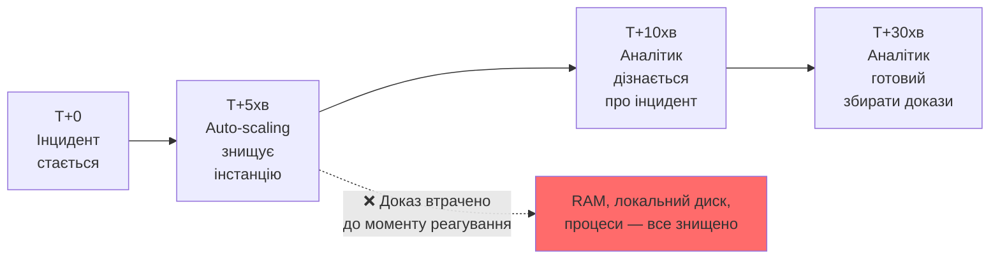

# 11.7. Форензика хмари і контейнерів

Класична форензика припускає фізичний доступ до носія — диск можна вилучити, write-blocker підключити, образ зробити. У хмарі цей фундамент зникає: EC2-інстанція може жити п'ять хвилин і зникнути назавжди разом з усім вмістом RAM і локального диска. Контейнер створюється з образу, виконується кілька секунд для обробки запиту і знищується — традиційний підхід «спочатку зберегти доказ, потім досліджувати» в принципі неможливий, якщо доказ перестає існувати швидше, ніж дослідник встигає відреагувати. Хмарна форензика вимагає переосмислення методології: збір доказів має бути спроєктований у систему заздалегідь, а не імпровізований після інциденту.

> 📖 Ключові терміни — у [глосарії модуля](00-glosariy.md).

## Ephemeral Resources: фундаментальний виклик



**Класична Order of Volatility (розділ 11.1) у хмарі стискається з годин до хвилин або секунд** — Lambda-функція виконується мілісекунди; контейнер у Kubernetes може бути знищений HPA (Horizontal Pod Autoscaler) за секунди після завершення навантаження.

## AWS Forensics: специфічні джерела доказів

### CloudTrail як основне джерело

Модуль 09 розглядав CloudTrail для виявлення хмарних атак. У форензичному контексті CloudTrail — найважливіше джерело, бо API-виклики залишаються в логах навіть після знищення самого ресурсу.

```bash
# Реконструкція повної історії дій IAM-користувача через CloudTrail
aws cloudtrail lookup-events \
  --lookup-attributes AttributeKey=Username,AttributeValue=compromised-user \
  --start-time 2024-01-15T00:00:00Z \
  --end-time 2024-01-16T00:00:00Z \
  --output json > user_activity_timeline.json

# Реконструкція повної історії дій з конкретної IP (атрибуція джерела)
aws cloudtrail lookup-events \
  --lookup-attributes AttributeKey=AccessKeyId,AttributeValue=AKIA... \
  --output json

# CloudTrail Insights — аномалії у викликах API
aws cloudtrail get-insight-selectors --trail-name organization-trail
```

### Збереження ephemeral-ресурсів до знищення

```python
"""
Псевдокод: автоматичне збереження forensic snapshot
при підозрі на компрометацію — критично налаштувати ЗАЗДАЛЕГІДЬ,
до інциденту.
"""
import boto3

def forensic_snapshot_ec2(instance_id: str):
    """Збереження EC2-інстанції для форензичного аналізу замість знищення."""
    ec2 = boto3.client('ec2')

    # 1. Зупинити (НЕ термінувати!) для збереження стану диска
    ec2.stop_instances(InstanceIds=[instance_id], Force=True)

    # 2. Snapshot всіх приєднаних EBS-volumes
    volumes = ec2.describe_volumes(
        Filters=[{'Name': 'attachment.instance-id', 'Values': [instance_id]}]
    )
    for volume in volumes['Volumes']:
        snapshot = ec2.create_snapshot(
            VolumeId=volume['VolumeId'],
            Description=f'FORENSIC-{instance_id}-{volume["VolumeId"]}'
        )
        # Tag для forensic chain of custody
        ec2.create_tags(
            Resources=[snapshot['SnapshotId']],
            Tags=[
                {'Key': 'Purpose', 'Value': 'ForensicEvidence'},
                {'Key': 'CaseNumber', 'Value': 'CASE-2024-0142'},
                {'Key': 'CollectedBy', 'Value': 'security-team'}
            ]
        )

    # 3. Ізолювати мережево (а не знищити!) для подальшого аналізу
    ec2.modify_instance_attribute(
        InstanceId=instance_id,
        Groups=['sg-forensic-isolation']  # SG без жодних правил трафіку
    )

    return f"Forensic snapshot created for {instance_id}"
```

**Критично важлива практика:** автоматизація (auto-scaling, self-healing) має мати "forensic hold" механізм — спосіб тегувати конкретний ресурс як "не знищувати, призначено для розслідування" ще до того, як він буде автоматично прибраний системою.

### Lambda Forensics

```python
# Serverless-форензика особливо складна: немає традиційного "диска"
# Джерела доказів для Lambda:

# 1. CloudWatch Logs — основне джерело (якщо логування налаштоване правильно)
import boto3
logs = boto3.client('logs')

def get_lambda_forensic_logs(function_name: str, start_time: int, end_time: int):
    response = logs.filter_log_events(
        logGroupName=f'/aws/lambda/{function_name}',
        startTime=start_time,
        endTime=end_time
    )
    return response['events']

# 2. X-Ray traces (якщо увімкнено) — деталізована трасування виконання
xray = boto3.client('xray')
traces = xray.get_trace_summaries(
    StartTime=start_time,
    EndTime=end_time,
    FilterExpression='service("my-lambda-function")'
)

# 3. Lambda environment variables snapshot (через CloudTrail GetFunction events)
# 4. VPC Flow Logs якщо Lambda підключена до VPC
```

## Container Forensics: Docker і Kubernetes

### Docker container forensics

```bash
# Якщо контейнер ще працює — захоплення стану перед знищенням
docker commit <container_id> forensic-snapshot:incident-001
docker save forensic-snapshot:incident-001 -o container_evidence.tar

# Експорт файлової системи контейнера
docker export <container_id> > container_filesystem.tar

# Логи контейнера (можуть зникнути при видаленні контейнера!)
docker logs <container_id> > container_logs.txt

# Inspect для повних метаданих (мережа, volumes, env vars)
docker inspect <container_id> > container_metadata.json

# Diff: що змінилось відносно базового образу
docker diff <container_id> > filesystem_changes.txt
```

### Kubernetes forensics

```bash
# Збір форензичних даних Pod ПЕРЕД видаленням
kubectl logs <pod-name> -n <namespace> --previous > pod_logs_previous.txt
kubectl logs <pod-name> -n <namespace> > pod_logs_current.txt

kubectl describe pod <pod-name> -n <namespace> > pod_description.txt

# Якщо Pod ще активний — exec для збору runtime-стану
kubectl exec <pod-name> -n <namespace> -- ps aux > pod_processes.txt
kubectl exec <pod-name> -n <namespace> -- netstat -tlnp > pod_network.txt

# Events кластера (контекст: чому Pod був перезапущений/видалений)
kubectl get events -n <namespace> --sort-by='.lastTimestamp' > k8s_events.txt

# CRI-O / containerd runtime logs (на рівні ноди, не Pod)
crictl logs <container-id>
journalctl -u containerd --since "2024-01-15 00:00:00"
```

**Falco (модуль 09, розділ 9.7)** — runtime security tool, що може слугувати форензичним джерелом: записує системні виклики контейнера в реальному часі, зберігаючи докази навіть для контейнерів, що вже знищені на момент розслідування.

## Azure і GCP: еквівалентні джерела

```
Azure:
├── Activity Log (еквівалент CloudTrail)
├── Azure Monitor / Log Analytics
├── Network Security Group Flow Logs
└── Azure Disk Snapshots (еквівалент EBS snapshot)

GCP:
├── Cloud Audit Logs (Admin Activity + Data Access)
├── VPC Flow Logs
├── Persistent Disk Snapshots
└── Cloud Functions execution logs (Cloud Logging)
```

## SaaS Forensics: коли немає інфраструктурного доступу

Для SaaS-сервісів (Microsoft 365, Google Workspace, Salesforce) форензика відбувається виключно через API/адміністративні логи провайдера — фізичного чи навіть віртуального "диска" для дослідження не існує.

```bash
# Microsoft 365: Unified Audit Log через PowerShell
Search-UnifiedAuditLog -StartDate 2024-01-15 -EndDate 2024-01-16 `
  -UserIds compromised-user@company.com `
  -Operations FileAccessed,FileDownloaded,MailItemsAccessed

# Google Workspace: Admin SDK Reports API
# Через gam (Google Apps Manager) CLI:
gam report users user compromised-user@company.com \
  start 2024-01-15 end 2024-01-16
```

## Chain of Custody для хмарних доказів

Принципи Chain of Custody (розділ 11.2) застосовуються до хмарних доказів з адаптацією:

```
Хмаро-специфічна Chain of Custody:

Замість фізичного підпису при передачі диска:
├── CloudTrail запис самого процесу збору доказів
│   (хто, коли, яку команду виконав для snapshot/export)
├── Хеш-сума експортованого образу snapshot
├── IAM-роль/користувач, що виконав збір (audit trail)
└── Незмінне сховище для збережених доказів
    (S3 Object Lock у Compliance Mode — модуль 09,
     розділ 9.4 — гарантує неможливість видалення
     навіть адміністратором до закінчення retention period)
```

```bash
# S3 Object Lock для незмінного зберігання форензичних доказів
aws s3api put-object \
  --bucket forensic-evidence-bucket \
  --key case-2024-0142/ec2-snapshot.img \
  --object-lock-mode COMPLIANCE \
  --object-lock-retain-until-date 2026-01-01T00:00:00Z
```

## Виклики хмарної і контейнерної форензики

```
Фундаментальні складнощі:

1. Ефемерність — ресурс може зникнути до початку розслідування
2. Multi-tenancy — фізичний диск спільний для багатьох клієнтів,
   "вилучити диск" неможливо принципово
3. Provider dependency — багато доказів існують лише в
   інфраструктурі провайдера, доступні лише через його API
4. Jurisdiction — дані можуть фізично знаходитись в іншій
   юрисдикції, ускладнюючи правовий доступ
5. Scale — мікросервісна архітектура може означати сотні
   контейнерів, що потребують кореляції для повної картини
```

## Міні-вправа

1. Перегляньте, чи має ваша організація (або навчальний AWS-акаунт) налаштований механізм "forensic hold" для критичних ресурсів — здатність позначити EC2/Pod як "не знищувати автоматично".
2. Якщо маєте AWS Free Tier — перевірте retention period вашого CloudTrail. Скільки днів історії доступно для форензичного аналізу?
3. Для Kubernetes (minikube): створіть Pod, зберіть `kubectl logs` і `kubectl describe`, потім видаліть Pod — переконайтесь що зібрані дані залишаються доступними після видалення оригіналу.

## Джерела та додаткові матеріали

- NIST SP 800-201 (Draft) — Cloud Computing Forensic Reference Architecture.
- SANS FOR509 — Enterprise Cloud Forensics and Incident Response.
- AWS, *Forensic investigation environment strategies in the AWS Cloud* (aws.amazon.com/blogs/security).
- Falco documentation (falco.org) — runtime forensics для контейнерів.

---

**Попередній розділ:** [11.6. Форензика мобільних пристроїв](06-mobilna-kryminalistyka.md)
**Далі:** [11.8. Anti-Forensics техніки](08-anti-forensics.md)
**Назад до модуля:** [README модуля 11](README.md)
