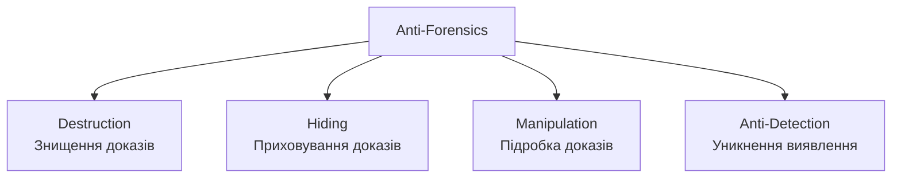

# 11.8. Anti-Forensics техніки

Досвідчений зловмисник знає, що форензичний аналітик прийде шукати докази — і будує атаку так, щоб ці докази або не з'явились взагалі, або виглядали інакше, ніж насправді. Anti-forensics — не окрема категорія атак, а доповнення до будь-якої атаки: техніки, що ускладнюють, уповільнюють або вводять в оману розслідування. Розуміння цих технік необхідне з двох причин: щоб розпізнати їх сліди (парадоксально, спроба приховати щось часто сама стає доказом) і щоб правильно інтерпретувати неповноту чи суперечливість зібраних даних.

> 📖 Ключові терміни — у [глосарії модуля](00-glosariy.md).

## Класифікація anti-forensics технік



## Destruction: знищення доказів

### Data Wiping

```bash
# Простий "rm" не знищує дані фізично — лише видаляє запис файлової
# системи (розділ 11.3). Справжнє знищення вимагає перезапису:

# DoD 5220.22-M стандарт (кілька проходів перезапису)
shred -v -n 3 -z /path/to/file
#       ↑3 проходи випадковими даними  ↑фінальний прохід нулями

# Повне знищення вмісту диска
dd if=/dev/urandom of=/dev/sdb bs=4M status=progress

# Для SSD: фізичне знищення утруднене через wear leveling —
# дані можуть фізично залишатись в "запасних" блоках навіть
# після команди ATA Secure Erase
hdparm --user-master u --security-erase NULL /dev/sdb
```

**Чому SSD ускладнює як wiping, так і forensic recovery:** контролер SSD абстрагує фізичне розташування даних через wear leveling — команда "видалити сектор X" логічно не відповідає прямому знищенню фізичних даних. TRIM-команда (якщо підтримується і увімкнена) може автоматично очищати "видалені" блоки на рівні апаратного забезпечення — що добре для приватності, але погано для криміналістичного відновлення.

### Log Deletion і Manipulation

```bash
# Видалення логів Windows Event Log
wevtutil cl Security
wevtutil cl System
wevtutil cl Application

# Видалення Linux логів
> /var/log/auth.log
echo "" > /var/log/syslog
history -c && history -w  # очищення bash history

# Видалення CloudTrail (модуль 09 — критична CloudTrail подія для виявлення!)
aws cloudtrail stop-logging --name organization-trail
aws cloudtrail delete-trail --name organization-trail
```

**Парадокс anti-forensics:** сама дія видалення логів зазвичай генерує власний лог-запис (наприклад, Windows Event ID 1102 — "Audit log cleared"), що стає сильним індикатором компрометації — досвідчений зловмисник видаляє логи, але не може видалити факт того, що логи були видалені (якщо тільки логи не зберігаються централізовано поза досяжністю зловмисника — звідси важливість централізованого SIEM, модуль 16).

## Hiding: приховування доказів

### Steganography

**Стеганографія** — приховування інформації всередині іншого, на вигляд невинного файлу (зображення, аудіо, відео), так що сам факт наявності прихованих даних непомітний.

```python
# Демонстрація принципу LSB (Least Significant Bit) стеганографії
from PIL import Image

def hide_data_in_image(image_path: str, secret_data: str, output_path: str):
    """Приховує текст у найменш значущих бітах пікселів зображення."""
    img = Image.open(image_path)
    pixels = img.load()
    binary_data = ''.join(format(ord(c), '08b') for c in secret_data) + '1111111111111110'  # термінатор

    data_index = 0
    for y in range(img.height):
        for x in range(img.width):
            if data_index < len(binary_data):
                r, g, b = pixels[x, y][:3]
                r = (r & ~1) | int(binary_data[data_index])
                pixels[x, y] = (r, g, b)
                data_index += 1
            else:
                break
    img.save(output_path)

# Криміналістичне виявлення: статистичний аналіз LSB-розподілу
# (легітимні зображення мають природний "шум" в LSB;
#  стеганографія часто створює статистично "занадто рівномірний"
#  розподіл) — інструменти: StegExpose, zsteg, StegSolve
```

**Криміналістичне виявлення стеганографії:** статистичні аномалії в розподілі LSB, незвичайний розмір файлу відносно вмісту, аналіз через спеціалізовані інструменти (StegExpose, zsteg для PNG/BMP, binwalk для виявлення вбудованих файлів).

### Alternate Data Streams (NTFS)

```powershell
# NTFS дозволяє приховувати дані в "альтернативних потоках" файлу —
# непомітних при звичайному перегляді

# Приховати дані в ADS
echo "Hidden malicious payload" > visible_file.txt:hidden_stream.txt

# Файл виглядає звичайним у Explorer:
dir visible_file.txt  # Показує лише оригінальний розмір

# Виявлення ADS (форензичний інструмент)
Get-Item visible_file.txt -Stream *
dir /r visible_file.txt  # /r прапор показує streams в cmd
```

### Encrypted Containers і Hidden Volumes

```
VeraCrypt Hidden Volumes — найскладніший case для форензики:

Зовнішній (decoy) том: зашифрований, з "невинним" вмістом
Прихований том: ВСЕРЕДИНІ вільного простору зовнішнього тому,
                математично невідрізнимий від випадкових даних
                
Навіть під примусом розкрити пароль зовнішнього тому,
зловмисник може показати лише decoy-вміст —
існування прихованого тому неможливо технічно довести
без знання другого пароля (plausible deniability за дизайном).
```

## Manipulation: підробка доказів

### Timestomping

```bash
# Зміна часових міток файлу для приховування справжнього
# часу дій (модуль 11.3 — MACB timestamps)

# Linux: touch для зміни timestamps
touch -t 202301010000.00 malicious_file.exe
# Файл тепер "виглядає" створеним 1 січня 2023, хоча
# реально з'явився сьогодні

# Windows: SetMACE, timestomp (Metasploit module)
# Копіює timestamps легітимного системного файлу на шкідливий

# Криміналістичне виявлення timestomping:
# 1. Розбіжність між $STANDARD_INFORMATION і $FILE_NAME
#    атрибутами MFT (модуль 11.3) — звичайні інструменти
#    timestomp змінюють лише один з двох наборів timestamps
# 2. USN Journal (Update Sequence Number) — окремий журнал
#    транзакцій NTFS, що часто не синхронізується зі зміненими
#    timestamps, залишаючи розбіжність
# 3. Часові мітки "занадто круглі" (рівно북ічна північ) —
#    природні timestamps рідко бувають ідеально круглими
```

```bash
# Виявлення через MFT-аналіз (Eric Zimmerman MFTECmd)
MFTECmd.exe -f $MFT --csv output --csvf mft_analysis.csv
# Порівняти $STANDARD_INFORMATION vs $FILE_NAME timestamps
# для кожного підозрілого файлу
```

### Log Injection / Spoofing

```python
# Зловмисник може намагатись "затопити" логи фальшивими записами
# для приховування реальної активності серед шуму, або вставити
# фальшиві записи, що вказують на іншого користувача/IP

# Захист: централізоване, незмінне (write-once) журналювання
# поза досяжністю системи, що може бути скомпрометована —
# SIEM з write-only forwarding, S3 Object Lock (модуль 11.7),
# криптографічний підпис кожного лог-запису (модуль 04)
```

## Anti-Detection: уникнення виявлення в реальному часі

### Process Hollowing і Code Injection

Детально розглянуто у форензичному контексті в модулі 11.4 (Memory Forensics, `malfind`); тут — anti-forensics мотивація: код виконується в пам'яті легітимного процесу, не залишаючи окремого підозрілого файлу на диску для виявлення антивірусом чи диск-форензикою.

### Living off the Land (LOLBAS)

Детально розглянуто в модулі 07 (розділ 7.7): використання легітимних системних утиліт (PowerShell, certutil, mshta) замість власних інструментів. Anti-forensics ефект: дії виглядають як звичайна адміністративна активність, не генерують підозрілих "невідомих виконуваних файлів", складно відрізнити від легітимного використання тих самих утиліт.

### Fileless Malware (детально модуль 07)

Anti-forensics мотивація: дискова форензика (розділ 11.3) не знаходить нічого підозрілого, бо нічого не записано на диск — весь життєвий цикл malware відбувається в пам'яті, що знищується при вимкненні. Це прямо пояснює критичну важливість Memory Forensics (розділ 11.4) саме як контрзаходу проти fileless-технік.

## Протидія Anti-Forensics: принципи стійкого розслідування

```
Стратегії аналітика проти anti-forensics:

1. Множинність джерел доказів
   → Якщо зловмисник видалив локальні логи, централізований
     SIEM (поза його досяжністю) може мати копію

2. Кореляція незалежних систем
   → Timestomping одного файлу не узгоджується з мережевими
     логами того ж періоду часу (розділ 11.5) — розбіжність
     сама стає доказом

3. Розуміння інструментів атаки
   → Знання типових anti-forensics технік дозволяє цілеспрямовано
     шукати їх сліди (USN Journal проти timestomping,
     статистичний аналіз LSB проти стеганографії)

4. Memory Forensics як контрзахід проти fileless/LOLBAS
   → Поки процес виконується, він видимий в пам'яті незалежно
     від того, що відбувається на диску

5. Immutable/centralized logging за дизайном (превентивно)
   → Найкращий захист від видалення логів — зробити їх
     технічно неможливими видалити навіть з адміністративним
     доступом до скомпрометованої системи
```

## Реальний кейс: APT-групи і anti-forensics

**Sandworm/APT44** (модуль 08, контекст атак на українську інфраструктуру) систематично використовує anti-forensics техніки: CaddyWiper і подібні інструменти (модуль 07) спеціально розроблені не просто для знищення даних, а для знищення слідів атаки одночасно з основною шкодою — поєднання деструктивної атаки і anti-forensics в одному інструменті.

## Міні-вправа

```bash
# Демонстрація виявлення timestomping (навчальна вправа,
# виконувати ЛИШЕ на тестовій VM):

# 1. Створити файл, змінити його timestamp
echo "test" > suspicious.txt
touch -t 202001010000.00 suspicious.txt
stat suspicious.txt  # Перегляньте Modify час

# 2. Якщо є доступ до Windows VM з MFT-аналізатором:
#    порівняйте $STANDARD_INFORMATION і $FILE_NAME timestamps
#    через MFTECmd для виявлення розбіжності

# 3. Перевірте чи ваша організація централізує логи поза
#    досяжністю звичайних адміністраторів робочих станцій
#    (це найефективніший превентивний захист від log deletion)
```

## Джерела та додаткові матеріали

- Garfinkel S., *Anti-Forensics: Techniques, Detection and Countermeasures* (2007).
- SANS, *Anti-Forensics Techniques* (FOR508 supplementary materials).
- StegExpose (github.com/b3dk7/StegExpose) — виявлення стеганографії.
- CERT-UA звіти про CaddyWiper, HermeticWiper — приклади поєднання деструкції і anti-forensics.

---

**Попередній розділ:** [11.7. Форензика хмари і контейнерів](07-khmarna-kryminalistyka.md)
**Далі:** [11.9. Написання форензичного звіту](09-forensychnyy-zvit.md)
**Назад до модуля:** [README модуля 11](README.md)
