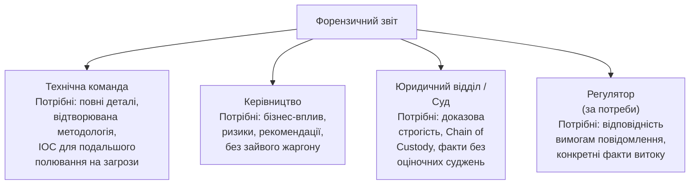

# 11.9. Написання форензичного звіту

Найблискучіший технічний аналіз втрачає всю свою цінність, якщо результат не можна донести до аудиторії, що приймає рішення. Форензичний звіт — міст між технічними деталями (хеші, timestamps, артефакти реєстру) і практичними висновками, на основі яких керівництво ухвалює рішення про звільнення, юрист готує позов, а суддя виносить вирок. Це окремий навик, відмінний від технічного аналізу: вміння зберегти точність і обґрунтованість, водночас роблячи матеріал зрозумілим для нетехнічної аудиторії.

> 📖 Ключові терміни — у [глосарії модуля](00-glosariy.md).

## Аудиторії форензичного звіту і їх потреби



**Практичний підхід:** один повний технічний звіт як «джерело правди», з якого готуються адаптовані версії (executive summary, юридичний витяг) для різних аудиторій — а не намагання написати один документ, що задовольнить усіх одночасно.

## Структура повного форензичного звіту

```
1. EXECUTIVE SUMMARY (1 сторінка)
   - Що сталося (2-3 речення)
   - Коли виявлено, коли почалось (якщо встановлено)
   - Масштаб впливу (скільки систем/записів)
   - Статус: чи компрометацію зупинено
   - Ключові рекомендації (3-5 пунктів)

2. SCOPE AND OBJECTIVES
   - Що саме досліджувалось і чому
   - Що НЕ входило в межі дослідження (явно!)
   - Хто замовив розслідування

3. METHODOLOGY
   - Які інструменти і версії використовувались
   - Послідовність дій (Order of Volatility — розділ 11.1)
   - Chain of Custody посилання (розділ 11.2)

4. FINDINGS (основна частина)
   - Хронологічний наратив подій (Timeline — розділ 11.3)
   - Технічні деталі для кожної знахідки
   - Докази для кожного твердження (посилання на конкретні
     артефакти, скріншоти, hash-значення)

5. ROOT CAUSE ANALYSIS
   - Як саме відбулась компрометація (initial access vector)
   - Чому існуючі контролі не запобігли або не виявили вчасно

6. IMPACT ASSESSMENT
   - Які дані/системи скомпрометовано
   - Конфіденційність/цілісність/доступність — що порушено

7. INDICATORS OF COMPROMISE (IOC)
   - Хеші файлів, IP-адреси, домени, мережеві сигнатури —
     структуровано для імпорту в SIEM/Threat Intelligence

8. RECOMMENDATIONS
   - Негайні дії (containment, якщо ще не виконано)
   - Короткострокові виправлення (1-4 тижні)
   - Довгострокові архітектурні зміни

9. APPENDICES
   - Повні логи, конфігурації інструментів
   - Chain of Custody форми
   - Глосарій технічних термінів (для нетехнічної аудиторії)
```

## Принципи написання: факти, не висновки-припущення

```
❌ Неприпустимо в форензичному звіті:
"Зловмисник, очевидно, хотів вкрасти фінансові дані"
"Ймовірно, це була інсайдерська атака"
"Швидше за все, співробітник навмисно видалив логи"

✅ Правильно — факти з чіткою атрибуцією джерела:
"CloudTrail зафіксував 47 запитів GetObject до S3 bucket
'financial-reports' з облікового запису user-X протягом
14:23-14:31 UTC 15.01.2024 (Додаток B, рядки 1102-1149)"

"MFT-аналіз виявив розбіжність між $STANDARD_INFORMATION
і $FILE_NAME timestamps для файлу backdoor.exe, що є
індикатором timestomping (детально — розділ 11.8);
справжній час створення файлу, за даними USN Journal,
встановлено як 03:14:22 15.01.2024 (Додаток C)"
```

**Принцип:** кожне твердження має конкретне джерело доказу, на яке читач може послатись і перевірити незалежно. Висновки про мотивацію чи наміри зловмисника — за межами компетенції цифрового криміналіста (це юридична, а не технічна категорія) і мають формулюватись з обережністю або взагалі виключатись з технічного звіту.

## Документування timeline: формат для звіту

```markdown
## Хронологія інциденту (всі часи UTC)

| Час | Подія | Джерело доказу |
|---|---|---|
| 2024-01-15 03:12:01 | Webshell `backdoor.php` створено в `/var/www/html/uploads/` | File system timestamp (Додаток A, файл #3) |
| 2024-01-15 03:12:05 | Apache access log: POST /upload.php з IP 185.220.101.1 | `access.log`, рядок 4521 (Додаток D) |
| 2024-01-15 03:14:33 | Виконання `powershell.exe` зафіксовано в Prefetch | `POWERSHELL.EXE-XXXX.pf` (Додаток E) |
| 2024-01-15 03:15:02 | Windows Event 4688: створено процес `svch0st.exe` | Security.evtx, EventRecordID 78234 |
| 2024-01-15 03:15:45 | Вихідне TCP-з'єднання до 185.220.101.1:443 | NetFlow запис (Додаток F) |
| 2024-01-15 14:24:15 | CloudTrail: GetCallerIdentity з вкраденими credentials | CloudTrail подія EventID a1b2c3 |
```

Така таблична форма дозволяє читачу (навіть нетехнічному) побачити логічну послідовність атаки, водночас зберігаючи прив'язку кожного факту до конкретного перевірюваного джерела.

## Executive Summary: переклад технічного на бізнес-мову

```markdown
## Executive Summary

**Що сталося:** Зловмисник отримав несанкціонований доступ до 
вебсервера компанії через вразливість завантаження файлів,
встановив прихований інструмент віддаленого доступу та
використав його для отримання доступу до внутрішньої мережі.

**Часові рамки:** Компрометація почалась 15 січня о 03:12, 
виявлена 15 січня о 14:45 (затримка виявлення: ~11.5 годин).

**Масштаб впливу:** Скомпрометовано 1 вебсервер та облікові дані 
адміністратора AWS. Виявлено ознаки доступу до S3-сховища з 
фінансовими звітами (47 файлів). Прямих доказів масового 
викачування даних клієнтів не виявлено.

**Поточний статус:** Загрозу нейтралізовано о 15:30 15 січня.
Скомпрометовані credentials відкликано. Вебсервер ізольовано
для подальшого дослідження.

**Ключові рекомендації:**
1. Негайно: ротація всіх AWS credentials, що мали доступ до 
   скомпрометованого сервера
2. Протягом тижня: впровадження валідації типів файлів при 
   завантаженні (усуне використаний вектор атаки)
3. Протягом місяця: впровадження централізованого, незмінного
   журналювання (поточні логи були частково видалені зловмисником)
```

## Технічний додаток: для аналітиків і Threat Hunting

```markdown
## Appendix: Indicators of Compromise (IOC)

### File Hashes (SHA-256)
- backdoor.php: 8f3a2c91e7b4d5f6a9c2e8b1d4f7a0c3e6b9d2f5a8c1e4b7d0f3a6c9e2b5d8f1
- svch0st.exe:  a1b2c3d4e5f6...

### Network Indicators
- C2 IP: 185.220.101.1
- C2 Domain: malware-c2.example-malicious.ru

### Behavioral Indicators (для SIEM-правил)
- Процес "svch0st.exe" (typosquatting svchost.exe)
- PowerShell з base64-encoded командами (-enc параметр)
- Windows Event ID 1102 (Audit log cleared) на хостах продакшену

### MITRE ATT&CK Mapping
- T1190 — Exploit Public-Facing Application (initial access)
- T1059.001 — PowerShell (execution)
- T1070.001 — Clear Windows Event Logs (defense evasion)
- T1078 — Valid Accounts (persistence, через вкрадені AWS credentials)
```

**MITRE ATT&CK mapping** (модуль 07) у звіті дозволяє іншим командам безпеки швидко зрозуміти TTP зловмисника і перевірити власну захищеність проти тих самих технік без необхідності читати весь технічний наратив.

## Peer Review: незалежна перевірка перед публікацією

```
Перед фіналізацією звіту:

☐ Інший кваліфікований аналітик незалежно перевіряє ключові
  висновки (чи можна відтворити результат за описаною
  методологією — ACPO Принцип 3, розділ 11.1)
☐ Юридичний відділ перевіряє формулювання на предмет
  юридичних ризиків (особливо якщо звіт може стати доказом)
☐ Технічна команда перевіряє точність IOC перед публікацією
  до SIEM/Threat Intelligence
☐ Видалені/виправлені будь-які оціночні судження про мотивацію
  чи особу зловмисника, не підкріплені прямими доказами
```

## Презентація звіту: усна комунікація з керівництвом

Письмовий звіт часто супроводжується усною презентацією для керівництва, де принципи відрізняються від письмового документа:

```
Структура 15-хвилинної презентації для C-level:

1. (2 хв) Що сталося — простими словами, без жаргону
2. (3 хв) Наскільки це серйозно — бізнес-вплив, не технічні деталі
3. (5 хв) Що ми вже зробили — демонстрація контролю над ситуацією
4. (3 хв) Що потрібно зробити далі — конкретні рішення, що
   потребують їх схвалення (бюджет, ресурси)
5. (2 хв) Питання-відповіді

Уникати:
- Абревіатур без пояснення (MFT, EDR, IOC — розшифровувати)
- Технічних подробиць, що не впливають на рішення
- Захисної позиції ("ми зробили все правильно") —
  фокус на фактах і рішеннях, а не на виправданнях
```

## Міні-вправа

Візьміть будь-який гіпотетичний інцидент (можна використати сценарій з міні-вправи розділу 11.1) і напишіть:

1. Executive Summary (максимум 150 слів) для керівництва.
2. Одну таблицю timeline з мінімум 5 подіями і прив'язкою до джерел доказів.
3. Три рекомендації, розділені на «негайно», «короткостроково», «довгостроково».

## Джерела та додаткові матеріали

- SWGDE, *Model Standard Operating Procedures for Computer Forensics*.
- SANS, *Writing Forensic Reports* (FOR500/FOR508 supplementary).
- NIST SP 800-86, Section 5 — Using a Forensic Process.
- MITRE ATT&CK Navigator (attack.mitre.org) — для IOC mapping.

---

**Попередній розділ:** [11.8. Anti-Forensics техніки](08-anti-forensics.md)
**Далі:** [11.10. Практична лабораторна на Python](10-praktychna-laboratorna.md)
**Назад до модуля:** [README модуля 11](README.md)
