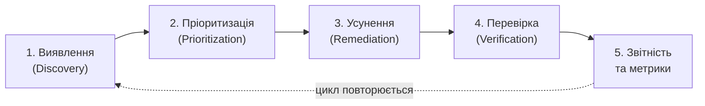

# 12.1. Вступ до управління вразливостями

## Навіщо потрібен окремий процес

Уявіть організацію, яка має 500 серверів, 2000 робочих станцій і 40 вебзастосунків. Щодня в базі NVD (National Vulnerability Database) публікується 40-80 нових CVE. Жодна людина фізично не може вручну відстежити, які з цих тисяч нових вразливостей за рік стосуються саме цієї інфраструктури. Vulnerability Management (VM) — це не разова дія, а **безперервний, циклічний процес**, що перетворює хаотичний потік загроз на керований конвеєр: виявити → оцінити → усунути → перевірити → повторити.

Ключова відмінність VM від разового аудиту: аудит фотографує стан системи на певний момент, VM — це відеозапис, що триває постійно, бо стан системи змінюється щодня (нові вразливості, нові конфігурації, нові співробітники з новими правами).

## Три пов'язані, але різні поняття

Плутанина між цими термінами — одна з найчастіших помилок навіть у досвідчених фахівців:

- **Weakness (слабкість)** — недолік у дизайні, коді чи конфігурації, який *потенційно* може призвести до проблеми безпеки. Каталогізується через **CWE (Common Weakness Enumeration)** — наприклад, CWE-79 (Cross-Site Scripting) описує клас проблеми абстрактно, незалежно від конкретного продукту.
- **Vulnerability (вразливість)** — конкретний, підтверджений випадок слабкості в конкретному продукті чи версії, який реально можна експлуатувати. Каталогізується через **CVE (Common Vulnerabilities and Exposures)** — наприклад, CVE-2021-44228 (Log4Shell) — це конкретна вразливість у конкретній бібліотеці Apache Log4j, що є проявом CWE-502 (Deserialization of Untrusted Data) та CWE-917 (Expression Language Injection).
- **Exposure (експозиція)** — конфігурація або практика, що сама по собі не є вразливістю, але розширює поверхню атаки чи полегшує розвідку (наприклад, відкритий SSH-порт назовні, банер сервера, що розкриває версію ПЗ).

**CPE (Common Platform Enumeration)** — стандартизований спосіб іменування продуктів і версій (наприклад, `cpe:2.3:a:apache:log4j:2.14.1`), що дозволяє автоматично зіставляти інвентар активів із базами CVE.

> **Міні-вправа 12.1.1:** Класифікуйте кожен з наступних записів як Weakness (CWE), Vulnerability (CVE) чи Exposure: (а) «SQL Injection» як клас проблеми; (б) «CVE-2017-5638 в Apache Struts»; (в) «сервер віддає заголовок `Server: Apache/2.4.6` у відповіді».
>
> 

Відповідь

>
> (а) Weakness — CWE-89, абстрактний клас проблеми, незалежний від конкретного продукту.
> (б) Vulnerability — конкретний CVE у конкретному продукті й версії.
> (в) Exposure — саме по собі не є вразливістю, але полегшує зловмиснику вибір експлойтів під конкретну версію (fingerprinting).
> 

## Життєвий цикл управління вразливостями

1. **Виявлення** — інвентаризація активів (не можна захистити те, про що не знаєш) + сканування вразливостей.
2. **Пріоритизація** — не всі вразливості однаково критичні; CVSS, EPSS та бізнес-контекст активу визначають чергу.
3. **Усунення** — патч, конфігураційна зміна, компенсуючий контроль (віртуальне патчування) або прийняття ризику.
4. **Перевірка** — повторне сканування підтверджує, що вразливість справді закрита, а не просто позначена «виправлено» в тікеті.
5. **Звітність** — метрики (MTTR, % критичних вразливостей поза SLA) для керівництва та для покращення самого процесу.

## Weakness vs Vulnerability vs Risk — де межа з Модулем 13

Важливо розрізняти **вразливість** і **ризик**: вразливість — технічний факт («у системі є SQL Injection»); ризик — це вразливість, помножена на ймовірність експлуатації та вплив на бізнес («ця SQL Injection в системі без чутливих даних і з обмеженим зовнішнім доступом — низький ризик; та сама вразливість у системі з персональними даними клієнтів, доступній з інтернету — критичний ризик»). Формальну методологію оцінки ризику (ISO/IEC 27005, NIST SP 800-30) розглядає Модуль 13 — цей модуль зосереджений на технічному виявленні й усуненні, що є вхідними даними для оцінки ризику.

## Українська практика: CERT-UA та координація вразливостей

**CERT-UA (Урядова команда реагування на комп'ютерні надзвичайні події України)** публікує не лише звіти про інциденти, а й консультації щодо вразливостей у продуктах, поширених в українському держсекторі. Організації, що підпадають під дію **Закону України «Про основні засади забезпечення кібербезпеки України»**, зобов'язані інформувати CERT-UA про виявлені інциденти, включно з фактами експлуатації вразливостей у критичній інфраструктурі.

> **Мінівправа 12.1.2:** Ваша організація використовує застарілу версію CMS на публічному сайті. Сканер виявив CVE з CVSS 9.8, для якої публічно доступний PoC-експлойт. Патч від вендора вийде через 3 тижні. Які два типи дій можна вжити паралельно, поки чекаєте офіційний патч?
>
> 

Відповідь

>
> 1. **Компенсуючий контроль (virtual patching)** — правило WAF, що блокує сигнатуру відомого експлойту, розглядається в розділі 12.4.
> 2. **Зниження поверхні атаки** — тимчасове обмеження доступу до вразливого компонента (IP allowlist, вимкнення нефункціонального модуля), якщо це не порушує бізнес-процеси.
>
> Очікування патча без проміжних дій за наявності публічного PoC — неприйнятний ризик.
> 

---

**Наступний розділ:** [12.2. Джерела вразливостей та бази даних](02-dzherela-vrazlyvostey-ta-bazy-danykh.md)
**Назад до модуля:** [README модуля 12](README.md)
