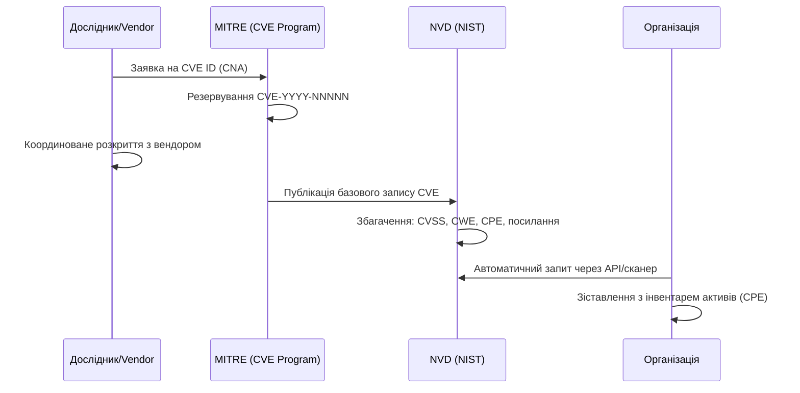

# 12.2. Джерела вразливостей та бази даних

## Від виявлення дослідником до запису в базі

Шлях вразливості до публічної бази — не миттєвий і не завжди прозорий. Розуміння цього шляху пояснює, чому дві різні бази (наприклад, NVD і CERT-UA) можуть мати різну інформацію про одну й ту саму проблему.

## Ключові бази та реєстри

- **CVE (cve.org)** — керується MITRE через мережу **CNA (CVE Numbering Authorities)** — вендори (Microsoft, Apache, Google) та дослідницькі організації, яким делеговано право видавати CVE-ідентифікатори для власних продуктів. CVE-запис сам по собі містить мінімум даних: ідентифікатор, короткий опис, посилання.
- **NVD (National Vulnerability Database, nvd.nist.gov)** — американська федеральна база, що **збагачує** CVE-записи: додає CVSS-вектор, прив'язку до CWE, CPE-ідентифікатори уражених продуктів. Саме NVD — джерело даних для більшості комерційних сканерів.
- **CWE (Common Weakness Enumeration, cwe.mitre.org)** — таксономія класів слабкостей (SQL Injection, Buffer Overflow, тощо), незалежна від конкретних продуктів; корисна для навчання розробників і для аналізу трендів («яка категорія CWE найчастіше зустрічається в наших внутрішніх додатках»).
- **EPSS (Exploit Prediction Scoring System, first.org/epss)** — на відміну від CVSS (статична оцінка тяжкості), EPSS дає **динамічну ймовірність реальної експлуатації вразливості протягом наступних 30 днів**, на основі машинного навчання на даних про фактичні атаки. Детальніше — розділ 12.4.
- **KEV (Known Exploited Vulnerabilities Catalog, CISA, cisa.gov/kev)** — список вразливостей, для яких **підтверджено факт активної експлуатації в реальних атаках**. Наявність CVE в цьому каталозі — сильний сигнал для негайної пріоритизації, незалежно від формального CVSS-балу.
- **CERT-UA (cert.gov.ua)** — публікує консультації щодо вразливостей і індикатори компрометації (IOC), релевантні для української інфраструктури; часто попереджає про експлуатацію конкретних CVE групами на кшталт UAC-0010 (Armageddon) чи Sandworm раніше за міжнародні джерела, оскільки атаки на Україну нерідко є полігоном для подальших глобальних кампаній.
- **ДСТУ ISO/IEC 27001/27002** — українські національні стандарти, гармонізовані з міжнародними ISO/IEC, що визначають вимоги до системи управління інформаційною безпекою, включно з процесом управління технічними вразливостями (контроль A.8.8 у редакції ISO/IEC 27001:2022).

> **Міні-вправа 12.2.1:** Сканер повідомляє про вразливість з CVSS 7.5 (High), яка не входить до каталогу CISA KEV. Інша вразливість має CVSS 6.1 (Medium), але присутня в KEV. Яку варто пріоритизувати першою і чому?
>
> 

Відповідь

>
> Вразливість з KEV (CVSS 6.1) — пріоритет вищий, бо CVSS оцінює *теоретичну* тяжкість, а присутність у KEV означає **підтверджений факт активної експлуатації в реальному світі**. Ймовірність атаки на вашу систему за наявності публічних інструментів експлуатації суттєво вища за формальний бал тяжкості. Це базовий принцип risk-based prioritization, який розвиває розділ 12.4.
> 

## Формат ідентифікатора CVE

`CVE-YYYY-NNNNN`, де YYYY — рік резервування ідентифікатора (не обов'язково рік публікації чи виявлення), NNNNN — послідовний номер (мінімум 4 цифри, може бути довшим). Наприклад, `CVE-2021-44228` (Log4Shell) було зарезервовано в 2021 році, хоча вразливість існувала в коді роками раніше.

## Обмеження публічних баз

Жодна база не є вичерпною чи миттєвою:

- **Затримка публікації** — між виявленням вразливості дослідником і появою запису в NVD може пройти від днів до місяців (період координованого розкриття, розділ 12.10).
- **Backlog збагачення NVD** — трапляються періоди, коли NVD не встигає додавати CVSS-вектори до нових CVE-записів вчасно, залишаючи їх без оцінки тяжкості тижнями.
- **Zero-day** — вразливості, що активно експлуатуються *до* того, як вендор чи дослідник взагалі про них дізналися; за визначенням відсутні в жодній базі до моменту виявлення.
- **CVE не покриває всі типи проблем** — конфігураційні помилки (наприклад, S3-бакет з публічним доступом) зазвичай не отримують CVE, оскільки це не вразливість продукту, а помилка експлуатації; такі проблеми виявляються через сканування конфігурацій (CSPM), а не через CVE-фіди.

---

**Попередній розділ:** [12.1. Вступ до управління вразливостями](01-vstup-do-upravlinnia-vrazlyvostiamy.md)
**Наступний розділ:** [12.3. Сканування вразливостей](03-skanuvannia-vrazlyvostey.md)
**Назад до модуля:** [README модуля 12](README.md)
