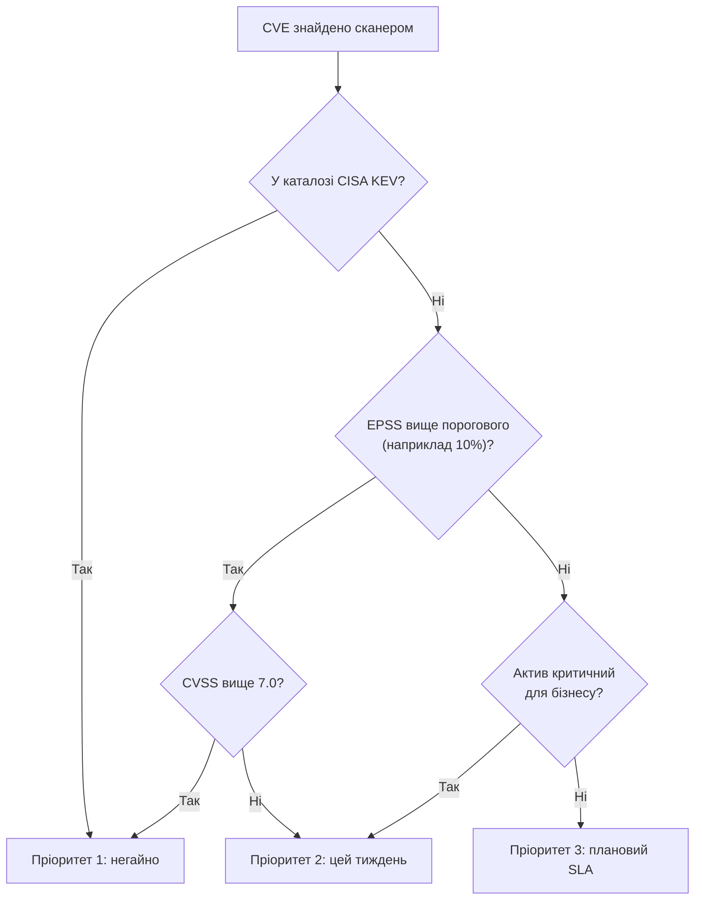

# 12.4. CVSS, EPSS та пріоритизація

## Проблема черги на 3000 записів

Уявіть звіт сканера з попереднього розділу: 3000 знайдених вразливостей у корпоративній мережі. Патч-команда може закрити реалістично 50-100 на тиждень. Яку саме чергу вибрати першою? Відповідь на це питання — суть пріоритизації, і саме тут CVSS сам по собі виявляється недостатнім інструментом.

## CVSS — вимір тяжкості, не терміновості

**CVSS (Common Vulnerability Scoring System)**, версія 3.1 і новіша 4.0, дає числову оцінку 0.0-10.0 на основі метрик:

- **Base metrics** (незмінні для конкретної вразливості): Attack Vector (Network/Adjacent/Local/Physical), Attack Complexity, Privileges Required, User Interaction, Scope, вплив на Confidentiality/Integrity/Availability.
- **Temporal metrics** (у 4.0 — Threat metrics): наявність робочого експлойту, наявність офіційного патча — змінюються з часом.
- **Environmental metrics**: контекст конкретної організації — критичність активу, наявність компенсуючих контролів.

Приклад вектора: `CVSS:3.1/AV:N/AC:L/PR:N/UI:N/S:U/C:H/I:H/A:H` — Attack Vector Network, низька складність, без потрібних привілеїв, без взаємодії користувача, повний вплив на всі три властивості = Base Score 9.8 (Critical).

**Ключове обмеження CVSS:** це оцінка *теоретичної максимальної тяжкості*, розрахована один раз при публікації вразливості (якщо організація не рахує Environmental metrics самостійно, що робить меншість команд). CVSS **нічого не каже про ймовірність того, що саме цю вразливість атакують у реальному світі**.

> **Міні-вправа 12.4.1:** Дві вразливості мають однаковий Base Score CVSS 9.1 (Critical). Перша — у популярному VPN-шлюзі, що використовується десятками тисяч організацій, з публічним PoC на GitHub. Друга — у вузькоспеціалізованому промисловому ПЗ, встановленому в кількох десятках підприємств світу, без публічного PoC. Чи однаковий у них терміновий пріоритет патчингу з точки зору CVSS? А з точки зору реального ризику?
>
> 

Відповідь

>
> CVSS Base Score — однаковий (9.1), бо він виміряє технічну тяжкість, ідентичну для обох. Але реальний ризик суттєво відрізняється: перша вразливість — привабливіша ціль для масової автоматизованої експлуатації (широка база жертв, готовий PoC знижує бар'єр для атаки навіть скрипт-кідді). Саме цю різницю покриває EPSS, розглянутий нижче — це ключова причина, чому CVSS сам по собі недостатній для пріоритизації черги патчингу.
> 

## EPSS — ймовірність реальної експлуатації

**EPSS (Exploit Prediction Scoring System)**, підтримується FIRST.org, дає відсоткову оцінку (0-100%) ймовірності того, що конкретна CVE буде реально проексплуатована в реальному світі протягом наступних 30 днів. Модель навчається на даних про фактично зафіксовані спроби експлуатації з мереж датчиків (honeypots, IDS-телеметрія), а не лише на теоретичних характеристиках вразливості.

Практичний ефект: дослідження FIRST.org демонструють, що менше 5% усіх опублікованих CVE коли-небудь реально експлуатуються в дикій природі — тобто сліпе патчування «всього з CVSS вище 7» витрачає ресурси на переважно теоретичні загрози, ігноруючи менш «тяжкі за CVSS», але активно атаковані вразливості.

## SSVC — структуроване прийняття рішень

**SSVC (Stakeholder-Specific Vulnerability Categorization)**, розроблена CISA та CMU SEI, іде далі за єдиний числовий бал — це дерево рішень, що враховує: чи є експлойт публічним, чи вразливість автоматизовано експлуатується, який технічний вплив, і яка місія/добробут organization-специфічні наслідки. Результат — не число, а категорія дії: `Track`, `Track*`, `Attend`, `Act`.

## Практична формула пріоритизації

Жоден окремий показник не є достатнім самостійно. Розсудлива черга пріоритизації враховує комбінацію:

## Віртуальне патчування як тимчасовий контроль

Коли офіційний патч ще недоступний (типова ситуація для zero-day чи щойно опублікованого CVE з публічним PoC до релізу офіційного виправлення), організація не залишається беззахисною. **Virtual patching (віртуальне патчування)** — це компенсуючий контроль, що блокує саму спробу експлуатації на рівні мережі чи застосунку, не змінюючи вразливий код:

- **WAF-правило**, що блокує специфічний патерн запиту, який експлуатує вразливість (наприклад, під час Log4Shell багато організацій за години розгорнули WAF-правила, що блокували патерн `${jndi:` у заголовках і параметрах запитів, ще до випуску офіційного патча Apache).
- **IPS-сигнатура** на мережевому рівні для відомого експлойту.
- **Тимчасове вимкнення** вразливого модуля/функціоналу, якщо бізнес-вплив прийнятний.

Важливо: віртуальне патчування — це **тимчасовий міст**, а не заміна офіційного патча; воно знижує ризик негайної експлуатації, залишаючи кореневу причину невиправленою до планового вікна обслуговування.

> **Міні-вправа 12.4.2:** Ваша команда отримала CVE з CVSS 9.8, EPSS 45% (дуже висока ймовірність активної експлуатації), присутню в каталозі CISA KEV. Офіційний патч вендора вийде за 10 днів через складність тестування зворотної сумісності. Опишіть план дій на найближчі 24 години.
>
> 

Відповідь

>
> 1. Негайно перевірити, чи вразливий компонент публічно доступний з інтернету — якщо так, це найвищий пріоритет.
> 2. Розгорнути віртуальне патчування (WAF/IPS-правило) для блокування відомого патерну експлуатації протягом години-двох.
> 3. Тимчасово обмежити доступ до компонента (allowlist IP, VPN-only), якщо бізнес-процес дозволяє.
> 4. Посилити моніторинг/логування навколо активу для раннього виявлення спроб експлуатації, поки патч не встановлено.
> 5. Задокументувати рішення й обґрунтування для аудиторського сліду (хто прийняв рішення про 10-денну затримку і чому компенсуючі контроли визнано достатніми).
> 

---

**Попередній розділ:** [12.3. Сканування вразливостей](03-skanuvannia-vrazlyvostey.md)
**Наступний розділ:** [12.5. Patch Management та hardening](05-patch-management-ta-hardening.md)
**Назад до модуля:** [README модуля 12](README.md)
