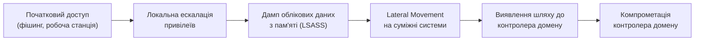

# 12.8. Post-exploitation: Lateral Movement та Active Directory

## Чому одна точка входу рідко є кінцевою метою

Реальна атака (та легітимний пентест, що її моделює) рідко зупиняється на першому скомпрометованому вузлі. Початковий доступ (наприклад, робоча станція бухгалтера через фішинг, Модуль 07) сам по собі рідко становить цінність — ціль зазвичай далі: контролер домену, база даних клієнтів, система резервного копіювання. **Post-exploitation** — фаза після початкового успішного проникнення, що охоплює закріплення (persistence), підвищення привілеїв та переміщення мережею.

## Lateral Movement

**Lateral Movement** — переміщення зловмисника між системами всередині мережі після початкового доступу, з метою досягнення цінніших цілей, недоступних з першого скомпрометованого вузла напряму.

Типовий ланцюжок у корпоративній мережі на базі Windows Active Directory:

## Атаки на Active Directory: розширення теми з Модуля 05

Модуль 05 (Автентифікація) уже вводив Kerberoasting, Golden Ticket та Pass-the-Hash з точки зору механізму атаки на протокол Kerberos. Тут ці техніки розглядаються в контексті **post-exploitation ланцюжка** — як саме вони використовуються послідовно під час реального просування мережею:

- **Credential dumping** (наприклад, з процесу LSASS у пам'яті Windows) — отримання хешів паролів чи Kerberos-квитків локально скомпрометованої машини для подальшого використання (Pass-the-Hash, Pass-the-Ticket).
- **BloodHound** — інструмент візуалізації відношень довіри й прав в Active Directory через граф; дозволяє пентестеру (і реальному зловмиснику) швидко знайти найкоротший шлях від скомпрометованого облікового запису звичайного користувача до прав Domain Admin, аналізуючи ланцюжки успадкованих груп і делегованих прав, непомітні при ручному перегляді.
- **Unconstrained Delegation** — конфігурація Active Directory, де серверу дозволено видавати себе за будь-якого користувача для будь-якого ресурсу в домені. Якщо зловмисник компрометує сервер із таким делегуванням, він потенційно отримує Kerberos-квитки будь-кого, хто автентифікувався на цьому сервері, включно з адміністраторами домену — критична, часто недооцінена конфігураційна вразливість, що не має власного CVE (це помилка конфігурації, а не помилка коду).

> **Міні-вправа 12.8.1:** BloodHound показує, що обліковий запис звичайного маркетолога, через членство в групі «Тимчасові проєктні права», має непряме право скидати пароль облікового запису, що входить до групи Domain Admins. Чи є це технічною вразливістю (CVE) чи конфігураційною вадою? Яка практична рекомендація?
>
> 

Відповідь

>
> Це конфігураційна вада (Exposure/misconfiguration, розділ 12.1), а не вразливість продукту — Active Directory працює за проєктом; проблема в тому, як призначено права. CVE тут не застосовний. Рекомендація: регулярний аудит ланцюжків непрямих привілеїв (не лише прямого членства в групах) через інструменти на кшталт BloodHound як частину планового процесу, а не лише під час пентесту раз на рік — принцип найменших привілеїв (least privilege, Модуль 05) вимагає, щоб тимчасові проєктні групи не накопичували довгострокові надлишкові права.
> 

## Pivoting

**Pivoting** — використання скомпрометованого хоста як проміжної точки для доступу до сегментів мережі, недоступних напряму зі стартової позиції пентестера (наприклад, внутрішня підмережа за файрволом, доступна лише зсередини периметра). Логічно продовжує тему сегментації мережі й trust boundaries з принципів secure-архітектури.

## Persistence (закріплення)

Механізми, що дозволяють зловміснику зберегти доступ навіть після перезавантаження системи чи зміни початкового пароля скомпрометованого облікового запису: заплановані завдання, служби, що запускаються автоматично, приховані облікові записи. У легітимному пентесті ці механізми **демонструються, документуються й обов'язково повністю видаляються** після завершення тесту — незнищений backdoor від пентестера — серйозний операційний ризик, що часом призводить до реальних інцидентів безпеки роками пізніше.

## Зв'язок із наступним розділом

Розділи 12.6-12.8 описали ручний, експертний підхід до тестування. Але масштабне, регулярне тестування захисту через ручний пентест неекономічне для щотижневої перевірки. Розділ 12.9 показує, як організації комбінують ручну експертизу (Red Team) з автоматизацією для безперервного тестування (BAS).

---

**Попередній розділ:** [12.7. Тестування на проникнення: методологія та експлуатація](07-testuvannia-na-pronyknennia.md)
**Наступний розділ:** [12.9. Red Team, Blue Team, Purple Team та BAS](09-red-blue-purple-team-bas.md)
**Назад до модуля:** [README модуля 12](README.md)
