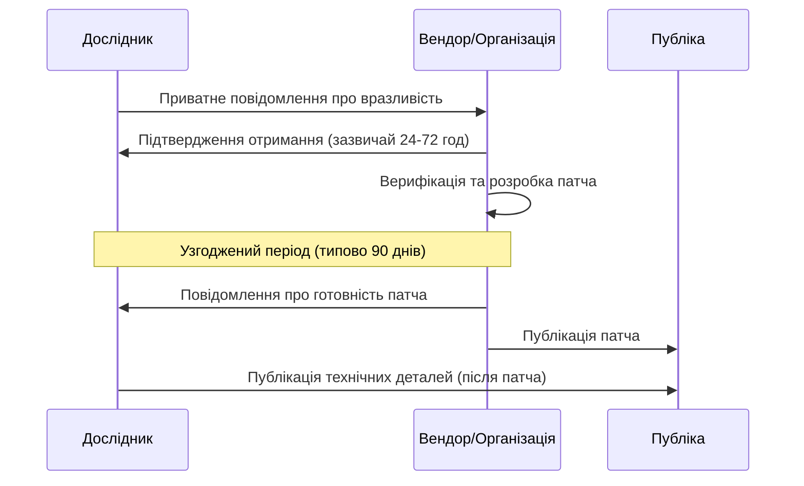

# 12.10. Відповідальне розкриття вразливостей (VDP)

## Дилема незалежного дослідника

Уявіть незалежного дослідника безпеки, який випадково — або цілеспрямовано, у межах легального дослідження публічно доступного застосунку — знаходить критичну вразливість у продукті організації, з якою немає жодних попередніх стосунків. Що робити? Публікація деталей одразу дає зловмисникам готовий рецепт атаки до того, як вендор встигне випустити патч. Мовчання залишає користувачів незахищеними невизначено довго, якщо вендор про проблему навіть не дізнається. **Coordinated Vulnerability Disclosure (координоване розкриття вразливостей, CVD)** — процес, що вирішує цю дилему.

## Процес координованого розкриття

Стандартний період узгодженого мовчання — **90 днів** (практика, популяризована Google Project Zero), хоча конкретний термін узгоджується індивідуально залежно від складності виправлення. Якщо вендор ігнорує повідомлення без відповіді протягом розумного часу, більшість дослідницьких спільнот вважають прийнятним розкриття деталей навіть без патча — це створює тиск на вендорів реагувати вчасно, водночас захищаючи дослідника від звинувачень у приховуванні небезпеки.

## Vulnerability Disclosure Program (VDP) проти Bug Bounty

- **VDP (Vulnerability Disclosure Program)** — формальна політика організації, що визначає **легальний, безпечний канал** для зовнішніх дослідників повідомляти про знайдені вразливості: контактну адресу (наприклад, security@organization.com чи форма на security.txt), очікуваний час відповіді, юридичні гарантії дослідникові (safe harbor — обіцянка не переслідувати судово за добросовісне тестування в межах politики), без обов'язкової фінансової винагороди.
- **Bug Bounty** — розширення VDP з фінансовою винагородою за знайдені вразливості, зазвичай градуйованою за тяжкістю (наприклад, від кількох сотень доларів за Low до десятків тисяч за Critical Remote Code Execution). Платформи на кшталт HackerOne чи Bugcrowd адмініструють такі програми для організацій, які не мають ресурсів вести власну.

**Ключова відмінність із точки зору організації, що має обмежені ресурси:** VDP — обов'язковий базовий мінімум практично для будь-якої організації з публічним застосунком (безкоштовний канал зв'язку з дослідницькою спільнотою знижує ризик неконтрольованого повного розкриття). Bug Bounty — додатковий, ресурсомісткий рівень, доцільний, коли організація вже має зрілий процес patch management (розділ 12.5), здатний оперативно реагувати на потік вхідних звітів; запуск Bug Bounty без готовності обробляти звіти швидко призводить до розчарованих дослідників і публічного розкриття через відсутність відповіді.

> **Міні-вправа 12.10.1:** Стартап без виділеної команди безпеки отримує перше повідомлення про вразливість від незалежного дослідника через загальну адресу info@ і не відповідає два тижні. Дослідник погрожує публічним розкриттям. Яку організаційну помилку можна було уникнути заздалегідь, і яка мінімальна дія для стартапу зараз?
>
> 

Відповідь

>
> Заздалегідь можна було уникнути проблему, впровадивши мінімальний VDP: виділену адресу security@ (або файл `/.well-known/security.txt` за стандартом RFC 9116, що вказує канал зв'язку для дослідників безпеки), з чітко визначеним очікуваним часом відповіді. Зараз мінімальна дія — негайно відповісти дослідникові особисто, підтвердити отримання, запросити технічні деталі приватним каналом і запропонувати конкретний, реалістичний термін виправлення — навіть без формальної Bug Bounty-програми, добросовісна й швидка комунікація суттєво знижує ймовірність передчасного публічного розкриття.
> 

## Український контекст: координація з CERT-UA

Для організацій критичної інфраструктури України координація вразливостей відбувається не лише двосторонньо (дослідник-вендор), а й через **CERT-UA** як національний координаційний центр: CERT-UA може виступати посередником між дослідником і організацією, публікувати узагальнені консультації про клас вразливості (без розкриття деталей до готовності патча) та забезпечувати відповідність вимогам ЗУ «Про основні засади забезпечення кібербезпеки України» щодо обов'язкового інформування про виявлені вразливості й інциденти в об'єктах критичної інфраструктури.

## Synthesis: чому жодна окрема практика модуля не замінює інші

Кейс Equifax (розділ 12.5) уже продемонстрував: сканування без патчування — марне знання, патчування без сканування — реагування наосліп. До цього додається третій вимір: пентест без vulnerability management — одноразовий знімок стану без системного покращення процесу, а vulnerability management без зовнішнього каналу розкриття (VDP) залишає організацію сліпою до проблем, знайдених поза власним периметром сканування. Equifax демонструє, що достатньо прогалини в будь-якій з цих практик для катастрофічного результату — саме тому весь модуль 12 побудований як єдиний, взаємопов'язаний цикл, а не набір ізольованих технік.

---

**Попередній розділ:** [12.9. Red Team, Blue Team, Purple Team та BAS](09-red-blue-purple-team-bas.md)
**Наступний розділ:** [12.11. Практична лабораторна](11-praktychna-laboratorna.md)
**Назад до модуля:** [README модуля 12](README.md)
