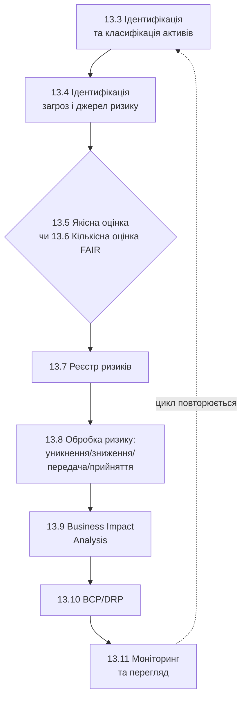

# 13.1. Від технічного ризику до організаційного управління

## Чому інтуїції інженера недостатньо

Модуль 01 ввів формулу ризику як добуток загрози, вразливості та впливу — корисну ментальну модель для окремого рішення («ця вразливість небезпечна, бо її легко експлуатувати і наслідки серйозні»). Модуль 12 навчив технічно виявляти вразливості й оцінювати їх тяжкість через CVSS та EPSS. Але уявіть організацію із 3000 відкритими вразливостями (сценарій з розділу 12.4), 40 бізнес-процесами, обмеженим бюджетом на безпеку і радою директорів, що вимагає одного запитання: «Наскільки ми в безпеці, і скільки грошей витратити далі?»

Жодна інтуїція окремого інженера не масштабується до відповіді на це запитання послідовно, відтворювано й перевірювано. Потрібен **формальний, документований процес**, що:

- дає однакові результати незалежно від того, хто саме проводить оцінку (відтворюваність);
- може бути перевірений аудитором чи регулятором (документованість);
- дозволяє порівнювати ризики різної природи (технічний CVE проти ризику відмови постачальника хмарних послуг) на спільній шкалі;
- пов'язує технічні рішення (яку вразливість патчити першою) з бізнес-наслідками (втрата доходу, штрафи, репутаційна шкода).

## Різниця між Vulnerability Management і Risk Management

Важливо чітко розрізняти два процеси, які легко сплутати:

| Критерій | Vulnerability Management (Модуль 12) | Risk Management (цей модуль) |
|---|---|---|
| Одиниця аналізу | Конкретна технічна вразливість (CVE) | Сценарій ризику (актив + загроза + вразливість + наслідок) |
| Питання | «Чи є в цій системі відома дірка?» | «Що станеться з бізнесом, якщо ця дірка буде проексплуатована, і чи виправдані витрати на її усунення?» |
| Вихідні дані | Скановані активи, бази CVE/CVSS/EPSS | Дані Vulnerability Management + бізнес-контекст (критичність активу, вартість простою, регуляторні наслідки) |
| Результат | Пріоритизований список патчів | Реєстр ризиків з рішеннями: уникнути/знизити/передати/прийняти |
| Власник процесу | Технічна команда (SecOps, IT) | Risk owner — часто на рівні бізнес-підрозділу чи керівництва |

**Ключовий зв'язок:** Vulnerability Management постачає технічні вхідні дані (наскільки ймовірна й тяжка експлуатація) для Risk Management, який додає бізнес-вимір (що це означає для організації) і приймає остаточне рішення про дії. Технічна вразливість з CVSS 9.8 у системі без чутливих даних і поза мережею продакшену може становити низький організаційний ризик; вразливість з CVSS 6.1 у системі обробки платежів клієнтів — високий ризик, незалежно від формального технічного бала.

> **Міні-вправа 13.1.1:** IT-команда повідомляє: «Ми виправили 95% усіх Critical-вразливостей за квартал» (метрика Vulnerability Management з Модуля 12). Рада директорів запитує: «Чи стали ми безпечнішими цього кварталу?» Чому пряма відповідь «так» на основі лише цієї метрики некоректна?
>
> 

Відповідь

>
> Метрика Vulnerability Management (95% Critical-вразливостей виправлено) вимірює технічну активність, але нічого не каже про бізнес-ризик напряму: можливо, невиправлені 5% стосуються найкритичніших систем компанії (обробка платежів клієнтів); можливо, за квартал з'явилися нові класи ризику, не пов'язані з CVE взагалі (наприклад, ризик відмови критичного постачальника хмарних послуг, розглянутий у розділі 13.4). Пряма відповідь на запитання ради директорів вимагає саме Risk Management — оцінки залишкового ризику (residual risk) з урахуванням бізнес-контексту, а не лише технічного відсотка усунення.
> 

## Ризик, загроза, вразливість, вплив — формальні визначення

Модуль 01 дав інтуїтивне пояснення; тепер закріпимо термінологію відповідно до ISO/IEC 27005 та NIST SP 800-30 (детальне порівняння стандартів — розділ 13.2):

- **Актив (Asset)** — усе, що має цінність для організації: дані, системи, процеси, репутація, персонал.
- **Загроза (Threat)** — потенційна причина небажаної події, що може завдати шкоди активу (природна, людська навмисна, людська ненавмисна, технічна).
- **Вразливість (Vulnerability)** — слабкість активу чи контролю, яку загроза може використати (пряме продовження термінології з Модуля 12, розділ 12.1).
- **Ризик (Risk)** — ефект невизначеності на досягнення цілей організації; формально — комбінація ймовірності настання події (загроза, що використовує вразливість) та її наслідків (вплив на актив).
- **Залишковий ризик (Residual Risk)** — ризик, що залишається після застосування контролів; жоден контроль не знижує ризик до нуля, і саме залишковий ризик є предметом рішення про прийняття (розділ 13.8).

## Структура модуля як послідовний процес

Розділи цього модуля йдуть у порядку, що відтворює реальний процес управління ризиками в організації:

Розділ 13.2 спершу дає формальну методологічну основу (які саме стандарти визначають ці кроки), перш ніж переходити до практичного виконання кожного етапу.

---

**Наступний розділ:** [13.2. Стандарти управління ризиками: ISO/IEC 27005 та NIST SP 800-30](02-standarty-upravlinnia-ryzykamy.md)
**Назад до модуля:** [README модуля 13](README.md)
