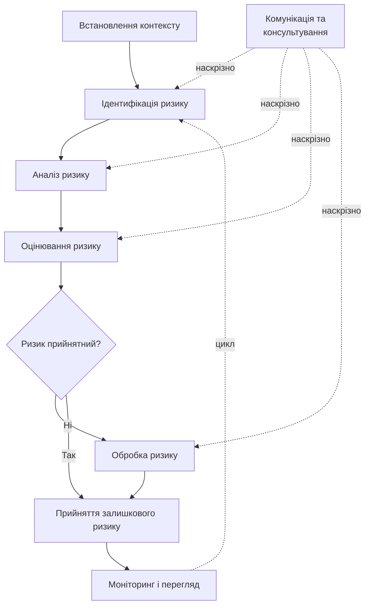

# 13.2. Стандарти управління ризиками: ISO/IEC 27005 та NIST SP 800-30

## Навіщо взагалі формальний стандарт

Розділ 13.1 показав, чому потрібен відтворюваний процес. Два найпоширеніші формальні фреймворки — **ISO/IEC 27005** (міжнародний, з українським національним відповідником ДСТУ ISO/IEC 27005) та **NIST SP 800-30** (американський федеральний стандарт) — не конкурують, а пропонують дві сумісні мови для одного й того самого процесу. Організація обирає один як основний залежно від регуляторного контексту (наприклад, компанія, що працює з американським урядовим замовником, скоріше обере NIST; організація, що сертифікується за ISO/IEC 27001, природно використовує ISO/IEC 27005 як методологію оцінки ризику для цієї системи управління).

## ISO/IEC 27005: методологія для ISMS

ISO/IEC 27005 не є самостійним стандартом сертифікації — це **методологічний додаток** до ISO/IEC 27001 (Модуль 09 вже згадував ISO 27001 у контексті хмарного комплаєнсу), що деталізує, як саме виконати вимогу контролю управління ризиками всередині Information Security Management System (ISMS). Процес складається з таких етапів:

1. **Встановлення контексту (Context Establishment)** — визначення меж оцінки, критеріїв прийнятності ризику, методології (якісна/кількісна/змішана).
2. **Оцінка ризику (Risk Assessment)** — сама складається з трьох підетапів: ідентифікація ризику, аналіз ризику (визначення ймовірності й наслідків), оцінювання ризику (порівняння з критеріями прийнятності).
3. **Обробка ризику (Risk Treatment)** — вибір і впровадження однієї з чотирьох стратегій (розділ 13.8).
4. **Прийняття ризику (Risk Acceptance)** — формальне затвердження залишкового ризику власником ризику.
5. **Комунікація та консультування (Risk Communication)** — наскрізний процес, що триває протягом усіх етапів, а не окремий крок наприкінці.
6. **Моніторинг і перегляд (Risk Monitoring and Review)** — так само наскрізний процес (розділ 13.11).

## NIST SP 800-30: чотиритактовий процес оцінки ризику

**NIST SP 800-30 Rev. 1** («Guide for Conducting Risk Assessments») визначає процес із чотирьох кроків, дещо детальніше акцентуючи на технічній підготовці й моделюванні загроз, ніж ISO/IEC 27005:

1. **Prepare (Підготовка)** — визначення мети, обсягу, припущень, обмежень та джерел інформації про загрози (включно з threat intelligence).
2. **Conduct (Проведення)** — ідентифікація джерел і подій загроз, вразливостей і схильних до них умов (predisposing conditions), визначення ймовірності та величини впливу, обчислення ризику.
3. **Communicate (Комунікація)** — передача результатів оцінки особам, що приймають рішення.
4. **Maintain (Підтримка)** — постійний моніторинг факторів ризику для виявлення змін, що вимагають повторної оцінки.

NIST SP 800-30 також вводить корисну деталізацію джерел загроз, яку розглянемо в розділі 13.4: **adversarial** (навмисні, людські), **accidental** (ненавмисні, людські), **structural** (технічні відмови обладнання/ПЗ), **environmental** (природні катастрофи, збої інфраструктури).

## Порівняльна таблиця

| Критерій | ISO/IEC 27005 | NIST SP 800-30 |
|---|---|---|
| Юрисдикція/походження | Міжнародний (ISO), укр. відповідник ДСТУ ISO/IEC 27005 | Федеральний уряд США (NIST) |
| Прив'язка | Методологічний додаток до ISO/IEC 27001 | Самостійний, частина серії NIST SP 800 (разом з SP 800-53, SP 800-61) |
| Акцент | Інтеграція в ISMS, наскрізна комунікація й моніторинг | Деталізована таксономія джерел загроз і схильних умов |
| Типовий контекст застосування | Організації, що сертифікуються за ISO/IEC 27001, або працюють у міжнародному/європейському регуляторному полі | Урядові підрядники США, організації, що орієнтуються на NIST CSF (уже згадувався в контексті цього посібника як парасольковий фреймворк) |
| Терміни для однакових понять | Risk Treatment, Risk Acceptance | Risk Response, Risk Tolerance |

> **Міні-вправа 13.2.1:** Українська компанія розробляє SaaS-продукт для клієнтів у Європейському Союзі й планує сертифікацію ISO/IEC 27001 для укладання контрактів з корпоративними клієнтами. Який з двох стандартів (ISO/IEC 27005 чи NIST SP 800-30) логічніше обрати як основну методологію оцінки ризику, і чому це не виключає використання ідей з другого стандарту?
>
> 

Відповідь

>
> ISO/IEC 27005 — логічний основний вибір, оскільки він методологічно прив'язаний саме до ISO/IEC 27001, який компанія планує сертифікувати; аудитор сертифікаційного органу очікуватиме процес, що явно відповідає структурі ISO/IEC 27005 (встановлення контексту → оцінка → обробка → прийняття → моніторинг). Це не виключає запозичення корисних елементів з NIST SP 800-30 — наприклад, детальнішої таксономії джерел загроз (adversarial/accidental/structural/environmental) чи методології FAIR для кількісної оцінки (розділ 13.6) — обидва стандарти визначають структуру процесу, а не забороняють використання додаткових аналітичних інструментів усередині цієї структури.
> 

## Куди це веде далі в модулі

Обидва стандарти сходяться на спільній послідовності кроків, яку решта модуля виконує практично: ідентифікація активів (13.3) та загроз (13.4) відповідають етапу «Ідентифікація ризику» / «Conduct»; якісна (13.5) і кількісна (13.6) оцінка — етапу «Аналіз ризику»; реєстр ризиків (13.7) документує результат «Оцінювання ризику»; обробка ризику (13.8) реалізує «Risk Treatment» / «Risk Response».

---

**Попередній розділ:** [13.1. Від технічного ризику до організаційного управління](01-vid-tekhnichnoho-ryzyku-do-upravlinnia.md)
**Наступний розділ:** [13.3. Ідентифікація та класифікація активів](03-identyfikatsiia-aktyviv.md)
**Назад до модуля:** [README модуля 13](README.md)
