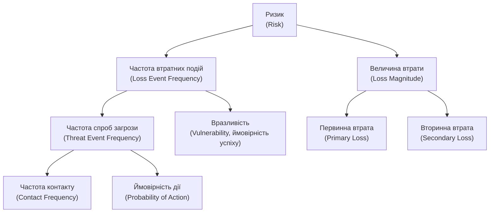

# 13.6. Кількісна оцінка ризику: методологія FAIR

## Чому «Критичний» недостатньо для ради директорів

Розділ 13.5 дав RISK-001 мітку «Критичний». Корисно для пріоритизації, але недостатньо для конкретного управлінського рішення: «чи варто витратити 2 мільйони гривень на додатковий контроль, що знижує ймовірність цього сценарію вдвічі?» Відповісти на це можна лише порівнявши вартість контролю з очікуваною фінансовою шкодою від ризику — а для цього потрібні числа в гривнях чи доларах, а не кольорові категорії.

## Класична формула ALE

Найпростіша кількісна модель, що з'явилася задовго до FAIR і досі використовується як базова:

- **SLE (Single Loss Expectancy)** — очікувана фінансова втрата від **однієї** реалізації ризику.
  `SLE = AV × EF`, де AV (Asset Value) — вартість активу, EF (Exposure Factor) — частка вартості активу, що втрачається при одній реалізації (у відсотках, 0-100%).
- **ARO (Annualized Rate of Occurrence)** — очікувана кількість реалізацій ризику **на рік** (наприклад, 0.1 означає «раз на 10 років», 2.0 означає «двічі на рік»).
- **ALE (Annualized Loss Expectancy)** — очікувана річна фінансова втрата від цього ризику.
  `ALE = SLE × ARO`

**Приклад:** база даних клієнтів (AST-001, розділ 13.3) оцінена у 50 000 000 грн. вартості бізнесу, що залежить від неї. Витік даних через RISK-001 призводить до втрати приблизно 20% цієї вартості через штрафи, відтік клієнтів і судові позови (EF = 0.20). SLE = 50 000 000 × 0.20 = 10 000 000 грн. Якщо аналіз threat intelligence (розділ 13.4) вказує на ймовірність такої атаки раз на 4 роки (ARO = 0.25), тоді ALE = 10 000 000 × 0.25 = **2 500 000 грн на рік**.

Ця цифра — очікувана річна вартість ризику — тепер безпосередньо порівнянна з вартістю контролю: якщо контроль коштує 500 000 грн на рік і знижує ARO вдвічі (до 0.125), новий ALE = 1 250 000 грн, тобто економія 1 250 000 грн мінус 500 000 грн вартості контролю = **чиста вигода 750 000 грн на рік** — обґрунтоване рішення інвестувати.

> **Міні-вправа 13.6.1:** Актив вартістю 10 000 000 грн має Exposure Factor 40% при реалізації конкретного сценарію ризику, а ARO становить 0.5 (раз на 2 роки). Розрахуйте SLE та ALE.
>
> 

Відповідь

>
> SLE = 10 000 000 × 0.40 = 4 000 000 грн.
> ALE = 4 000 000 × 0.5 = **2 000 000 грн на рік**.
> 

## Обмеження класичної ALE-моделі

Проста ALE-формула має суттєву слабкість: вона вимагає одного точного числа для ARO та EF, тоді як реальність невизначена — експерти рідко можуть впевнено сказати «рівно раз на 4 роки», радше «десь між раз на 2 роки і раз на 10 років». **FAIR (Factor Analysis of Information Risk)**, розроблена організацією FAIR Institute й прийнята як стандарт Open Group (O-RA), вирішує цю проблему через розкладання ризику на менші, легше оцінювані фактори з діапазонами замість точкових значень.

## Дерево факторів FAIR

- **Loss Event Frequency (LEF)** — очікувана кількість подій втрати на рік (аналог ARO, але виведений з менших факторів, а не оцінений напряму):
  - **Threat Event Frequency (TEF)** — як часто загроза взагалі намагається реалізуватися (наприклад, скільки разів на рік зловмисники намагаються атакувати конкретний API).
  - **Vulnerability** — у термінології FAIR це ймовірність, що спроба загрози дійсно завершиться успіхом (не плутати з CVE-вразливістю з Модуля 12, хоча вони прямо пов'язані: наявність невиправленої CVE підвищує цей фактор).
- **Loss Magnitude (LM)** — фінансовий масштаб втрати, якщо подія відбулася (аналог SLE, теж розкладений глибше):
  - **Primary Loss** — прямі втрати (простій, вартість реагування на інцидент, вартість відновлення).
  - **Secondary Loss** — вторинні втрати від реакції зацікавлених сторін (штрафи регуляторів, судові позови, відтік клієнтів, репутаційна шкода) — часто перевищують первинні втрати в масштабних інцидентах.

## Діапазони замість точкових оцінок

Ключова методологічна відмінність FAIR: кожен фактор оцінюється як **діапазон з рівнем упевненості** (мінімум, найбільш ймовірне значення, максимум), а не єдине число, і результат обчислюється через симуляцію Монте-Карло (тисячі випадкових прогонів у межах заданих діапазонів), що дає не одне число ALE, а **розподіл ймовірностей** очікуваних втрат — наприклад, «є 90% ймовірність, що річні втрати від цього ризику не перевищать 5 000 000 грн, і 50% ймовірність, що вони не перевищать 1 200 000 грн».

Це набагато чесніший спосіб комунікації з керівництвом, ніж хибно точне єдине число: замість «ризик коштує компанії 2 500 000 грн на рік» (що звучить як точний факт), FAIR-аналіз каже «з 90% упевненістю річні втрати від цього ризику становитимуть від 500 000 до 8 000 000 грн», що чесно відображає реальну невизначеність оцінки.

> **Міні-вправа 13.6.2:** Команда безпеки оцінює TEF для сценарію RISK-001 (спроби експлуатації RCE-вразливості API платежів) як «від 5 до 50 спроб на рік, найімовірніше 15» — на основі даних моніторингу WAF за попередній квартал. Vulnerability (ймовірність успіху спроби) оцінюється як «від 5% до 20%, найімовірніше 10%», з огляду на впроваджене віртуальне патчування (Модуль 12, розділ 12.4). Що з цього випливає для LEF, і чому точна єдина цифра тут була б оманливою?
>
> 

Відповідь

>
> LEF (кількість успішних подій втрати на рік) — добуток TEF і Vulnerability, і оскільки обидва фактори задані діапазонами, а не точковими значеннями, результат теж має бути діапазоном (приблизно від 5×0.05=0.25 до 50×0.20=10 успішних подій на рік у крайніх випадках, з найімовірнішим значенням близько 15×0.10=1.5). Єдина точна цифра була б оманливою, бо приховала б реальну невизначеність вхідних оцінок TEF і Vulnerability — керівництво, побачивши «1.5 події на рік», може прийняти рішення, що не враховує розумно ймовірний гірший сценарій (до 10 подій на рік при менш сприятливому поєднанні факторів), тоді як явний діапазон змушує враховувати цю невизначеність свідомо.
> 

## Коли застосовувати FAIR, а коли достатньо якісної оцінки

FAIR вимагає суттєво більше часу, даних і експертизи, ніж якісна матриця (розділ 13.5). Практичний компроміс: якісна оцінка — для швидкого первинного скринінгу й пріоритизації великої кількості сценаріїв (як у розділі 13.4); кількісний FAIR-аналіз — для вузького кола ризиків найвищої категорії (Критичний/Високий за матрицею), де рішення про значні інвестиції в контролі вимагає точнішого фінансового обґрунтування для бюджетного затвердження керівництвом.

---

**Попередній розділ:** [13.5. Якісна оцінка ризику та матриця ризиків](05-yakisna-otsinka-ryzyku.md)
**Наступний розділ:** [13.7. Реєстр ризиків](07-reiestr-ryzykiv.md)
**Назад до модуля:** [README модуля 13](README.md)
