# 13.9. Business Impact Analysis: RTO, RPO, MTD

## Коли ризик уже реалізувався: інший тип запитання

Розділи 13.3-13.8 відповідали на запитання «як запобігти ризику чи знизити його ймовірність». **Business Impact Analysis (BIA)** відповідає на принципово інше запитання: «якщо, попри всі заходи, критичний інцидент все ж стався (актив недоступний прямо зараз) — що саме й у якому порядку відновлювати, і скільки часу на це є, перш ніж наслідки стануть непоправними?» BIA — місток між управлінням ризиками (профілактика) і плануванням безперервності бізнесу (розділ 13.10, реакція на вже реалізовану подію).

## Український кейс: атака на Київстар (грудень 2023)

Наймасштабніший публічно задокументований приклад availability-впливу в українському контексті — кібератака на оператора «Київстар» у грудні 2023 року, що спричинила повне припинення роботи мобільного зв'язку та інтернету для мільйонів абонентів на понад добу. Цей інцидент ілюструє центральну ідею BIA напряму: наслідки простою для критичного інфраструктурного сервісу нелінійні в часі — перші хвилини простою некритичні (звичний короткий збій), але з кожною годиною наслідки зростають експоненційно: спершу незручність для абонентів, потім — порушення роботи систем екстреного зв'язку, банківських SMS-підтверджень, критичної інфраструктури, що покладається на мобільний зв'язок для моніторингу. Саме цю нелінійну динаміку BIA формалізує через метрики RTO, RPO та MTD.

## Ключові метрики BIA

- **RTO (Recovery Time Objective)** — максимально прийнятний час, протягом якого бізнес-процес чи система можуть залишатися недоступними після інциденту, перш ніж наслідки стануть неприйнятними для бізнесу. Відповідає на запитання: «Скільки часу є на відновлення?»

- **RPO (Recovery Point Objective)** — максимально прийнятний обсяг втрачених даних, вимірюваний у часі з моменту останньої точки відновлення до моменту збою. Відповідає на запитання: «Скільки даних ми готові втратити?» Наприклад, RPO = 1 година означає, що резервне копіювання має відбуватися не рідше, ніж раз на годину, оскільки саме стільки даних максимально прийнятно втратити при відновленні з останньої резервної копії.

- **MTD (Maximum Tolerable Downtime)** — абсолютна межа простою, після якої настають незворотні наслідки для існування бізнесу (втрата ліцензії, банкрутство, незворотна втрата довіри клієнтів). MTD завжди більший або дорівнює RTO — **RTO має бути встановлений із запасом до MTD**, а не впритул до нього, оскільки реальне відновлення рідко відбувається точно за планом.

```mermaid
gantt
    dateFormat X
    axisFormat %s
    section Часова шкала інциденту
    Нормальна робота (до інциденту) :done, a1, 0, 10
    Інцидент (система недоступна) :crit, a2, 10, 15
    RPO (втрачені дані з цього періоду) :active, a3, 8, 10
    RTO (плановий час відновлення) :active, a4, 10, 22
    Запас до MTD :milestone, a5, 22, 22
    MTD (критична межа) :crit, a6, 30, 30
```

> **Міні-вправа 13.9.1:** Платіжний API (AST-002, розділ 13.3) має RTO = 4 години та RPO = 15 хвилин. Поточна конфігурація резервного копіювання виконується раз на добу (24 години). Яка невідповідність тут є, і чому вона критична саме для платіжної системи?
>
> 

Відповідь

>
> RPO = 15 хвилин вимагає, щоб максимальна втрата даних при відновленні не перевищувала 15 хвилин з моменту збою, але поточне резервне копіювання раз на добу означає потенційну втрату **до 24 годин** даних — у 96 разів більше за прийнятний ліміт. Для платіжної системи це критично: втрата навіть кількох годин транзакцій означає втрачені або задубльовані платежі, розбіжності в балансах клієнтів, і потенційні фінансові та регуляторні наслідки. Це типова прогалина BIA: організація визначає амбітний RPO на папері, не приводячи технічну реалізацію резервного копіювання у відповідність — саме тому BIA має завершуватися конкретними технічними вимогами до інфраструктури, а не залишатися абстрактним документом.
> 

## Процес проведення BIA

1. **Ідентифікація критичних бізнес-процесів** — на відміну від реєстру активів (розділ 13.3), який класифікує технічні й інформаційні активи, BIA починається з **бізнес-процесів** (обробка платежів, обслуговування клієнтів, виробництво) і лише потім прив'язує до них підтримуючі технічні системи.
2. **Оцінка впливу простою в часі** — для кожного процесу визначається, як зростають наслідки простою по мірі збільшення часу (1 година / 4 години / 24 години / тиждень), зазвичай через опитування власників бізнес-процесів, а не лише IT-персоналу.
3. **Визначення RTO, RPO, MTD** для кожного критичного процесу й підтримуючої системи на основі цього аналізу.
4. **Визначення залежностей (Dependency Mapping)** — критичний процес часто залежить від інших систем (платіжний API залежить від бази даних, мережевої інфраструктури, стороннього платіжного шлюзу) — RTO самого процесу не може бути коротшим за RTO найповільнішої залежності в ланцюжку.
5. **Пріоритизація відновлення (Recovery Priority)** — на основі зібраних RTO будується черга відновлення систем після масштабного інциденту, що зачіпає кілька систем одночасно (саме цю чергу реалізує DRP, розділ 13.10).

> **Міні-вправа 13.9.2:** Платіжний API (RTO = 4 години) технічно залежить від зовнішнього сервісу верифікації особи клієнта (KYC-провайдер), чий власний договірний SLA на відновлення після збою становить 12 годин. Яка реальна, а не формально задокументована RTO платіжного API, і яку дію варто розглянути?
>
> 

Відповідь

>
> Реальна RTO платіжного API обмежена найповільнішою критичною залежністю — фактично **не менше 12 годин**, попри задокументовану мету в 4 години, оскільки процес не може повністю відновитися, поки недоступний необхідний KYC-провайдер. Це класичний приклад того, чому dependency mapping (крок 4) обов'язковий: RTO, встановлений без урахування зовнішніх залежностей, — нереалістична мета на папері. Варіанти дій: переговори з провайдером про жорсткіший SLA, впровадження резервного альтернативного KYC-провайдера (стратегія Зниження ризику, розділ 13.8), або перегляд задекларованого RTO у бік реалістичного значення з чітким усвідомленням цього обмеження керівництвом.
> 

---

**Попередній розділ:** [13.8. Обробка ризику: чотири стратегії](08-obrobka-ryzyku.md)
**Наступний розділ:** [13.10. Business Continuity та Disaster Recovery Planning](10-bcp-drp.md)
**Назад до модуля:** [README модуля 13](README.md)
