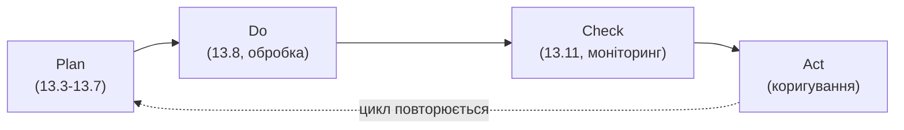

# 13.11. Моніторинг ризиків та інтеграція в ISMS

## Ризик-менеджмент — не проєкт із датою завершення

Розділи 13.3-13.10 могли створити враження лінійного процесу з чітким фіналом: ідентифікували активи, оцінили ризики, обробили, задокументували BCP/DRP — готово. Насправді, як і цикл Vulnerability Management з Модуля 12 (розділ 12.1), управління ризиками — **безперервний цикл**, а не одноразовий проєкт: нові активи з'являються, нові загрози виникають, бізнес-контекст змінюється, і вчорашня прийнятна оцінка ризику сьогодні може бути застарілою.

## Тригери позапланового перегляду

Крім планового періодичного перегляду (щоквартально чи щонапівроку, залежно від зрілості організації), реєстр ризиків (розділ 13.7) вимагає негайного перегляду конкретних записів за такими подіями:

- **Нова критична вразливість** — результат сканування чи пентесту (Модуль 12) прямо стосується активу з реєстру ризиків; притаманний ризик цього сценарію потребує переоцінки.
- **Зміна бізнес-контексту** — запуск нового продукту, вихід на новий ринок з іншими регуляторними вимогами, злиття/поглинання додає нові активи й загрози до реєстру.
- **Реалізований інцидент** — фактична подія безпеки (навіть якщо результат нижчий за оцінений вплив) — привід переглянути точність попередньої оцінки ймовірності для подібних сценаріїв.
- **Зміна регуляторного середовища** — новий закон чи оновлення стандарту (наприклад, зміни до ЗУ «Про захист персональних даних» чи нова версія ISO/IEC 27001) може змінити класифікацію активів чи поріг прийнятності ризику.
- **Зміна геополітичного контексту** — для української інфраструктури, як показує приклад RISK-004 (розділ 13.4), зміна безпекової ситуації прямо впливає на ймовірність Environmental-категорії загроз і вимагає оперативної переоцінки, а не очікування планового квартального циклу.

## Ключові показники ефективності (KPI/KRI) процесу

Для оцінки, чи справді працює процес управління ризиками (а не існує лише формально на папері), використовуються метрики:

| Метрика | Що показує |
|---|---|
| Кількість ризиків за рівнем (тренд за квартал) | Чи зростає, чи знижується загальна кількість Критичних/Високих ризиків |
| Середній час від ідентифікації до обробки | Чи діє організація оперативно, чи ризики місяцями чекають рішення |
| % ризиків, що пройшли плановий перегляд вчасно | Дисципліна виконання процесу моніторингу |
| % прийнятих ризиків з формальним затвердженням власника | Чи прийняття задокументоване (розділ 13.8), а не мовчазне ігнорування |
| Результати останнього BCP/DRP-тестування | Чи довели плани відновлення свою працездатність практично (розділ 13.10) |

> **Міні-вправа 13.11.1:** У звіті для ради директорів кількість зареєстрованих Критичних ризиків знизилась з 8 до 2 за квартал — на перший погляд позитивний тренд. Яке додаткове запитання варто поставити перед тим, як інтерпретувати це як реальне покращення безпеки?
>
> 

Відповідь

>
> Варто перевірити, **як саме** досягнуто зниження: чи це результат реальних заходів зниження ризику (впроваджені контролі, розділ 13.8) і повторної, обґрунтованої переоцінки, чи ризики просто закриті формально без фактичного усунення причини (наприклад, статус змінено на «Закрито» без верифікації, аналогічно проблемі верифікації патчів з Модуля 12, розділ 12.1). Друге запитання: чи не відбулося одночасно **додавання нових ризиків**, які компенсують видиме зниження — метрика «кількість Критичних ризиків» без контексту тренду появи нових записів може вводити в оману так само, як голий відсоток виправлених вразливостей у розділі 13.1.
> 

## Інтеграція в ISMS (Information Security Management System)

Процес управління ризиками, розглянутий у цьому модулі, — не ізольована практика, а центральний елемент **ISMS** за ISO/IEC 27001: реєстр ризиків прямо визначає **Statement of Applicability (SoA)** — документ, що обґрунтовує, які саме контролі з Annex A ISO/IEC 27001 застосовуються до організації (на основі виявлених ризиків, що ці контролі покликані знижувати), а які свідомо не застосовуються (з обґрунтуванням чому — наприклад, контроль щодо безпеки розробки мобільних застосунків не застосовний до організації, що взагалі не розробляє мобільних додатків).

**Continuous Improvement (безперервне вдосконалення)** — цикл PDCA (Plan-Do-Check-Act), що лежить в основі ISO/IEC 27001, прямо відображається в структурі цього модуля: Plan (розділи 13.3-13.7, ідентифікація й оцінка) → Do (розділ 13.8, впровадження обробки) → Check (цей розділ, моніторинг) → Act (коригування на основі моніторингу, що замикає цикл назад до Plan).

## GRC-платформи як практичний інструмент

На масштабі, що перевищує кілька десятків ризиків у таблиці Excel, організації переходять на спеціалізовані **GRC-платформи (Governance, Risk, and Compliance)** — програмні рішення, що автоматизують ведення реєстру ризиків, пов'язують його з реєстром контролів і комплаєнс-вимогами, генерують дашборди для керівництва в реальному часі, і забезпечують аудиторський слід усіх змін статусу ризику — практичний технологічний місток між методологією, розглянутою в цьому модулі, і повсякденною операційною роботою команди з управління ризиками.

---

**Попередній розділ:** [13.10. Business Continuity та Disaster Recovery Planning](10-bcp-drp.md)
**Наступний розділ:** [13.12. Практична лабораторна на Python](12-praktychna-laboratorna.md)
**Назад до модуля:** [README модуля 13](README.md)
