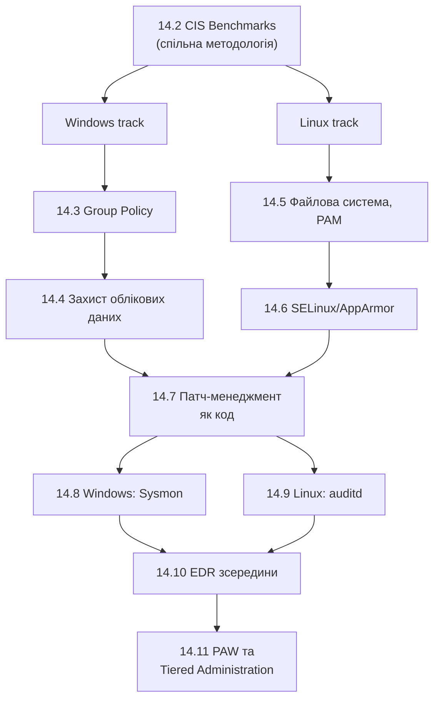

# 14.1. Hardening як остання лінія оборони

## Захисна цибулина і її внутрішній шар

Принцип defense in depth, згаданий ще на початку цього посібника, часто ілюструють цибулиною: периметр (файрвол, IDS/IPS), мережева сегментація, автентифікація (Модуль 05), безпека застосунку (Модуль 06). Кожен шар покликаний зупинити зловмисника, якщо попередній не спрацював. **Операційна система хоста — найвнутрішніший шар цієї цибулини.** Якщо зловмисник дістався до виконання коду на конкретній машині (через фішинг, експлуатацію вразливості застосунку, чи вкрадені облікові дані), саме конфігурація ОС визначає, наскільки далеко він зможе просунутися далі: чи зможе підвищити привілеї, чи зможе викрасти облікові дані інших користувачів з пам'яті, чи буде його активність взагалі помічена.

## Чому запатчена система — не те саме, що захищена система

Модуль 12 детально розглянув Patch Management: закриття конкретних відомих вразливостей (CVE). Але уявіть сервер із нульовою кількістю невиправлених CVE, який водночас:

- дозволяє анонімний доступ до спільних мережевих ресурсів;
- має ввімкненими застарілі, непотрібні служби (Telnet, SMBv1);
- зберігає облікові дані адміністратора в пам'яті без додаткового захисту (LSA Protection, розділ 14.4);
- не журналює жодної підозрілої активності (відсутній Sysmon/auditd, розділи 14.8-14.9);
- дозволяє звичайним користувачам виконувати команди від імені root/Administrator без обмежень.

Жодна з цих проблем не отримає CVE-ідентифікатора — це не помилки коду вендора, а помилки конфігурації адміністратора, точно так само, як розділ 12.5 Модуля 12 вже розрізняв vulnerability scanning (CVE) від hardening-скану (конфігурація). Цей модуль — глибоке занурення саме в другу категорію.

## Кейс: NotPetya (2017) як ілюстрація важливості hardening поза патчами

NotPetya (детально розглянутий у контексті українських кібератак у попередніх модулях) технічно експлуатував EternalBlue (CVE-2017-0144, патч для якої вже існував на момент атаки) для початкового поширення. Але вирішальним фактором катастрофічного масштабу поширення стала **друга** техніка: після компрометації однієї машини NotPetya використовував викрадені облікові дані (через інструмент, подібний до Mimikatz, що читає паролі з пам'яті процесу LSASS) для **lateral movement** через легітимні адміністративні інструменти (PsExec, WMI) на інші машини в мережі — навіть повністю запатчені проти EternalBlue. Організації з увімкненим Credential Guard (розділ 14.4, технологія, що на момент атаки вже існувала, хоча й не була повсюдно розгорнута) чи належною сегментацією адміністративних облікових записів (Tiered Administration, розділ 14.11) значно обмежили б цей другий етап поширення, незалежно від патч-статусу щодо EternalBlue.

**Висновок:** патчинг закриває конкретний вхідний вектор; hardening обмежує, наскільки далеко зловмисник просунеться, **навіть якщо** якийсь вхідний вектор усе ж спрацював — це принципово додатковий, а не альтернативний рівень захисту.

> **Міні-вправа 14.1.1:** Організація стверджує: «Ми повністю захищені — усі сервери запатчені на 100% протягом останніх 24 годин після виходу кожного оновлення (SLA з Модуля 12, розділ 12.5)». Наведіть два конкретні типи атак, від яких ідеальний patch management сам по собі не захищає, і поясніть, який шар захисту з цього модуля покриває кожен з них.
>
> 

Відповідь

>
> 1. **Крадіжка облікових даних з пам'яті та lateral movement** (як у сценарії NotPetya вище) — не пов'язана з жодним невиправленим CVE, а експлуатує стандартну поведінку ОС зі зберігання облікових даних у пам'яті процесу. Покривається технологіями захисту облікових даних (розділ 14.4: Credential Guard, LSA Protection) та сегментацією адміністративного доступу (розділ 14.11).
> 2. **Зловживання легітимними інструментами (Living off the Land, LOLBAS з Модуля 07)** — використання вбудованих, легітимних утиліт ОС (PowerShell, WMI, certutil) для шкідливих цілей; жоден патч не усуває саму наявність цих утиліт, оскільки вони потрібні для нормальної роботи системи. Покривається журналюванням і детекцією підозрілих патернів використання (розділи 14.8-14.9: Sysmon, auditd) та обмеженням прав виконання (AppLocker/SELinux, розділи 14.3, 14.6).
> 

## Структура модуля: дзеркальна пара Windows і Linux

Модуль побудований як послідовні пари розділів для двох домінантних серверних і десктопних ОС, з наскрізними темами, спільними для обох платформ:

Розділ 14.2 дає спільну методологічну рамку (CIS Benchmarks) для обох платформ, після чого модуль розгалужується на паралельні технічні треки Windows і Linux, знову сходячись на спільних наскрізних темах (патч-менеджмент, EDR, привілейований доступ), що застосовні незалежно від конкретної ОС.

---

**Наступний розділ:** [14.2. CIS Benchmarks практично](02-cis-benchmarks-praktychno.md)
**Назад до модуля:** [README модуля 14](README.md)
