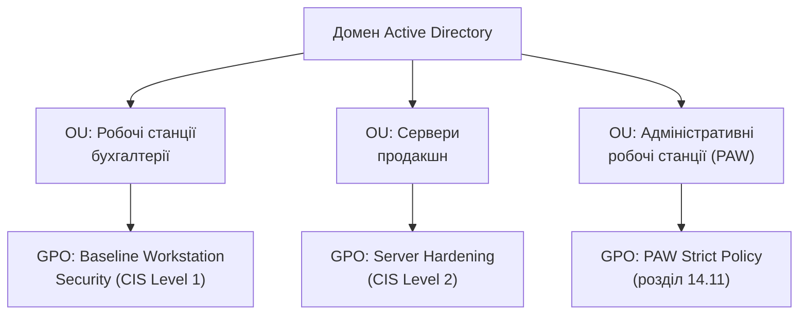

# 14.3. Windows: Group Policy та Local Security Policy

## Механізм масштабованого впровадження hardening

Розділ 14.2 дав методологію (CIS Benchmarks), але на масштабі тисяч робочих станцій ручне налаштування кожної нежиттєздатне. **Group Policy (Групова політика)** — механізм Windows/Active Directory (Active Directory вперше детально розглядався в Модулі 05), що дозволяє централізовано визначити конфігурацію безпеки один раз і автоматично застосувати до тисяч комп'ютерів і користувачів одночасно, з автоматичним періодичним оновленням (типово кожні 90-120 хвилин).

## Group Policy Object (GPO): структура

**GPO** — контейнер налаштувань, що прив'язується (linked) до організаційної одиниці (Organizational Unit, OU) в Active Directory. Коли комп'ютер чи користувач входить до складу OU, до якої прив'язаний GPO, налаштування застосовуються автоматично при завантаженні системи чи вході користувача.

Ключова перевага цієї моделі — **успадкування й пріоритизація**: GPO можуть застосовуватися на рівні домену, сайту чи конкретної OU, з чіткими правилами, яке налаштування має пріоритет при конфлікті (найближчий до об'єкта OU зазвичай перемагає, якщо явно не заблоковано успадкування).

## Ключові категорії налаштувань безпеки

- **Password Policy** — мінімальна довжина, складність, історія паролів, максимальний вік (пряме продовження принципів автентифікації з Модуля 05).
- **Account Lockout Policy** — кількість невдалих спроб входу до блокування облікового запису, тривалість блокування — контроль проти brute-force атак.
- **User Rights Assignment** — які групи/користувачі мають конкретні системні привілеї (наприклад, «Log on as a service», «Debug programs», «Act as part of the operating system») — надлишкове призначення цих прав звичайним користувачам є частим джерелом ескалації привілеїв.
- **Security Options** — сотні окремих перемикачів: вимкнення анонімного перелічування SAM-акаунтів, вимоги до підпису SMB-трафіку (захист проти SMB relay-атак), поведінка UAC (User Account Control).
- **Windows Defender Firewall налаштування** — централізовані правила хостового файрвола.
- **AppLocker / Windows Defender Application Control (WDAC)** — обмеження, які виконувані файли, скрипти й DLL дозволено запускати, реалізуючи принцип allowlisting замість blocklisting (пряме застосування принципу secure defaults з блоку контексту завдання: за замовчуванням заборонено все, крім явно дозволеного).

> **Міні-вправа 14.3.1:** Компанія виявляє через журнали (розділ 14.8), що зловмисник після компрометації однієї робочої станції зміг виконати PowerShell-скрипт для завантаження додаткового шкідливого інструменту (типовий патерн Post-Exploitation з Модуля 12, розділ 12.8). Яке налаштування Group Policy з категорій вище найбільш прямо перешкодило б цій конкретній дії, і чому це ілюструє принцип allowlisting?
>
> 

Відповідь

>
> AppLocker чи WDAC-політика, що дозволяє виконання лише явно затверджених, підписаних скриптів і виконуваних файлів, безпосередньо заблокувала б запуск довільного, незатвердженого PowerShell-скрипта зловмисника. Це ілюструє принцип allowlisting (secure default «заборонено, якщо явно не дозволено») на противагу типовій за замовчуванням політиці Windows blocklisting («дозволено, якщо явно не заборонено») — перша модель значно ефективніша проти невідомих, щойно написаних шкідливих інструментів, які жоден антивірусний сигнатурний механізм ще не розпізнає (пряме продовження теми AV vs EDR з Модуля 07).
> 

## Local Security Policy: коли GPO недоступна

Для комп'ютерів поза доменом Active Directory (окремі робочі станції, невеликі мережі без AD-інфраструктури) той самий набір налаштувань конфігурується локально через **Local Security Policy** (`secpol.msc`) — застосовується лише до конкретної машини, без централізованого автоматичного розповсюдження. Це прийнятне рішення для малих організацій чи ізольованих систем, але не масштабується — саме тому більшість організацій середнього й великого розміру покладаються на доменну Group Policy.

## PowerShell DSC та Group Policy як конфігурація

**PowerShell Desired State Configuration (DSC)** доповнює традиційну Group Policy декларативним підходом: адміністратор описує бажаний стан системи (конкретний набір служб, реєстрових ключів, файлів) у декларативному скрипті, а DSC-агент на кожній машині періодично перевіряє й автоматично виправляє відхилення від цього стану — пряма аналогія з підходом Infrastructure as Code, розглянутим детальніше в розділі 14.7.

## Практичний аудит: gpresult та Resultant Set of Policy

Через складність успадкування й потенційних конфліктів кількох GPO, застосованих до одного об'єкта, Windows надає інструмент `gpresult /h report.html`, що генерує звіт **Resultant Set of Policy (RSoP)** — фактичний, підсумковий набір налаштувань, які реально застосовані до конкретного комп'ютера чи користувача після врахування всіх успадкувань і пріоритетів, критично важливий для діагностики, коли очікувана й фактична поведінка системи розходяться.

---

**Попередній розділ:** [14.2. CIS Benchmarks практично](02-cis-benchmarks-praktychno.md)
**Наступний розділ:** [14.4. Windows: захист облікових даних](04-windows-zakhyst-oblikovykh-danykh.md)
**Назад до модуля:** [README модуля 14](README.md)
