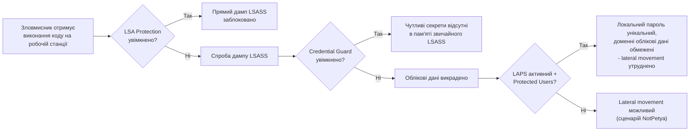

# 14.4. Windows: захист облікових даних

## Чому саме цей розділ настільки критичний

Розділ 14.1 уже показав на прикладі NotPetya: техніка крадіжки облікових даних з пам'яті — один із найпотужніших інструментів у арсеналі зловмисника для lateral movement, і жоден патч конкретної CVE її не усуває, оскільки це зловживання **штатною** поведінкою ОС. Модуль 05 (розділ про атаки: Pass-the-Hash, Golden Ticket) і Модуль 12 (розділ 12.8: credential dumping, BloodHound) уже описали ці атаки з боку зловмисника. Цей розділ — дзеркальна відповідь: конкретні технології Windows, що системно ускладнюють чи унеможливлюють ці атаки.

## Проблема: LSASS як єдина точка збору облікових даних

Процес **LSASS (Local Security Authority Subsystem Service)** — центральний компонент Windows, що відповідає за автентифікацію користувачів і, як частина цієї роботи, тимчасово зберігає в своїй пам'яті облікові дані (хеші NTLM, Kerberos-квитки, а історично — навіть паролі у відкритому вигляді для деяких сценаріїв автентифікації). Інструменти на кшталт Mimikatz (згаданий у Модулі 05 та 12) спеціалізуються саме на видобуванні цих даних з пам'яті LSASS для користувача з достатніми привілеями (типово, локального адміністратора).

## LSA Protection (Protected Process Light)

Найпростіший рівень захисту: позначення процесу LSASS як **Protected Process Light (PPL)** — режим, у якому лише інші процеси з відповідним, вищим рівнем захисту можуть отримати доступ до пам'яті LSASS, блокуючи типові інструменти дампінгу, що працюють на рівні звичайного адміністративного процесу. Вмикається через реєстровий параметр `RunAsPPL` і застосовується через Group Policy (розділ 14.3) на масштабі.

**Обмеження:** LSA Protection — суттєвий бар'єр, але не абсолютний захист; існують більш просунуті техніки обходу PPL (наприклад, через вразливі, підписані драйвери — техніка Bring Your Own Vulnerable Driver, BYOVD, яку, зокрема, застосовували деякі українські wiper-атаки для отримання доступу на рівні ядра попри захисні механізми користувацького рівня).

## Credential Guard

**Windows Defender Credential Guard** — суттєво потужніший механізм, що використовує апаратну віртуалізацію (**Virtualization-Based Security, VBS**, на основі Hyper-V) для ізоляції найчутливіших секретів (NTLM-хешів, Kerberos Ticket-Granting Tickets) в окремому, ізольованому віртуалізованому контейнері, до якого навіть процес із правами SYSTEM на основній ОС не має прямого доступу. Фактично LSASS на основній ОС більше не зберігає ці секрети напряму — він звертається до ізольованого процесу через строго контрольований інтерфейс.

**Практичний ефект:** класичні техніки дампінгу LSASS (Mimikatz `sekurlsa::logonpasswords`) не отримують доступу до захищених Credential Guard секретів, оскільки їх фізично немає в пам'яті звичайного LSASS-процесу.

**Вимоги й обмеження:** Credential Guard вимагає підтримки апаратної віртуалізації (UEFI Secure Boot, TPM 2.0), і, що важливо, **несумісний із деякими застарілими механізмами автентифікації** (наприклад, NTLMv1, деякі legacy Kerberos-делегування) — типовий приклад компромісу Level 2 CIS-подібної рекомендації з розділу 14.2: значний виграш у безпеці ціною можливих проблем сумісності зі старими системами, що потребує тестування перед впровадженням.

> **Міні-вправа 14.4.1:** Компанія впроваджує Credential Guard на всіх робочих станціях, але залишає без змін кілька застарілих серверів на Windows Server 2008 R2, які фізично не підтримують цю технологію (вимагає щонайменше Windows 10/Server 2016). Опишіть залишковий ризик у цьому сценарії мовою Модуля 13.
>
> 

Відповідь

>
> Притаманний ризик крадіжки облікових даних через дампінг LSASS суттєво знижений для робочих станцій із Credential Guard, але **залишається на попередньому, більш високому рівні** для застарілих серверів без цієї технології. Якщо привілейований обліковий запис (наприклад, доменний адміністратор) коли-небудь автентифікується на застарілому сервері, його облікові дані потенційно доступні для крадіжки навіть попри захист на всіх інших машинах — це прямо перегукується з принципом Tiered Administration (розділ 14.11): привілейовані облікові дані ніколи не повинні використовуватися на менш захищених системах, незалежно від того, наскільки добре захищені основні робочі станції.
> 

## Protected Users Security Group

Ще один рівень захисту — членство облікового запису в групі **Protected Users** (доступна для доменних середовищ від Windows Server 2012 R2), яка автоматично накладає низку обмежень на цей обліковий запис: заборона автентифікації через застарілий NTLM (лише Kerberos), заборона делегування Kerberos-квитків (пряме обмеження проти Unconstrained Delegation-атак з Модуля 12, розділ 12.8), скорочений термін дії Kerberos Ticket-Granting Ticket, що звужує вікно для атак типу Golden Ticket (Модуль 05).

## Local Administrator Password Solution (LAPS) — коротке нагадування

Модуль 05 вже детально розглядав LAPS у контексті PAM (Privileged Access Management) — автоматичну ротацію унікальних, випадкових локальних адміністративних паролів на кожній машині, що усуває класичну проблему «один і той самий локальний адміністративний пароль на всіх робочих станціях» — критичну умову, що дозволяє лаврово поширюватися lateral movement-атакам одним викраденим паролем по всій мережі.

## Комплексний ефект: як ці механізми працюють разом

---

**Попередній розділ:** [14.3. Windows: Group Policy та Local Security Policy](03-windows-group-policy.md)
**Наступний розділ:** [14.5. Linux: файлова система, права доступу, PAM](05-linux-faylova-systema-pam.md)
**Назад до модуля:** [README модуля 14](README.md)
