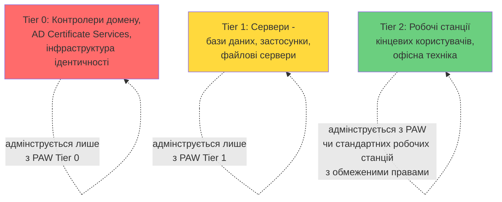

# 14.11. Privileged Access Workstations та Tiered Administration

## Останній структурний контроль модуля

Розділи 14.1-14.10 дали технічні механізми захисту окремої машини (hardening, MAC, журналювання, EDR). Цей завершальний розділ вирішує інше запитання, на яке жоден із попередніх механізмів не відповідає повністю: **навіть з усіма технічними контролями, що станеться, якщо той самий адміністратор, що керує критичними серверами, щодня читає пошту й переглядає вебсторінки з тієї самої робочої станції?** Один вдалий фішинговий лист (Модуль 07) на цій машині компрометує облікові дані найвищого рівня привілеїв в організації — усі попередні технічні бар'єри стають неактуальними, якщо сам привілейований обліковий запис скомпрометовано в джерелі.

## Проблема "плоскої" адміністративної моделі

У багатьох організаціях один і той самий обліковий запис доменного адміністратора використовується для: читання електронної пошти, перегляду вебсторінок, повсякденної офісної роботи **і** адміністрування критичних серверів і контролерів домену. Це — фундаментальна архітектурна вада, а не окрема технічна вразливість: найвищий привілей в організації регулярно наражається на найризикованіші, найчастіше атаковані вектори (фішинг, шкідливі вебсайти, Модуль 07).

## Tiered Administration Model (Модель ярусного адміністрування)

Розроблена Microsoft як структурне рішення цієї проблеми, модель ділить усю інфраструктуру та адміністративні облікові записи на три ізольовані рівні (tiers), між якими адміністративні облікові дані **ніколи** не перетинаються:

- **Tier 0** — найкритичніший рівень: контролери домену, служби сертифікації Active Directory, будь-яка інфраструктура, компрометація якої означає повний контроль над усім доменом (пряме продовження атак Golden Ticket, Unconstrained Delegation з Модулів 05 та 12).
- **Tier 1** — сервери й застосунки, що обробляють дані організації, але не контролюють саму інфраструктуру ідентичності.
- **Tier 2** — робочі станції кінцевих користувачів, найбільш наражені на щоденні ризики (фішинг, перегляд вебсторінок, USB-накопичувачі).

**Ключове, незламне правило моделі:** обліковий запис адміністратора певного рівня **ніколи** не використовується для входу на машину нижчого рівня захисту. Адміністратор Tier 0 ніколи не вводить свої облікові дані на звичайній робочій станції Tier 2 — саме це правило, послідовно й без винятків застосоване, унеможливлює сценарій NotPetya з розділу 14.1, де облікові дані високопривілейованого адміністратора опинилися в пам'яті звичайної, менш захищеної робочої станції.

> **Міні-вправа 14.11.1:** Системний адміністратор отримує термінове повідомлення про проблему на файловому сервері (Tier 1) о 2-й ночі й, не маючи під рукою виданої організацією PAW (розглянуто нижче), швидко підключається до сервера через RDP зі свого особистого ноутбука, використовуючи облікові дані доменного адміністратора Tier 0 «просто цього разу, бо терміново». Яке саме структурне правило Tiered Administration Model порушено, і яка конкретна атака стає можливою внаслідок цього одного порушення?
>
> 

Відповідь

>
> Порушено фундаментальне правило ярусної ізоляції: обліковий запис Tier 0 (доменний адміністратор) використано для входу на машину поза захищеним периметром Tier 0 — особистий ноутбук, ймовірно без Credential Guard, LSA Protection чи будь-яких контролів hardening з розділу 14.4, і поза контролем організації взагалі. Якщо цей особистий ноутбук скомпрометований (навіть банальним, раніше встановленим malware, не пов'язаним із цим інцидентом), облікові дані Tier 0 тепер доступні для крадіжки з пам'яті (Mimikatz-подібна техніка, розділ 14.4) — одне-єдине «термінове виключення о 2-й ночі» технічно надає зловміснику шлях до повної компрометації всього домену Active Directory, незалежно від того, наскільки добре захищені всі інші компоненти інфраструктури згідно з рештою цього модуля.
> 

## Privileged Access Workstations (PAW)

**PAW** — фізично чи логічно окрема, суворо захищена робоча станція, призначена **виключно** для виконання адміністративних завдань відповідного рівня, без жодного використання для повсякденних, ризикованих активностей (пошта, перегляд вебсторінок, офісні документи):

- **Дедиковане апаратне забезпечення** (у найсуворішому варіанті) чи, як мінімум, **окрема віртуальна машина/сесія**, повністю ізольована від основного робочого середовища користувача.
- **Максимально суворий hardening** — усі технології з цього модуля застосовані на найвищому рівні: Credential Guard, LAPS, WDAC/AppLocker у режимі суворого allowlisting, Sysmon із повним журналюванням, доступ лише до вузького, явно дозволеного переліку адміністративних інструментів і адрес призначення.
- **Відсутність доступу до інтернету** (крім явно необхідних адміністративних порталів) і **відсутність поштового клієнта** — фізичне усунення найпоширеніших векторів компрометації (фішинг, drive-by завантаження) на рівні самої архітектури, а не лише через технічний контроль, що теоретично можна обійти.
- **Multi-Factor Authentication (Модуль 05)** обов'язкова для входу на саму PAW і для будь-якої подальшої адміністративної дії з неї.

## Зв'язок із Just-In-Time Access (JIT) з Модуля 05

Модуль 05 уже вводив концепцію Just-In-Time (JIT) Privileged Access — тимчасове, обмежене в часі надання підвищених прав лише на період фактичної потреби, замість постійного (standing) привілейованого доступу. Tiered Administration Model і PAW доповнюють цю концепцію просторовим виміром: JIT обмежує **коли** привілей активний, PAW і ярусна модель обмежують **звідки** й **у якому ізольованому середовищі** цей привілей взагалі може бути використаний — комбінація обох вимірів (часового й просторового обмеження) дає значно надійніший захист, ніж будь-який з них окремо.

## Практичний виклик впровадження

Найпоширеніша причина провалу впровадження цієї моделі на практиці — не технічна складність, а **людський фактор зручності**: адміністратори, звиклі до єдиної робочої станції для всіх завдань, сприймають необхідність перемикання між PAW і звичайним робочим середовищем як перешкоду продуктивності. Успішне впровадження вимагає не лише технічного розгортання, а й організаційної підтримки на рівні керівництва (прямий приклад стратегії обробки ризику «Зниження» з Модуля 13, розділ 13.8, що вимагає усвідомленого компромісу між операційною зручністю й суттєвим зниженням ризику компрометації найвищого рівня привілеїв організації).

---

**Попередній розділ:** [14.10. EDR зсередини: технічні механізми](10-edr-zseredyny.md)
**Наступний розділ:** [14.12. Практична лабораторна на Python](12-praktychna-laboratorna.md)
**Назад до модуля:** [README модуля 14](README.md)
