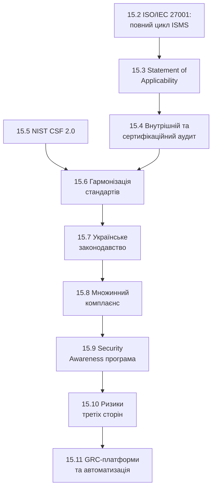

# 15.1. Від технічних практик до управлінської системи

## Проблема розрізнених практик

Уявіть організацію, що пройшла модулі 12-14 сумлінно: вразливості скануються й патчаться (Модуль 12), ризики оцінюються й фіксуються в реєстрі (Модуль 13), сервери hardened за CIS Benchmarks (Модуль 14). Здавалося б, вона в безпеці. Але великий корпоративний клієнт просить надати підтвердження: сертифікат ISO/IEC 27001 чи звіт SOC 2. Регулятор під час перевірки запитує: «покажіть документований процес управління ризиками, затверджений керівництвом, з призначеними власниками й датами перегляду». Аудитор запитує: «як ви доводите, що ваш reєстр ризиків дійсно використовується для прийняття рішень, а не просто існує у файлі Excel, який ніхто не відкриває після створення?»

Жодна з окремих технічних практик сама по собі не відповідає на ці запитання. Потрібна **система** — формалізована структура, що зв'язує окремі практики в єдине ціле, документує їх, призначає відповідальність, і головне — може бути **незалежно перевірена й підтверджена** третьою стороною. Це і є предмет GRC.

## Три літери: Governance, Risk, Compliance

- **Governance (управління)** — структура прийняття рішень: хто відповідає за що, як приймаються рішення про безпеку, як звітує керівництво перед радою директорів. Це відповідь на запитання «хто в кінцевому підсумку відповідальний, якщо щось піде не так».
- **Risk (ризик)** — систематичний процес з Модуля 13, тепер розглянутий як частина ширшої системи, а не ізольована практика.
- **Compliance (комплаєнс)** — доведення відповідності зовнішнім вимогам: законодавству, галузевим стандартам, контрактним зобов'язанням перед клієнтами.

Ключове розуміння цього модуля: **Governance визначає структуру, Risk Management (Модуль 13) заповнює цю структуру змістом рішень, Compliance доводить стороннім особам, що структура й рішення реальні, а не декларативні.**

## Чому «просто робити правильні речі» недостатньо

Технічно зріла команда безпеки може щиро вважати документацію й аудит бюрократичною зайвиною — «ми й так патчимо вразливості, навіщо ще папери». Це поширена, але дорога помилка з кількох причин:

1. **Відтворюваність незалежно від конкретних людей.** Без документованого процесу знання живе в головах кількох ключових співробітників; коли вони звільняються, процес розпадається. Формалізована система (ISO 27001, розділ 15.2) переживає плинність кадрів.
2. **Бізнес-необхідність, а не бюрократія.** Багато B2B-контрактів, особливо з великими корпораціями чи державними замовниками, прямо вимагають сертифікації ISO/IEC 27001 чи звіту SOC 2 як умови підписання договору — без цього організація фізично не може конкурувати за певні контракти, незалежно від того, наскільки технічно добре вона захищена насправді.
3. **Юридичний захист.** У разі інциденту (витік даних, атака) наявність задокументованої, аудованої системи управління — це різниця між «організація вжила розумних заходів, але стала жертвою атаки» і «організація була недбалою» з точки зору регулятора чи суду — прямий вплив на розмір штрафів і юридичну відповідальність.
4. **Регуляторна вимога, а не вибір.** Для об'єктів критичної інфраструктури України (розділ 15.7) впровадження системи управління інформаційною безпекою — пряма законодавча вимога, а не добровільна ініціатива.

> **Міні-вправа 15.1.1:** Технічний директор стартапу каже: «Ми проводимо пентести, патчимо все вчасно, у нас хороший security-культура в команді — навіщо витрачати місяці на ISO 27001 сертифікацію?» Яка конкретна бізнес-ситуація найімовірніше змусить його переглянути цю позицію?
>
> 

Відповідь

>
> Найтиповіша ситуація — великий корпоративний клієнт (банк, страхова компанія, державна установа) на етапі due diligence перед підписанням контракту прямо запитує сертифікат ISO/IEC 27001 чи звіт SOC 2 Type II як обов'язкову умову, незалежно від того, наскільки технічно добре захищений стартап насправді. Без формального доказу (сертифікат, аудований звіт) технічна досконалість команди безпеки залишається недоведеним твердженням для сторонньої, юридично обережної організації, яка не може просто повірити на слово — це і є момент, коли GRC переходить з категорії «бюрократія» в категорію «блокуючий фактор для росту бізнесу».
> 

## Структура модуля

Розділи 15.2-15.4 будують повний цикл навколо ISO/IEC 27001 — найпоширенішого міжнародного стандарту сертифікації; розділ 15.5 вводить альтернативний, менш формальний, але широко застосовуваний NIST CSF 2.0; розділ 15.6 показує, як поєднати обидва замість штучного вибору «або-або»; розділи 15.7-15.8 заземлюють це в конкретний правовий контекст, включно з українським законодавством і множинними одночасними вимогами; розділи 15.9-15.11 — практичні операційні компоненти системи, що підтримують її живою день у день.

---

**Наступний розділ:** [15.2. ISO/IEC 27001: повний цикл ISMS](02-iso-27001-isms.md)
**Назад до модуля:** [README модуля 15](README.md)
