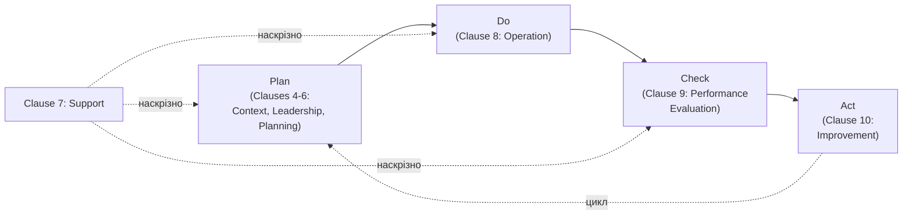

# 15.2. ISO/IEC 27001: повний цикл ISMS

## Найпоширеніший міжнародний стандарт сертифікації

**ISO/IEC 27001** — міжнародний стандарт, що визначає вимоги до **Information Security Management System (ISMS)** — системи управління інформаційною безпекою. На відміну від ISO/IEC 27005 (Модуль 13, розділ 13.2), який дає лише методологію оцінки ризику, ISO/IEC 27001 — стандарт, за яким організація **може бути сертифікована** незалежним органом сертифікації. Український національний відповідник — **ДСТУ ISO/IEC 27001**, повністю гармонізований з міжнародною версією.

## Структура стандарту: Clauses 4-10 (Annex SL)

ISO/IEC 27001 побудований за загальною структурою **Annex SL** — уніфікованим форматом, спільним для багатьох ISO-стандартів менеджменту (ISO 9001 якість, ISO 14001 екологія), що полегшує інтегроване впровадження кількох систем управління одночасно:

| Clause | Назва | Зміст |
|---|---|---|
| 4 | Context of the Organization | Визначення внутрішнього й зовнішнього контексту, зацікавлених сторін, меж ISMS (scope) |
| 5 | Leadership | Зобов'язання найвищого керівництва, політика інформаційної безпеки, ролі й відповідальність |
| 6 | Planning | Оцінка ризиків (пряме застосування методології Модуля 13), цілі інформаційної безпеки |
| 7 | Support | Ресурси, компетентність персоналу, обізнаність (зв'язок з розділом 15.9), комунікація, документована інформація |
| 8 | Operation | Оперативне планування й контроль, виконання оцінки та обробки ризиків |
| 9 | Performance Evaluation | Моніторинг, вимірювання, внутрішній аудит (розділ 15.4), аналіз з боку керівництва |
| 10 | Improvement | Виправлення невідповідностей (non-conformities), безперервне вдосконалення |

**Ключове спостереження:** Clauses 4-10 — це прямий, формалізований варіант циклу **PDCA (Plan-Do-Check-Act)**, уже введеного в Модулі 13 (розділ 13.11): Clauses 4-6 відповідають Plan, Clause 8 — Do, Clause 9 — Check, Clause 10 — Act.

## Scope: межі ISMS

Одне з перших і найважливіших рішень при впровадженні ISMS — визначення **scope (області застосування)**: які саме підрозділи, продукти, локації, бізнес-процеси покриває система. Поширена й цілком легітимна практика — обмежити початковий scope конкретним продуктом чи підрозділом (наприклад, «ISMS охоплює хмарну SaaS-платформу компанії X, розроблену командою в Києві та Варшаві, розміщену в AWS eu-central-1»), а не всю організацію одразу.

**Практичний наслідок для клієнтів:** сертифікат ISO/IEC 27001 з вузьким scope технічно валідний, але не покриває частини бізнесу поза межами scope — уважний корпоративний клієнт під час due diligence (розділ 15.1) перевіряє саме формулювання scope в сертифікаті, а не лише факт його наявності.

> **Міні-вправа 15.2.1:** Компанія має два продукти: A (обробляє дані клієнтів, продається великим корпоративним замовникам) і B (внутрішній інструмент без чутливих даних). ISMS-scope обмежено лише продуктом A. Великий клієнт, зацікавлений виключно в продукті A, вимагає сертифікат ISO/IEC 27001. Чи достатньо поточного scope, і яка потенційна проблема виникне, якщо цей самий клієнт пізніше захоче також придбати продукт B?
>
> 

Відповідь

>
> Поточний scope достатній для запиту клієнта щодо продукту A — вузький, чітко визначений scope, що охоплює саме той продукт, який цікавить клієнта, є цілком прийнятною й поширеною практикою. Проблема виникне, якщо клієнт пізніше захоче придбати продукт B: сертифікат ISO/IEC 27001 на продукт A формально не покриває продукт B, і клієнт (чи його служба безпеки під час нового due diligence) може вимагати або розширення scope ISMS на продукт B, або окремого підтвердження відповідності для нього — організації варто заздалегідь планувати, чи розширювати scope проактивно, чи реагувати на запит по факту, з урахуванням часу, потрібного на розширення сертифікації.
> 

## Leadership: не формальність, а вимога стандарту

Clause 5 прямо вимагає **задокументованого, видимого зобов'язання найвищого керівництва** — не просто мовчазного схвалення бюджету на безпеку, а активної участі: затвердженої політики інформаційної безпеки, чітко призначених ролей і відповідальності, регулярного аналізу ISMS з боку керівництва (management review, зазвичай не рідше разу на рік). Аудитор сертифікаційного органу (розділ 15.4) під час перевірки прямо запитує представників керівництва про їхнє розуміння цілей і ризиків ISMS — формальний підпис на політиці без реального розуміння змісту зазвичай виявляється саме на цьому етапі.

## Documented Information: що саме потрібно документувати

Стандарт вимагає документованої інформації для ключових елементів системи, включно з (але не обмежуючись):

- Scope ISMS та політика інформаційної безпеки
- Методологія та результати оцінки ризиків (пряме посилання на Модуль 13)
- Statement of Applicability (детально — розділ 15.3)
- План обробки ризиків (Risk Treatment Plan)
- Цілі інформаційної безпеки та плани їх досягнення
- Докази компетентності персоналу
- Результати моніторингу, вимірювання, внутрішнього аудиту
- Результати аналізу з боку керівництва
- Задокументовані невідповідності та коригувальні дії

**Практичний принцип:** документація має бути **достатньою для відтворюваності й доказовості**, а не надлишковою бюрократією заради самої бюрократії — типова помилка організацій, що вперше впроваджують ISMS, полягає або в недостатній документації (аудитор не може підтвердити виконання вимоги), або в надлишковій, формальній документації, яку ніхто реально не використовує в повсякденній роботі (розділ 15.4 покаже, як аудитор виявляє саме таку розбіжність між папером і реальністю).

---

**Попередній розділ:** [15.1. Від технічних практик до управлінської системи](01-vid-praktyk-do-systemy.md)
**Наступний розділ:** [15.3. Statement of Applicability та Annex A](03-soa-ta-annex-a.md)
**Назад до модуля:** [README модуля 15](README.md)
