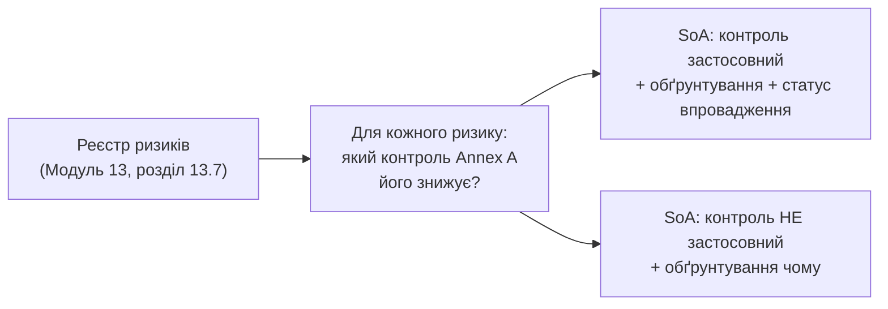

# 15.3. Statement of Applicability та Annex A

## Місток, згаданий у Модулі 13, розкритий повністю

Модуль 13 (розділ 13.11) коротко згадав Statement of Applicability (SoA) як документ, що обґрунтовує застосовність контролів на основі виявлених ризиків. Цей розділ розкриває це повністю: SoA — один із **обов'язкових документів** ISO/IEC 27001 і, разом із реєстром ризиків, найважливіший артефакт, який перевіряє аудитор під час сертифікації.

## Annex A: каталог із 93 контролів

**Annex A** ISO/IEC 27001:2022 (актуальна редакція) містить каталог із **93 контролів**, згрупованих у чотири теми (у попередній редакції 2013 року контролів було 114, згруповано інакше — важливо розрізняти версії при читанні застарілих матеріалів):

| Тема Annex A | Приблизна кількість контролів | Приклади |
|---|---|---|
| **A.5 Organizational controls** | 37 | Політики інформаційної безпеки, ролі й відповідальність, управління активами (пряме продовження Модуля 13, розділ 13.3), управління постачальниками (розділ 15.10), управління інцидентами |
| **A.6 People controls** | 8 | Перевірка при найманні (screening), угоди про конфіденційність, обізнаність та навчання (розділ 15.9), дисциплінарний процес |
| **A.7 Physical controls** | 14 | Фізичний периметр безпеки, захист від фізичних і природних загроз, безпечна утилізація обладнання |
| **A.8 Technological controls** | 34 | Контроль доступу (Модуль 05), захист від шкідливого ПЗ (Модуль 07), управління вразливостями (Модуль 12, прямо контроль A.8.8), криптографія (Модуль 04), безпечна розробка (Модуль 06) |

**Ключове спостереження для читачів цього посібника:** переважна більшість технічних контролів Annex A вже детально розглянуті в попередніх модулях — Annex A не вводить нову технічну інформацію, а **систематизує й формалізує** те, що організація вже мала б робити технічно, у формат, придатний для аудиту й сертифікації.

## Як SoA виникає з реєстру ризиків

SoA — не довільний вибір контролів «які здаються корисними», а прямий, обґрунтований наслідок процесу оцінки ризиків (Модуль 13):

Для кожного з 93 контролів SoA фіксує:

| Поле | Опис |
|---|---|
| ID контролю | Наприклад, A.8.8 |
| Назва контролю | «Управління технічними вразливостями» |
| Застосовність | Так / Ні |
| Обґрунтування застосовності (чи незастосовності) | Прив'язка до конкретного ризику з реєстру (Модуль 13) або пояснення, чому контроль не релевантний |
| Статус впровадження | Не розпочато / В процесі / Впроваджено |
| Посилання на докази | Де саме задокументовано реалізацію (політика, процедура, технічна конфігурація) |

**Приклад запису SoA:**

| ID | Назва | Застосовність | Обґрунтування | Статус | Докази |
|---|---|---|---|---|---|
| A.8.8 | Управління технічними вразливостями | Так | Знижує RISK-001 (реєстр ризиків, Модуль 13) — RCE через невиправлені CVE в критичному API | Впроваджено | Процес Vulnerability Management, Модуль 12; SLA-політика, розділ 12.5 |
| A.7.4 | Моніторинг фізичної безпеки | Ні | Організація не володіє власними серверними приміщеннями; вся інфраструктура — у хмарі з відповідальністю провайдера (Shared Responsibility Model, Модуль 09) | Н/З | Договір з хмарним провайдером, сертифікати провайдера (SOC 2) |

## Обґрунтована незастосовність — не лазівка, а легітимна практика

Типова помилка новачків у GRC — прагнення позначити всі 93 контролі як «застосовні» з побоювання, що аудитор розцінить будь-яку незастосовність як спробу уникнути роботи. Насправді **чітко обґрунтована незастосовність** — цілком легітимна й очікувана частина SoA: контроль щодо фізичної безпеки серверної кімнати не застосовний до організації, що повністю працює в хмарі; контроль щодо безпеки розробки мобільних застосунків не застосовний до організації, що взагалі не розробляє мобільних продуктів. Аудитора турбує **необґрунтована** незастосовність (позначено «Н/З» без пояснення) чи, навпаки, застосовний контроль без реального впровадження, задекларований як «Впроваджено» без доказів.

> **Міні-вправа 15.3.1:** Організація позначає контроль A.8.28 (Secure Coding) як «Незастосовний» без жодного обґрунтування, хоча компанія активно розробляє власний вебзастосунок (Модуль 06). Що виявить аудитор під час перевірки, і чому це серйозніша проблема, ніж просто «забутий» контроль?
>
> 

Відповідь

>
> Аудитор виявить очевидну логічну суперечність: організація, що активно розробляє власне програмне забезпечення, не може обґрунтовано вважати Secure Coding незастосовним контролем — це прямо суперечить факту наявності власної розробки (легко перевіряється через опис бізнес-діяльності організації чи навіть просте запитання «чи розробляєте ви власне ПЗ»). Це серйозніша проблема, ніж один забутий контроль, тому що ставить під сумнів достовірність **усього** SoA-документа: якщо один явно необґрунтований запис виявлено так легко, аудитор обґрунтовано поставить під питання ретельність аналізу решти 92 контролів, що може призвести до розширеної перевірки чи навіть незадовільного результату аудиту (розділ 15.4).
> 

## SoA як живий документ, а не одноразовий артефакт сертифікації

Так само, як реєстр ризиків (Модуль 13, розділ 13.11), SoA не створюється один раз перед сертифікаційним аудитом і забувається — він переглядається за тими самими тригерами: нові ризики, зміна бізнес-контексту, результати внутрішнього аудиту (розділ 15.4). Розбіжність між SoA й реальним станом контролів — одна з найчастіших знахідок під час повторної (наглядової) сертифікації.

---

**Попередній розділ:** [15.2. ISO/IEC 27001: повний цикл ISMS](02-iso-27001-isms.md)
**Наступний розділ:** [15.4. Внутрішній та сертифікаційний аудит](04-audyt-isms.md)
**Назад до модуля:** [README модуля 15](README.md)
