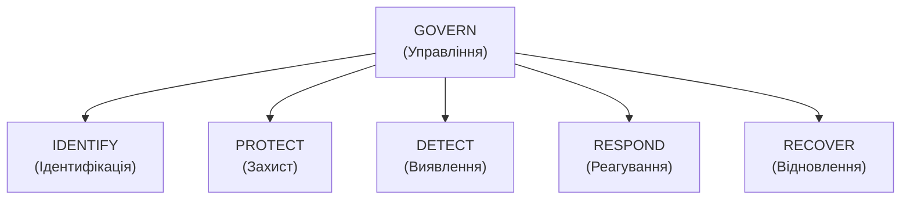

# 15.5. NIST CSF 2.0 на практиці

## Альтернатива сертифікації: фреймворк самооцінки

ISO/IEC 27001 (розділи 15.2-15.4) — сертифікаційний стандарт: організація або сертифікована, або ні, з бінарним результатом зовнішнього аудиту. **NIST Cybersecurity Framework (CSF) 2.0** — принципово інший інструмент: **не сертифікаційний стандарт**, а гнучкий фреймворк для самооцінки зрілості й пріоритизації, без формального органу сертифікації чи бінарного «пройшов/не пройшов». Організації часто використовують обидва одночасно (гармонізація — тема розділу 15.6): NIST CSF — для внутрішнього стратегічного планування й комунікації з керівництвом, ISO/IEC 27001 — для зовнішнього, юридично визнаного підтвердження.

## Шість функцій CSF 2.0

Версія 2.0 (опублікована NIST у 2024 році) додала шосту функцію — **Govern** — порівняно з попередньою версією 1.1, що мала лише п'ять. Це доповнення прямо відображає ту саму еволюцію мислення, яку демонструє цей модуль: розуміння, що технічні функції безпеки (Identify-Protect-Detect-Respond-Recover) недостатні без явного управлінського шару над ними.

- **GOVERN (Управління)** — нова функція 2.0: організаційний контекст, стратегія управління ризиками кібербезпеки, ролі й відповідальність, політики, нагляд керівництва, управління ризиками постачальницького ланцюга. Концептуально відповідає Clauses 4-5 ISO/IEC 27001 (розділ 15.2) і всьому змісту цього модуля.
- **IDENTIFY (Ідентифікація)** — інвентаризація активів, оцінка ризиків. Прямо відповідає Модулю 13 (розділи 13.3-13.4).
- **PROTECT (Захист)** — контроль доступу, навчання персоналу, захист даних, hardening. Охоплює зміст Модулів 04, 05, 14.
- **DETECT (Виявлення)** — безперервний моніторинг, процеси виявлення аномалій. Відповідає Модулю 14 (розділи 14.8-14.10: журналювання, EDR).
- **RESPOND (Реагування)** — планування реагування на інциденти, комунікація, аналіз. Відповідає IR Playbooks з Модуля 07.
- **RECOVER (Відновлення)** — планування відновлення, комунікація під час відновлення. Прямо відповідає Модулю 13 (розділи 13.9-13.10: BIA, BCP/DRP).

**Практична цінність структури для цього посібника:** шість функцій CSF 2.0 фактично дають зручну мапу, що показує, який саме модуль цього посібника яку функцію покриває — корисний інструмент самоперевірки повноти власних знань.

## Categories та Subcategories: деталізація функцій

Кожна з шести функцій розкладається на **Categories** (категорії, наприклад у межах Identify — «Asset Management», «Risk Assessment»), а ті — на **Subcategories** — конкретні, вимірювані результати (наприклад, підкатегорія «ID.AM-01: Інвентаризація фізичних пристроїв та систем ведеться»). Це схоже за принципом на структуру Annex A контролів ISO/IEC 27001 (розділ 15.3), хоча NIST CSF описує **бажані результати (outcomes)**, а не конкретні технічні контролі — залишаючи вибір конкретної реалізації на розсуд організації.

## Implementation Tiers: зрілість підходу до ризику

**Tiers** (1-4) — не оцінка «наскільки організація захищена» технічно, а оцінка **зрілості й системності підходу до управління ризиком кібербезпеки** в цілому:

| Tier | Назва | Характеристика |
|---|---|---|
| 1 | Partial | Управління ризиком ситуативне, реактивне, не інтегроване в загальну стратегію організації; обмежена обізнаність керівництва |
| 2 | Risk Informed | Практики управління ризиком затверджені керівництвом, але не встановлені як організаційна політика; непослідовне застосування між підрозділами |
| 3 | Repeatable | Формально задокументовані, регулярно оновлювані політики; послідовне застосування в усій організації |
| 4 | Adaptive | Організація адаптує практики на основі отриманих уроків і прогнозної аналітики загроз у реальному часі; безперервне вдосконалення як культурна норма |

**Важлива відмінність від ISO 27001:** Tier не є метою сертифікації й не має «правильного» універсального значення для всіх організацій — Tier 4 не обов'язково потрібен малому стартапу з низьким профілем ризику; вибір цільового Tier — управлінське рішення, узгоджене з риск-апетитом (Модуль 13, розділ 13.5), подібно до вибору DRP-архітектури (Модуль 13, розділ 13.10) відповідно до реального RTO, а не автоматичне прагнення до максимуму.

## Profiles: адаптація фреймворку під конкретний контекст

**Profile** — вибіркове зіставлення Subcategories CSF із конкретними бізнес-цілями, риск-толерансом і ресурсами організації:

- **Current Profile** — де організація перебуває зараз (які Subcategories реально впроваджені, на якому рівні).
- **Target Profile** — де організація хоче бути (які Subcategories пріоритетні для найближчого горизонту планування).
- **Gap Analysis** — різниця між Current і Target Profile безпосередньо формує план дій і бюджетних пріоритетів — той самий принцип пріоритизації «найбільший ризик/вартість спочатку», що й у контексті цього посібника загалом.

> **Міні-вправа 15.5.1:** Компанія на ранній стадії (10 співробітників, MVP-продукт без чутливих даних) проводить самооцінку за NIST CSF і виявляє, що перебуває на Tier 1 (Partial) за більшістю функцій. Чи це привід для тривоги, і яка практична дія логічніша: негайне прагнення досягти Tier 4 за всіма функціями одночасно, чи щось інше?
>
> 

Відповідь

>
> Tier 1 сам по собі не привід для тривоги для компанії на такій ранній стадії з низьким профілем ризику (немає чутливих даних, малий масштаб) — прагнення досягти Tier 4 негайно й за всіма функціями одночасно було б непропорційною витратою обмежених ресурсів стартапу, що суперечить принципу пропорційності (контекст завдання на початку посібника). Логічніша дія — побудувати Target Profile, що визначає **вибіркові** Subcategories, критичні саме для поточного контексту (наприклад, базовий контроль доступу й резервне копіювання), залишаючи менш критичні функції на нижчому Tier свідомо, з планом підвищення зрілості в міру росту компанії й ускладнення профілю ризику — саме для цього й існує механізм Target Profile, а не універсальна вимога максимальної зрілості для всіх.
> 

---

**Попередній розділ:** [15.4. Внутрішній та сертифікаційний аудит](04-audyt-isms.md)
**Наступний розділ:** [15.6. Гармонізація ISO/IEC 27001 та NIST CSF](06-harmonizatsiia-standartiv.md)
**Назад до модуля:** [README модуля 15](README.md)
