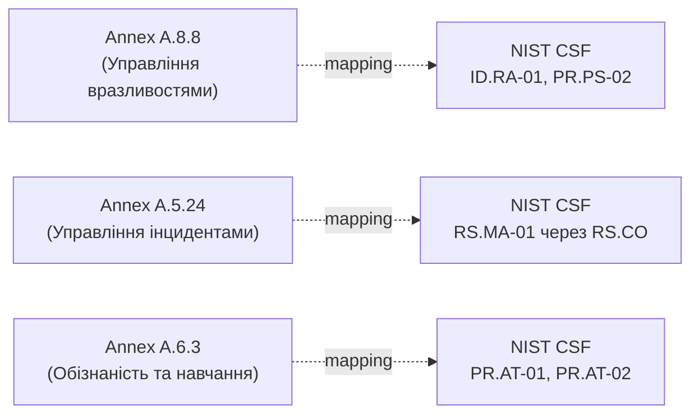

# 15.6. Гармонізація ISO/IEC 27001 та NIST CSF

## Хибна дилема «або-або»

Розділи 15.2-15.5 могли створити враження, що організація має обрати один фреймворк — ISO/IEC 27001 **або** NIST CSF 2.0. На практиці більшість зрілих організацій використовують обидва одночасно, кожен для властивої йому мети, а не як конкуруючі альтернативи.

## Різні цілі, що доповнюють одна одну

| | ISO/IEC 27001 | NIST CSF 2.0 |
|---|---|---|
| Природа | Сертифікаційний стандарт з бінарним результатом | Гнучкий фреймворк самооцінки без сертифікації |
| Аудиторія результату | Зовнішні сторони: клієнти, партнери, регулятори (потребують доказу) | Внутрішнє керівництво: стратегічне планування й пріоритизація |
| Деталізація | Конкретні, обов'язкові контролі (Annex A) | Бажані результати (outcomes) без прив'язки до конкретної реалізації |
| Вимірювання прогресу | Пройдено/не пройдено сертифікаційний аудит | Continuum через Tiers (1-4) і Current/Target Profile |
| Типовий власник процесу всередині організації | CISO, Compliance Manager | CISO, стратегічне планування безпеки на рівні керівництва |

**Практичний висновок:** NIST CSF відповідає на запитання «наскільки зріла й системна наша загальна стратегія управління ризиком, і куди рухатися далі стратегічно» — корисний внутрішній інструмент незалежно від планів сертифікації. ISO/IEC 27001 відповідає на запитання «чи можемо ми довести стороннім особам, юридично й формально, що наша система відповідає визнаному міжнародному стандарту» — необхідний, коли бізнес вимагає зовнішнього підтвердження (розділ 15.1).

## Мапування Subcategories на Annex A контролі

Оскільки обидва фреймворки покривають концептуально ту саму територію управління ризиком кібербезпеки (хоча й різною мовою й структурою), NIST офіційно публікує таблиці відповідності (mapping), що зіставляють Subcategories CSF 2.0 з контролями Annex A ISO/IEC 27001:2022. Практичний ефект: організація, що вже впровадила Annex A контролі для ISO 27001-сертифікації, отримує значну частину роботи з NIST CSF Identify/Protect/Detect/Respond/Recover «безкоштовно» — контроль A.8.8 (управління вразливостями, Модуль 12) прямо відповідає кільком Subcategories в межах функції Protect і Identify NIST CSF.

> **Міні-вправа 15.6.1:** Організація вже сертифікована за ISO/IEC 27001 і вирішує додатково провести самооцінку за NIST CSF 2.0. Чи означає це подвійну роботу з нуля, і яка практична стратегія мінімізує зусилля?
>
> 

Відповідь

>
> Це не подвійна робота з нуля — завдяки офіційним таблицям мапування, документація й докази, вже зібрані для контролів Annex A під час ISO 27001-сертифікації (розділи 15.3-15.4), безпосередньо перевикористовуються як докази виконання відповідних Subcategories NIST CSF. Практична стратегія: почати з мапування вже впроваджених Annex A контролів на відповідні Subcategories CSF, визначити поточний Tier на основі цього зіставлення (розділ 15.5), а не проводити повністю незалежну оцінку з нуля — основна додаткова робота зосереджується на елементах, специфічних саме для CSF і відсутніх у структурі ISO 27001 (наприклад, деталізованіша функція Govern щодо ланцюга постачання, розділ 15.10).
> 

## Спільна основа: ризик-орієнтований підхід

Обидва фреймворки, попри структурні відмінності, спираються на ту саму фундаментальну ідею, вже глибоко розкриту в Модулі 13: рішення про контролі й пріоритети мають випливати з систематичної оцінки ризику, а не з довільного вибору «здається правильним» чи сліпого копіювання чужого чек-листа. ISO/IEC 27005 (методологія оцінки ризику для ISO 27001, Модуль 13, розділ 13.2) та Identify-функція NIST CSF по суті вимагають того самого процесу ідентифікації активів і загроз, лише різними словами.

## Практична рекомендація вибору для різних стадій організації

- **Рання стадія, без вимог клієнтів до сертифікації** — NIST CSF як внутрішній інструмент самооцінки й стратегічного планування, без витрат на формальну сертифікацію ISO 27001, поки бізнес-необхідність (розділ 15.1) не з'явиться прямо.
- **Зростання, перші вимоги великих клієнтів чи виходу на регульовані ринки** — початок формальної підготовки до ISO 27001 (чи SOC 2, розділ 15.8, залежно від географії клієнтів), використовуючи вже наявну NIST CSF-оцінку як фундамент для швидшого визначення scope і SoA.
- **Зріла організація з кількома одночасними вимогами** — паралельне підтримання обох (і, часто, додаткових регуляторних режимів одночасно) — тема наступного розділу 15.8.

---

**Попередній розділ:** [15.5. NIST CSF 2.0 на практиці](05-nist-csf-praktyka.md)
**Наступний розділ:** [15.7. Українське законодавство про кібербезпеку](07-ukrainske-zakonodavstvo.md)
**Назад до модуля:** [README модуля 15](README.md)
