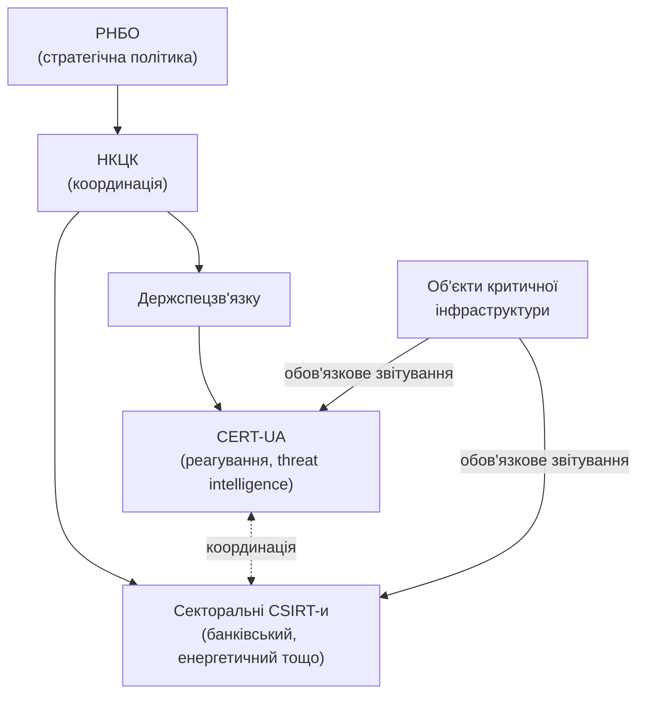

# 15.7. Українське законодавство про кібербезпеку

## Від міжнародних стандартів до національного правового поля

Розділи 15.2-15.6 розглянули міжнародні фреймворки (ISO/IEC 27001, NIST CSF), які організація впроваджує здебільшого добровільно, з бізнес-мотивів. Цей розділ переходить до **обов'язкових** вимог українського законодавства — де впровадження системи управління безпекою не вибір, а юридичний обов'язок для певних категорій організацій.

## Закон України «Про основні засади забезпечення кібербезпеки України»

Це базовий, рамковий закон, що визначає національну систему кібербезпеки України: правові та організаційні основи, принципи державної політики, суб'єктів забезпечення кібербезпеки та їхні повноваження. Закон вводить ключове поняття, актуальне для цього модуля, — **об'єкти критичної інфраструктури** — підприємства, установи та організації незалежно від форми власності, порушення функціонування яких може мати значний негативний вплив на національну безпеку, економіку, громадське здоров'я чи довкілля (енергетика, фінансовий сектор, транспорт, телекомунікації, охорона здоров'я, державне управління).

## Обов'язки об'єктів критичної інфраструктури

Для організацій, віднесених до критичної інфраструктури, закон і супутні підзаконні акти встановлюють низку обов'язків, що прямо перегукуються зі структурою, розглянутою в цьому модулі:

- **Впровадження системи управління інформаційною безпекою**, узгодженої з визнаними стандартами (пряме застосування ISO/IEC 27001 чи ДСТУ ISO/IEC 27001, розділ 15.2, у національному правовому контексті).
- **Обов'язкове інформування CERT-UA** про виявлені кіберінциденти в установлені терміни — уже згадувалося в Модулі 12 (розділ 12.2) щодо координації вразливостей; тут це формалізований юридичний обов'язок, а не добровільна практика.
- **Проведення незалежного аудиту інформаційної безпеки** з визначеною періодичністю (принцип, аналогічний сертифікаційному аудиту ISO 27001, розділ 15.4, але як юридична вимога, а не добровільний вибір бізнесу).
- **Впровадження заходів кіберзахисту**, пропорційних категорії критичності об'єкта — прямий відгомін принципу пропорційності, згаданого на початку цього посібника: вимоги масштабуються залежно від значущості об'єкта, а не однакові для всіх.

## Національна система суб'єктів кібербезпеки

Закон визначає багаторівневу систему суб'єктів, кожен з яких відповідає за свою частину національної кіберзахисту:

- **Рада національної безпеки і оборони України (РНБО)** — визначає державну політику у сфері кібербезпеки на найвищому стратегічному рівні.
- **Національний координаційний центр кібербезпеки (НКЦК)** — консультативно-дорадчий орган при РНБО, що координує діяльність суб'єктів національної системи кібербезпеки.
- **Державна служба спеціального зв'язку та захисту інформації України (Держспецзв'язку)** — до структури якої входить **CERT-UA**, уже добре знайомий читачам цього посібника з попередніх модулів як джерело threat intelligence і координатор реагування на інциденти.
- **Секторальні CSIRT-и (Computer Security Incident Response Teams)** — команди реагування на інциденти в конкретних галузях (наприклад, банківський сектор має власну секторальну команду реагування, що координується з CERT-UA на національному рівні, а не діє повністю ізольовано).

> **Міні-вправа 15.7.1:** Комерційний банк виявляє інцидент безпеки, що зачіпає системи обробки платежів клієнтів. Банк вважається об'єктом критичної інфраструктури у фінансовому секторі. Куди й чому банк зобов'язаний повідомити про інцидент, і чому це не просто «добра практика», як VDP з Модуля 12?
>
> 

Відповідь

>
> Банк зобов'язаний повідомити як CERT-UA (національний рівень координації), так і, зазвичай, відповідну секторальну команду реагування у фінансовому секторі та регулятора (Національний банк України має власні вимоги до кіберстійкості банківської системи) — на відміну від VDP (Модуль 12, розділ 12.10), яка є добровільним каналом для *зовнішніх дослідників*, повідомлення про власний інцидент об'єктом критичної інфраструктури — пряма юридична вимога закону, невиконання якої тягне адміністративну відповідальність, а не просто питання доброї репутації чи галузевої етики.
> 

## Зв'язок із Законом України «Про захист персональних даних»

Якщо кіберінцидент включає компрометацію персональних даних клієнтів (типова ситуація для витоку бази даних, Модуль 13, приклад RISK-001), одночасно застосовується окремий правовий режим — **Закон України «Про захист персональних даних»**, що встановлює власні, окремі вимоги щодо повідомлення суб'єктів даних та уповноваженого органу з питань захисту персональних даних. Організація в такому сценарії одночасно виконує обов'язки за двома різними законами — тема, поглиблена в наступному розділі (15.8) у ширшому контексті множинного комплаєнсу, включно з європейським GDPR для організацій, що обробляють дані громадян ЄС.

## ДСТУ-стандарти як міст між національним і міжнародним

Закон і супутні підзаконні акти спираються на систему національних стандартів **ДСТУ**, гармонізованих з міжнародними ISO/IEC (ДСТУ ISO/IEC 27001, ДСТУ ISO/IEC 27005 — уже згадані в Модулі 13), а також національні криптографічні стандарти (ДСТУ 4145, Купина/Калина — Модуль 04), обов'язкові для використання в державних інформаційних системах і системах, що обробляють інформацію з обмеженим доступом.

---

**Попередній розділ:** [15.6. Гармонізація ISO/IEC 27001 та NIST CSF](06-harmonizatsiia-standartiv.md)
**Наступний розділ:** [15.8. Множинний комплаєнс: GDPR, PCI DSS, SOC 2 одночасно](08-mnozhynnyi-komplaiens.md)
**Назад до модуля:** [README модуля 15](README.md)
