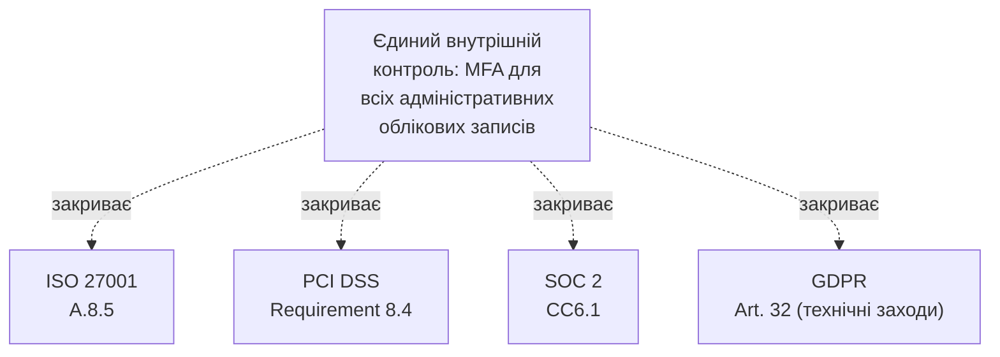

# 15.8. Множинний комплаєнс: GDPR, PCI DSS, SOC 2 одночасно

## Реалістичний сценарій: не один режим, а кілька одночасно

Розділи 15.2-15.7 розглядали окремі фреймворки послідовно, для ясності викладу. Реальність типової організації середнього розміру складніша: український SaaS-стартап, що обробляє платежі клієнтів з ЄС, одночасно підпадає під **ISO/IEC 27001** (бажаний клієнтами стандарт), **GDPR** (обробка даних громадян ЄС), **PCI DSS** (обробка даних платіжних карток) і, можливо, **SOC 2** (вимога клієнтів у США). Наївний підхід — впроваджувати кожен режим окремо, з нуля, дублюючи роботу — швидко стає неможливим ресурсно. Цей розділ показує, як гармонізувати кілька вимог одночасно.

## Короткий огляд режимів, актуальних для типової організації

- **GDPR (General Data Protection Regulation)** — регламент ЄС щодо захисту персональних даних, застосовний до будь-якої організації, що обробляє дані громадян ЄС, незалежно від того, де сама організація зареєстрована. Вимагає, серед іншого: правової підстави для обробки даних, права суб'єктів даних (доступ, видалення, портативність), повідомлення про витік протягом 72 годин, Data Protection Impact Assessment для ризикованих видів обробки. Українська **ЗУ «Про захист персональних даних»** (Модуль 15.7) концептуально схожа, але не ідентична GDPR за деталями вимог.
- **PCI DSS (Payment Card Industry Data Security Standard)** — галузевий стандарт (не державне законодавство, а вимога платіжних систем Visa/Mastercard) для будь-якої організації, що зберігає, обробляє чи передає дані платіжних карток. Чотири рівні (Level 1-4) залежно від обсягу транзакцій, з різними вимогами до глибини аудиту.
- **SOC 2 (System and Organization Controls 2)** — американський стандарт звітності (не сертифікація в класичному розумінні, а аудований звіт) за п'ятьма Trust Service Criteria: Security, Availability, Processing Integrity, Confidentiality, Privacy. Type I оцінює дизайн контролів на конкретний момент, Type II — фактичну ефективність контролів протягом періоду (типово 6-12 місяців) — суттєво вагоміший доказ для клієнта, ніж Type I. Уже коротко згадувався в Модулі 09 у контексті хмарного комплаєнсу.

## Спільне ядро: чому дублювання роботи не обов'язкове

Попри різне походження (державне законодавство ЄС, галузевий стандарт платіжних систем, американська аудиторська практика), усі перелічені режими вимагають концептуально того самого фундаменту, уже розглянутого в цьому й попередніх модулях:

| Спільна вимога | Де в посібнику розглянуто |
|---|---|
| Інвентаризація активів і даних | Модуль 13, розділ 13.3 |
| Оцінка ризику | Модуль 13, розділи 13.5-13.6 |
| Контроль доступу за принципом найменших привілеїв | Модуль 05 |
| Шифрування даних у спокої й у передачі | Модуль 04 |
| Журналювання та моніторинг | Модуль 14, розділи 14.8-14.10 |
| Процес реагування на інциденти | Модуль 07 (IR Playbooks), Модуль 12 (VDP) |
| Навчання персоналу | Модуль 07 (базове), розділ 15.9 (поглиблено) |
| Управління вразливостями | Модуль 12 |

**Практичний підхід — «compliance mapping» (карта відповідності):** замість окремого проєкту впровадження для кожного режиму, зріла організація будує **єдиний внутрішній набір контролів** (часто на основі Annex A ISO/IEC 27001 як найдетальнішого каталогу, розділ 15.3), а потім складає **матрицю відповідності**, що показує, який внутрішній контроль закриває яку вимогу кожного зовнішнього режиму одночасно.

## Приклад матриці відповідності (фрагмент)

| Внутрішній контроль | ISO 27001 Annex A | PCI DSS | SOC 2 | GDPR |
|---|---|---|---|---|
| Шифрування бази даних клієнтів у спокої (AES-256, Модуль 04) | A.8.24 | Req. 3.5 | CC6.7 | Art. 32(1)(a) |
| Багатофакторна автентифікація для адміністраторів (Модуль 05) | A.8.5 | Req. 8.4.2 | CC6.1 | Art. 32(1)(b) |
| Щорічний пентест критичних систем (Модуль 12) | A.8.29 | Req. 11.4 | CC7.1 | — (непряма вимога через Art. 32) |
| План реагування на витік даних із повідомленням протягом 72 годин | A.5.24, A.5.26 | Req. 12.10 | CC7.4 | Art. 33-34 (пряма вимога) |

**Практична вигода такого підходу:** один аудит (наприклад, сертифікаційний аудит ISO 27001, розділ 15.4) чи один внутрішній огляд може одночасно постачати докази для кількох зовнішніх режимів, замість окремого, дублюючого циклу підготовки доказів для кожного окремо.

> **Міні-вправа 15.8.1:** Стартап проходить сертифікаційний аудит Stage 2 ISO 27001 (розділ 15.4) і аудитор перевіряє контроль A.8.24 (шифрування), знаходячи докази коректного впровадження AES-256 для бази даних клієнтів. Через два місяці той самий стартап готується до окремого аудиту PCI DSS. Чи потрібно демонструвати шифрування «з нуля» для нового аудитора, і яка практична економія часу тут можлива завдяки матриці відповідності?
>
> 

Відповідь

>
> Технічно так, аудитор PCI DSS проводить власну, незалежну перевірку (акредитація й вимоги PCI DSS формально відокремлені від ISO 27001), тому формальний повторний аудит все ж відбувається. Але завдяки заздалегідь побудованій матриці відповідності практична підготовка суттєво швидша: команда вже знає точно, які докази (конфігурація шифрування, журнали керування ключами, політики) відповідають Requirement 3.5 PCI DSS, оскільки ці самі докази вже були зібрані й структуровані для контролю A.8.24 ISO 27001 — замість збирання доказів з нуля, команда переносить і адаптує вже готовий пакет доказів під термінологію й формат нового аудиту, що суттєво скорочує час підготовки й знижує ризик людської помилки при повторному, незалежному зборі тих самих по суті фактів.
> 

## Коли множинний комплаєнс стає непропорційним

Принцип пропорційності (контекст завдання на початку посібника) застосовний і тут: невеликий стартап без клієнтів у США та без обробки платіжних карток не повинен інвестувати ресурси в SOC 2 чи PCI DSS «про всяк випадок» — множинний комплаєнс впроваджується **реактивно, за конкретною бізнес-необхідністю** (розділ 15.1: конкретний клієнт вимагає конкретного підтвердження), а не проактивно «про всяк випадок», що було б невиправданою витратою обмежених ресурсів organizації на ранній стадії.

---

**Попередній розділ:** [15.7. Українське законодавство про кібербезпеку](07-ukrainske-zakonodavstvo.md)
**Наступний розділ:** [15.9. Побудова програми Security Awareness](09-security-awareness-prohrama.md)
**Назад до модуля:** [README модуля 15](README.md)
