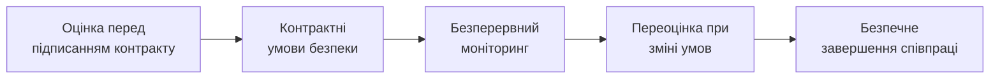

# 15.10. Управління ризиками третіх сторін

## Периметр організації давно не закінчується на її власних серверах

Кожен попередній модуль цього посібника здебільшого розглядав контроль над **власною** інфраструктурою організації. Але сучасна організація глибоко залежить від десятків, а часто сотень зовнішніх постачальників: хмарні провайдери (Модуль 09), бібліотеки з відкритим кодом (SCA/SBOM, Модуль 06), SaaS-інструменти для внутрішніх процесів, аутсорсинговані команди розробки, платіжні провайдери. Кожен із них — потенційний вектор атаки, над яким організація не має прямого технічного контролю, але за наслідки якого несе повну відповідальність перед власними клієнтами й регуляторами.

## SolarWinds та XZ Utils: два архетипи supply chain-ризику

Модуль 07 згадував **SolarWinds** (2020) як приклад атаки на ланцюг постачання: зловмисники скомпрометували процес збірки програмного забезпечення постачальника Orion, вставивши шкідливий код у легітимне, підписане оновлення, яке потім автоматично встановилося в тисячах організацій-клієнтів, включно з державними установами США. Модуль 04 згадував **XZ Utils** (2024) — спробу впровадження бекдору в широко використовувану бібліотеку стиснення через соціальну інженерію процесу супроводу відкритого коду (maintainer). Обидва кейси ілюструють один і той самий структурний ризик під різним кутом: **організація довіряє коду чи сервісу, який вона сама не писала й не може повністю перевірити**, і ця довіра — легітимна ціль для атаки.

## Категорії ризику третіх сторін

- **Постачальники ПЗ і бібліотек** — вразливості чи зловмисний код у сторонньому коді (Модуль 06, SCA/SBOM; XZ Utils вище).
- **Хмарні та SaaS-провайдери** — Shared Responsibility Model (Модуль 09): провайдер відповідає за безпеку хмари (інфраструктура), клієнт — за безпеку в хмарі (конфігурація, дані); плутанина щодо цієї межі — типова причина інцидентів.
- **Аутсорсинг і підрядники** — зовнішні розробники чи адміністратори з доступом до внутрішніх систем; фактично розширення периметра довіри організації за її формальні межі.
- **Постачальники фізичних послуг** — компанії з фізичним доступом до приміщень (клінінг, охорона), що технічно можуть отримати доступ до обладнання (Annex A.7, розділ 15.3).

## Життєвий цикл управління ризиком третьої сторони

1. **Оцінка перед підписанням (Due Diligence)** — опитувальник безпеки (security questionnaire), запит сертифікатів (SOC 2 Type II, ISO 27001, розділ 15.8), для критичних постачальників — власний пентест чи аудит постачальника.
2. **Контрактні умови безпеки** — Service Level Agreement (SLA) з конкретними вимогами до безпеки (наприклад, обов'язкове повідомлення про інцидент протягом 24-72 годин), право на аудит (right-to-audit clause), вимоги до шифрування й розташування даних (актуально для GDPR, розділ 15.8).
3. **Безперервний моніторинг** — не одноразова перевірка при підписанні, а регулярний перегляд (аналогічно циклу перегляду ризиків, Модуль 13, розділ 13.11): чи не змінився статус сертифікації постачальника, чи не з'явилися публічні звіти про інциденти в постачальника.
4. **Переоцінка при зміні умов** — новий тип даних, переданих постачальнику; зміна обсягу доступу; злиття/поглинання постачальника іншою компанією — усе це тригери позапланової переоцінки ризику.
5. **Безпечне завершення співпраці (Offboarding)** — гарантоване видалення чи повернення даних, відкликання всіх наданих доступів, документоване підтвердження завершення зобов'язань — часто ігнорований, але критичний останній етап.

> **Міні-вправа 15.10.1:** Організація підписує контракт із новим хмарним постачальником для зберігання резервних копій бази даних клієнтів (Модуль 13, розділ 13.9, BCP/DRP-контекст) без формальної оцінки безпеки постачальника, покладаючись лише на усне запевнення відділу продажів постачальника «у нас все безпечно». Через рік постачальник зазнає витоку даних через власну невиправлену вразливість. Яка відповідальність організації-клієнта в цьому сценарії, і чому «ми довірились постачальнику» — недостатній юридичний захист?
>
> 

Відповідь

>
> Організація-клієнт зберігає повну відповідальність перед власними клієнтами й регуляторами (Модуль 13, розділ 13.1: юридичний захист вимагає доказу «розумних заходів») незалежно від того, що технічна причина інциденту — вразливість у системах постачальника, а не власна. «Ми довірились постачальнику» без формального due diligence, контрактних гарантій і права на аудит — не є розумним заходом з точки зору регулятора чи суду; навпаки, відсутність формальної оцінки ризику третьої сторони перед довіренням їй чутливих даних (резервні копії бази клієнтів — критичний актив, Модуль 13, розділ 13.3) сама по собі може розглядатися як недбалість організації-клієнта. Це прямо ілюструє, чому Annex A ISO/IEC 27001 (розділ 15.3) містить окремі контролі щодо управління постачальниками — довіра третій стороні має бути задокументованим, обґрунтованим рішенням, а не мовчазним припущенням.
> 

## Vendor Risk Tiering: пропорційність зусиль

За аналогією з класифікацією активів (Модуль 13, розділ 13.3), не всі постачальники вимагають однакової глибини перевірки — принцип пропорційності застосовується й тут:

| Рівень постачальника | Приклад | Глибина оцінки |
|---|---|---|
| Критичний (доступ до чутливих даних чи критичних систем) | Хмарний провайдер, платіжний процесор, постачальник резервного копіювання | Повний security questionnaire, вимога сертифікатів, право на аудит, щорічний перегляд |
| Значний (обмежений доступ, нечутливі дані) | SaaS-інструмент для внутрішньої комунікації без чутливих даних | Спрощений questionnaire, перевірка публічної репутації й сертифікатів |
| Низький (без доступу до систем чи даних організації) | Постачальник офісних канцтоварів | Мінімальна чи відсутня формальна оцінка безпеки |

---

**Попередній розділ:** [15.9. Побудова програми Security Awareness](09-security-awareness-prohrama.md)
**Наступний розділ:** [15.11. GRC-платформи та комплаєнс як код](11-grc-platformy.md)
**Назад до модуля:** [README модуля 15](README.md)
