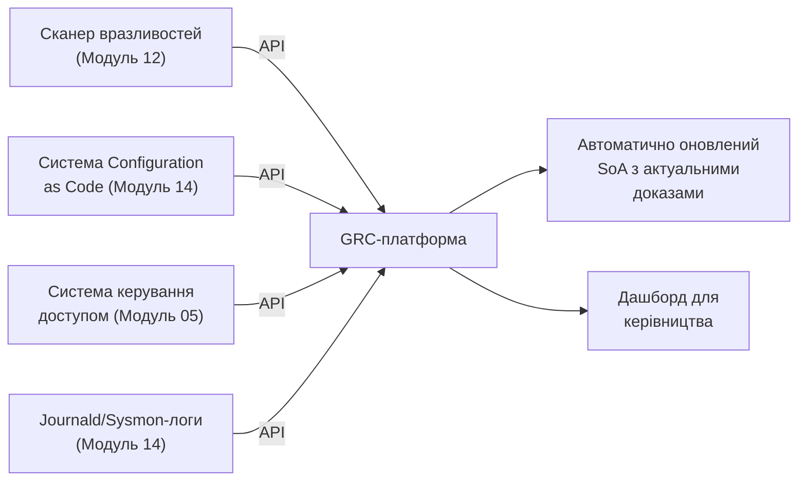

# 15.11. GRC-платформи та комплаєнс як код

## Від таблиць Excel до операційної системи комплаєнсу

Модуль 13 (розділ 13.11) коротко згадав GRC-платформи як практичний інструмент на масштабі, що перевищує ручне ведення реєстру ризиків у таблиці. Цей завершальний практичний розділ модуля розкриває, як саме такі платформи автоматизують усе, розглянуте в розділах 15.2-15.10: SoA, докази для аудиту, множинний комплаєнс, ризики третіх сторін — перетворюючи ручну, трудомістку підготовку на постійно актуальний, автоматизований процес.

## Проблема, яку вирішують GRC-платформи

Без автоматизації організація, що підтримує SoA (розділ 15.3) для ISO 27001 і водночас відповідає GDPR, PCI DSS, SOC 2 (розділ 15.8), стикається з експоненційно зростаючим тягарем: кожна зміна в інфраструктурі (нова CVE, змінена конфігурація, новий постачальник) вимагає ручного оновлення документів у кількох місцях одночасно, а докази для аудиту (розділ 15.4) збираються вручну напередодні кожної перевірки — трудомісткий, схильний до людської помилки процес, що й сам може стати предметом Non-Conformity, якщо документація відстає від реальності.

## Функціональні компоненти GRC-платформи

- **Централізований реєстр ризиків і контролів** — електронна версія таблиць з Модуля 13 (розділ 13.7) і цього модуля (SoA, розділ 15.3), з версіюванням змін і аудиторським слідом (хто, коли, що змінив).
- **Автоматизоване зіставлення контролів (Control Mapping)** — платформа підтримує вбудовані бібліотеки відповідності (аналогічно матриці з розділу 15.8), автоматично показуючи, який внутрішній контроль закриває які саме вимоги кожного застосовного зовнішнього режиму.
- **Автоматизований збір доказів (Continuous Evidence Collection)** — інтеграція через API з реальними технічними системами: сканер вразливостей (Модуль 12) автоматично постачає докази виконання контролю A.8.8; система Configuration as Code (Модуль 14, розділ 14.7) автоматично підтверджує стан hardening-контролів; система керування доступом (Модуль 05) автоматично підтверджує застосування MFA.
- **Дашборди реального часу для керівництва** — агрегована картина стану комплаєнсу («87% контролів Annex A мають актуальні докази виконання, 3 контролі потребують уваги») замість статичного звіту, підготовленого вручну раз на квартал.
- **Автоматизовані нагадування й робочі процеси (Workflows)** — автоматичне сповіщення власника ризику про наближення терміну перегляду (Модуль 13, розділ 13.11), ескалація прострочених дій.

## Compliance as Code: розширення принципу з Модуля 14

Модуль 14 (розділ 14.7) ввів Configuration as Code — декларативний опис бажаного технічного стану системи. **Compliance as Code** застосовує ту саму філософію до самих правил комплаєнсу: замість того, щоб правило («усі S3-бакети мають бути приватними за замовчуванням») існувало лише як речення в текстовій політиці, яку хтось має вручну перевіряти, правило кодується у машинозчитуваному форматі (наприклад, через **Open Policy Agent (OPA)** та мову **Rego**, поширений інструмент для цієї мети) і **автоматично, безперервно** перевіряється проти реального стану хмарної інфраструктури, негайно сигналізуючи про будь-яке відхилення — той самий принцип виявлення дрейфу конфігурації (Модуль 14, розділ 14.7), але застосований на рівні політик комплаєнсу, а не лише технічного hardening окремого хоста.

**Практичний ефект:** замість того, щоб дізнатися про порушення контролю під час щорічного сертифікаційного аудиту (розділ 15.4) — запізно, коли ризик, можливо, вже реалізувався — Compliance as Code виявляє відхилення в реальному часі, тим самим наближаючи процес комплаєнсу до принципу «Continuous Compliance», логічного продовження ідеї безперервного циклу PDCA (розділ 15.2) на технологічному рівні.

> **Міні-вправа 15.11.1:** Організація впровадила Compliance as Code правило, що автоматично перевіряє: «усі бази даних мають шифрування в спокої увімкнене» (відповідає A.8.24, розділ 15.8). Розробник випадково створює нову тестову базу даних без шифрування для швидкого прототипування. Порівняйте, як цей сценарій розвивався б за традиційного (ручного, річного) підходу до аудиту проти підходу Compliance as Code.
>
> 

Відповідь

>
> За традиційного підходу порушення залишиться непоміченим до наступного планового внутрішнього чи сертифікаційного аудиту (розділ 15.4) — потенційно місяці, протягом яких незашифрована база даних становить реальний, непомічений ризик, а сам факт порушення може стати Non-Conformity під час аудиту. За підходу Compliance as Code автоматизована перевірка виявляє відхилення практично одразу після створення нової бази даних (залежно від частоти сканування — від хвилин до годин), автоматично сповіщаючи відповідального власника ризику (Модуль 13, розділ 13.7) чи навіть автоматично блокуючи розгортання незашифрованого ресурсу через CI/CD security gate (Модуль 06, розділ про API Security) ще до того, як він стане частиною продакшн-інфраструктури — принципова різниця між реактивним виявленням раз на рік і проактивним запобіганням у реальному часі.
> 

## Обмеження автоматизації: людське судження все ще необхідне

Автоматизація ефективна для об'єктивно перевірюваних, технічних контролів (шифрування увімкнене чи ні, MFA застосований чи ні). Вона суттєво менш ефективна для контролів, що вимагають людського судження: чи достатньо якісна політика інформаційної безпеки (Clause 5, розділ 15.2), чи справді керівництво розуміє свою відповідальність (розділ 15.2, Leadership), чи адекватна культура повідомлення про інциденти (розділ 15.9). GRC-платформа й Compliance as Code — потужні інструменти підтримки, а не заміна для змістовного управлінського судження, що залишається в основі всього цього модуля.

---

**Попередній розділ:** [15.10. Управління ризиками третіх сторін](10-tretii-storony-ryzyk.md)
**Наступний розділ:** [15.12. Практична лабораторна на Python](12-praktychna-laboratorna.md)
**Назад до модуля:** [README модуля 15](README.md)
