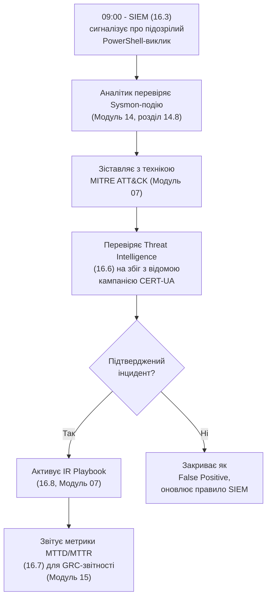

# 16.1. SOC як синтез посібника

## Остання зупинка: де все сходиться

Кожен попередній модуль цього посібника, зі свого боку, відповідав на вузьке запитання: як шифрувати дані (Модуль 04), як автентифікувати користувача (Модуль 05), як писати безпечний вебзастосунок (Модуль 06), як розпізнати фішинг (Модуль 07), як оцінити ризик (Модуль 13), як задокументувати систему управління (Модуль 15). **Security Operations Center (SOC)** — не нова техніка поряд з іншими, а операційне середовище, де фахівці щодня використовують знання з усіх цих модулів одночасно, у реальному часі, під тиском обмеженого часу й неповної інформації.

## Практичний сценарій одного дня SOC-аналітика

Уявіть типову зміну аналітика SOC, щоб побачити, як матеріал попередніх модулів проявляється практично:

Жоден із цих кроків не є новою темою — кожен прямо посилається на конкретний модуль цього посібника. SOC — контекст, у якому все це застосовується разом, а не послідовно й ізольовано, як у навчальному форматі попередніх модулів.

## Три стовпи Security Operations

- **Люди (People)** — аналітики різних рівнів (Tier 1/2/3, розділ 16.2), Threat Hunters (16.5), Threat Intelligence-аналітики (16.6), керівник SOC.
- **Процеси (Process)** — методології виявлення, ескалації, реагування (16.8), полювання (16.5), безперервного вдосконалення (16.7) — прямий відгомін PDCA-циклу з Модуля 15.
- **Технологія (Technology)** — SIEM (16.3) для агрегації й кореляції, SOAR (16.4) для автоматизації, EDR-платформи (Модуль 14, розділ 14.10) як джерело телеметрії кінцевих точок.

**Поширена помилка організацій, що будують SOC вперше:** інвестувати переважно в технологію (найдорожча, найбільш «відчутна» частина — придбання SIEM-ліцензії), нехтуючи людьми й процесами. SIEM без кваліфікованих аналітиків і задокументованих процесів ескалації — дорога система, що генерує сповіщення, які ніхто не переглядає вчасно, аналогічно тому, як реєстр ризиків без власників (Модуль 13, розділ 13.7) залишається мертвим документом.

> **Міні-вправа 16.1.1:** Компанія витрачає значний бюджет на найдорожчу комерційну SIEM-платформу, але наймає лише одного аналітика на повний робочий день без чіткого процесу ескалації. Через три місяці керівництво скаржиться: «ми платимо за SIEM, але інциденти все одно виявляємо із запізненням». Яка найімовірніша коренева причина, і який із трьох стовпів Security Operations найбільш занедбаний?
>
> 

Відповідь

>
> Найімовірніша коренева причина — дисбаланс на користь Технології за рахунок Людей і Процесів: один аналітик фізично не може переглянути весь потік сповіщень від потужної SIEM-платформи цілодобово (SOC вимагає змінного покриття, розділ 16.2), а відсутність задокументованого процесу ескалації означає, що навіть виявлені аналітиком підозрілі події можуть застрягати без чіткого наступного кроку. Найбільш занедбаний стовп — Люди (недостатня кількість персоналу для покриття) і Процеси (відсутність формалізованого workflow) одночасно; сама технологія SIEM — необхідна, але недостатня умова ефективного SOC, так само як CIS Benchmark (Модуль 14) сам по собі не гарантує hardened системи без процесу його застосування.
> 

## Реактивна проти проактивної моделі SOC

Історично SOC асоціювався виключно з **реактивною** моделлю: чекати сповіщення від SIEM, реагувати. Зрілий сучасний SOC додає **проактивний** компонент — Threat Hunting (розділ 16.5), де аналітики активно шукають ознаки компрометації, не чекаючи автоматичного сповіщення, керуючись гіпотезами на основі Threat Intelligence (розділ 16.6). Це прямий концептуальний паралель з різницею між Vulnerability Management (реактивне закриття відомих CVE, Модуль 12) і Red Team (проактивний пошук невідомих слабкостей, Модуль 12, розділ 12.9) — SOC поєднує обидва підходи в єдиній операційній структурі.

## Структура модуля

Розділи 16.2-16.4 будують операційну структуру SOC (люди, технологія SIEM, автоматизація SOAR); розділи 16.5-16.6 додають проактивний, аналітичний вимір (полювання й розвідка загроз); розділ 16.7 вимірює ефективність усього цього; розділ 16.8 фіксує, як SOC реалізує реагування на інциденти на практиці; розділ 16.9 розглядає організаційні моделі побудови SOC; розділ 16.12 завершує весь 16-модульний курс синтезом.

---

**Наступний розділ:** [16.2. Модель SOC: Tier 1/2/3 та workflow ескалації](02-model-soc-tier.md)
**Назад до модуля:** [README модуля 16](README.md)
