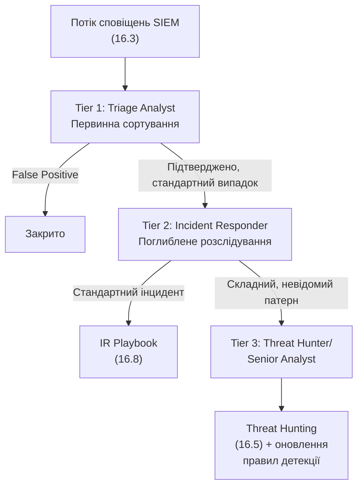

# 16.2. Модель SOC: Tier 1/2/3 та workflow ескалації

## Чому один аналітик не може робити все

SOC обробляє потік сповіщень, що коливається від сотень до десятків тисяч подій на день у великій організації. Якби кожне сповіщення вимагало найглибшої експертизи (аналогічної Threat Hunting, розділ 16.5), система захлинулася б миттєво. Практичне рішення — **ярусна модель (Tiered Model)**, що розподіляє роботу за складністю й глибиною експертизи, аналогічно принципу Tiered Administration з Модуля 14 (розділ 14.11), лише застосованому до аналітичної, а не адміністративної роботи.

## Три яруси аналітиків

- **Tier 1 (Triage Analyst)** — перша лінія: отримує сповіщення від SIEM, проводить первинну сортування (triage) за заздалегідь визначеними процедурами (runbooks). Основне завдання — швидко відрізнити явний False Positive від такого, що потребує подальшого розслідування, і правильно призначити пріоритет. Типово найбільша за чисельністю група, часто точка входу для кар'єри в SOC.
- **Tier 2 (Incident Responder)** — отримує ескальовані від Tier 1 випадки, проводить глибше розслідування: кореляція кількох джерел даних (Sysmon, мережеві журнали, EDR-телеметрія — Модуль 14), визначення обсягу компрометації (scope), безпосередня реалізація кроків IR Playbook (розділ 16.8, Модуль 07).
- **Tier 3 (Threat Hunter / Senior Analyst)** — найдосвідченіші аналітики: обробляють найскладніші, нестандартні випадки, яких немає в жодному runbook; проводять проактивне полювання (розділ 16.5); відповідають за написання й вдосконалення кореляційних правил SIEM (розділ 16.3) на основі нових знахідок — замикаючи цикл покращення детекції для майбутніх Tier 1/2 випадків.

## Критерії ескалації: коли передавати далі

Чіткі, задокументовані критерії ескалації — необхідна умова, щоб ярусна модель не перетворилася на вузьке місце (bottleneck) чи джерело втрачених інцидентів між ярусами:

| Критерій ескалації з Tier 1 в Tier 2 | Приклад |
|---|---|
| Підтверджена шкідлива активність (не False Positive) | Sysmon-подія відповідає відомому LOLBAS-патерну (Модуль 14, розділ 14.12) |
| Зачіпає критичний актив | Подія на сервері з класифікацією Critical (Модуль 13, розділ 13.3) |
| Перевищує визначений SLA для Tier 1 | Аналітик не може закрити випадок за визначений час (типово 15-30 хвилин для первинної тріажу) |

| Критерій ескалації з Tier 2 в Tier 3 | Приклад |
|---|---|
| Патерн не відповідає жодному відомому runbook | Нова, раніше не задокументована техніка атаки |
| Підозра на APT чи цілеспрямовану кампанію | Збіг з активним CERT-UA-звітом про конкретну загрозу (Модуль 07) |
| Потрібне написання нового правила детекції | Виявлена прогалина покриття (coverage gap, Модуль 12, розділ 12.9) |

> **Міні-вправа 16.2.1:** Tier 1-аналітик отримує сповіщення про вхід в систему з незвичної географічної локації. Стандартний runbook каже: «якщо користувач підтверджує, що це він, закрити як False Positive; якщо ні — ескалювати в Tier 2». Аналітик телефонує користувачу, той підтверджує вхід, і аналітик закриває сповіщення. Через тиждень з'ясовується, що обліковий запис користувача був скомпрометований, а «підтвердження» насправді дав зловмисник, що зателефонував із підробленого номера (техніка vishing, Модуль 07). Чи означає це провал ярусної моделі, чи іншу проблему?
>
> 

Відповідь

>
> Це не провал ярусної моделі як такої, а прогалина в конкретному runbook Tier 1: процедура покладалася на телефонне підтвердження без додаткової верифікації особи того, хто відповідає на дзвінок (пряме продовження теми vishing і соціальної інженерії з Модуля 07 — зловмисники можуть підробляти номери чи попередньо скомпрометувати й мобільний зв'язок жертви). Правильний висновок — не відмова від ярусної моделі, а вдосконалення конкретного runbook Tier 1 (наприклад, вимога підтвердження через окремий, заздалегідь верифікований канал, а не просто дзвінок на номер із профілю користувача) — це саме той цикл покращення детекції, який Tier 3 (розділ 16.2) відповідає підтримувати на основі нових знахідок.
> 

## Змінна робота та цілодобове покриття

Кіберзагрози не обмежуються робочими годинами — реальні атаки часто цілеспрямовано плануються на неробочий час чи вихідні саме тому, що очікується менше уваги захисної команди (пряма паралель із моделюванням Red Team, Модуль 12, розділ 12.9, де реалістичність включає й час доби атаки). Організації вирішують питання цілодобового покриття (24/7/365) кількома способами:

- **Follow-the-Sun** — розподілені команди в різних часових поясах, що передають зміну одна одній, забезпечуючи безперервне покриття без нічних змін для жодної окремої команди.
- **Змінний графік (Shift Rotation)** — єдина команда з ротацією нічних/денних змін.
- **Аутсорсинг нічного покриття MSSP** — гібридна модель (розділ 16.9), де власна команда працює в робочий час, а зовнішній постачальник покриває решту.

## Burnout як реальний операційний ризик

SOC, особливо Tier 1, відомий високим рівнем вигорання персоналу через постійний потік сповіщень, значну частку False Positives (спричинену неоптимізованими правилами SIEM, розділ 16.3), і високий психологічний тиск ситуацій реального інциденту. Управлінська відповідь — не лише технічна оптимізація (зниження шуму сповіщень), а й організаційна: ротація завдань, чіткі межі змін, шляхи кар'єрного росту від Tier 1 до Tier 3, що утримують досвідчений персонал у SOC замість плинності кадрів, яка сама по собі підриває якість детекції (втрата накопиченого знання про специфіку конкретної інфраструктури, аналогічно ризику з Модуля 13, розділ 13.7, коли реєстр ризиків втрачає власника через звільнення).

---

**Попередній розділ:** [16.1. SOC як синтез посібника](01-soc-yak-syntez.md)
**Наступний розділ:** [16.3. SIEM: архітектура та практика](03-siem-arkhitektura.md)
**Назад до модуля:** [README модуля 16](README.md)
