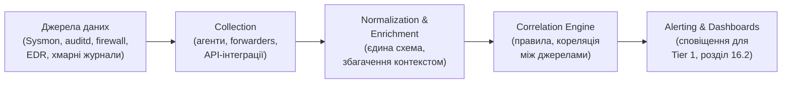

# 16.3. SIEM: архітектура та практика

## Від розрізнених журналів до єдиної картини

Модуль 14 (розділи 14.8-14.9) детально розглянув, як Windows (Event Log, Sysmon) і Linux (journald, auditd) генерують журнали на рівні окремого хоста. Але жоден окремий хост не показує картину атаки, що розгортається через кілька систем одночасно — lateral movement (Модуль 12, розділ 12.8) за визначенням зачіпає кілька машин послідовно. **SIEM (Security Information and Event Management)** — платформа, що агрегує журнали з усіх джерел організації в єдине місце, дозволяючи кореляцію подій між системами, яку жоден окремий журнал показати не може.

## Архітектура SIEM: чотири основні компоненти

1. **Collection (збір)** — агенти на кінцевих точках (часто той самий агент, що постачає EDR-телеметрію, Модуль 14, розділ 14.10), forwarders для мережевих пристроїв, API-інтеграції з хмарними платформами (наприклад, збір CloudTrail-подій, згаданих у контексті хмарної безпеки).
2. **Normalization (нормалізація)** — журнали з різних джерел мають різний формат (Windows Event Log — XML-подібний, Linux syslog — текстовий, хмарні API — JSON); SIEM приводить їх до єдиної внутрішньої схеми (наприклад, Common Event Format чи власна схема платформи), щоб поле «ім'я користувача» чи «IP-адреса джерела» було зіставним незалежно від оригінального джерела.
3. **Enrichment (збагачення)** — додавання контексту до сирих подій: зіставлення IP-адреси з геолокацією чи репутаційною базою (перевірка проти відомих індикаторів компрометації, розділ 16.6), зіставлення користувача з його роллю й підрозділом з каталогу організації (Модуль 05).
4. **Correlation Engine (кореляційний рушій)** — серце SIEM: правила, що виявляють патерни **між** окремими подіями, які кожна сама по собі не є підозрілою.

## Приклад кореляційного правила

Розглянемо конкретний приклад, що ілюструє цінність кореляції понад окремі події:

- **Подія A (сама по собі не підозріла):** невдала спроба входу користувача `admin` о 03:14.
- **Подія B (сама по собі не підозріла):** успішний вхід того самого користувача `admin` о 03:17, з нової, раніше не бачений IP-адреси.
- **Подія C (сама по собі не підозріла):** створення нового облікового запису з правами адміністратора о 03:22 тим самим користувачем.

Кожна подія окремо може бути легітимною (забутий пароль, робота з дому через VPN, планове створення облікового запису). Але **кореляційне правило**, що виявляє послідовність «кілька невдалих спроб + успішний вхід з нової локації + створення привілейованого облікового запису протягом короткого часового вікна (наприклад, 15 хвилин)» — значно сильніший сигнал компрометації, ніж будь-яка з трьох подій окремо. Саме такі багатоступеневі кореляційні правила — основна цінність SIEM понад просте централізоване зберігання журналів.

> **Міні-вправа 16.3.1:** Спираючись на техніки LOLBAS з Модуля 07 і Sysmon-аналіз з Модуля 14 (розділ 14.12), сформулюйте власне кореляційне правило SIEM, що поєднує щонайменше дві окремі, самі по собі не підозрілі події в сильніший сигнал компрометації. Наприклад, розгляньте послідовність «відкриття документа Office» → «породжений дочірній процес PowerShell» → «мережеве з'єднання до зовнішньої IP-адреси, відсутньої в базі репутації».
>
> 

Відповідь

>
> Приклад правильної відповіді: «PowerShell.exe, породжений напряму від winword.exe чи excel.exe (нетипова для нормальної роботи офісного застосунку батьківсько-дочірня пара процесів, Модуль 14, розділ 14.12), протягом 60 секунд встановлює вихідне мережеве з'єднання до IP-адреси поза корпоративним allowlist». Кожна складова окремо неоднозначна (документи Office іноді легітимно запускають макроси; PowerShell використовується щодня; мережеві з'єднання - норма), але **комбінація саме цих трьох елементів у визначеному часовому вікні** - класичний патерн виконання шкідливого макросу з подальшим завантаженням другого етапу payload (типова техніка, розглянута в Модулі 07 щодо фішингу з вкладеннями).
> 

## SIEM Use Cases: систематизація правил

Замість хаотичного накопичення окремих правил, зрілий SOC організовує кореляційні правила за **Use Cases** — конкретними сценаріями загроз, прямо зіставленими з техніками MITRE ATT&CK (Модуль 07), формуючи структуровану карту покриття детекції:

| Use Case | Техніка MITRE ATT&CK | Джерела даних |
|---|---|---|
| Виявлення Kerberoasting | T1558.003 | Windows Event Log 4769 (Kerberos Service Ticket Request) |
| Виявлення масового шифрування файлів (ransomware) | T1486 | EDR-телеметрія файлових операцій (Модуль 14, розділ 14.10) |
| Виявлення lateral movement через WMI | T1047 | Sysmon Event ID 1 (Process Create) на цільовому хості |
| Виявлення ексфільтрації через DNS-тунелювання | T1048.003 | DNS-журнали, аномальна довжина/частота запитів |

Цей підхід прямо продовжує ідею MITRE ATT&CK Navigator gap analysis, введену в Модулі 12 (розділ 12.9): кожен Use Case SIEM — це «закрита клітинка» на карті ATT&CK, а відсутність Use Case для конкретної техніки — видима, вимірювана прогалина покриття, а не невідоме невідоме.

## Проблема шуму: Alert Fatigue

Ключова операційна проблема будь-якого SIEM — баланс між чутливістю правил (виявити якомога більше реальних загроз) і специфічністю (не завалити Tier 1 хибними спрацюваннями). Занадто широке правило (наприклад, «сповіщати про кожен запуск PowerShell») генерує тисячі здебільшого легітимних сповіщень щодня — точний аналог проблеми надлишкового, невибіркового auditd-журналювання з Модуля 14 (розділ 14.9). **Alert Fatigue** — стан, коли аналітики Tier 1, перевантажені хибними спрацюваннями, починають механічно закривати сповіщення без належної уваги, ризикуючи пропустити справжню загрозу серед шуму — та сама небезпека, що й у Модулі 12 (розділ 12.3) щодо хибних спрацювань сканерів вразливостей, тепер у контексті реального часу.

**Практичне рішення:** ітеративне налаштування правил (tuning) на основі зворотного зв'язку від Tier 1/2 (правило генерує забагато False Positives → звузити критерії чи додати контекст збагачення), пріоритизація правил за ризиком (Модуль 13, розділ 13.5-13.6: правила для критичних активів отримують вищий пріоритет розгляду), і поступова автоматизація рутинного тріажу через SOAR (розділ 16.4) для звільнення часу аналітиків на дійсно неоднозначні випадки.

---

**Попередній розділ:** [16.2. Модель SOC: Tier 1/2/3](02-model-soc-tier.md)
**Наступний розділ:** [16.4. SOAR та автоматизація реагування](04-soar-avtomatyzatsiia.md)
**Назад до модуля:** [README модуля 16](README.md)
