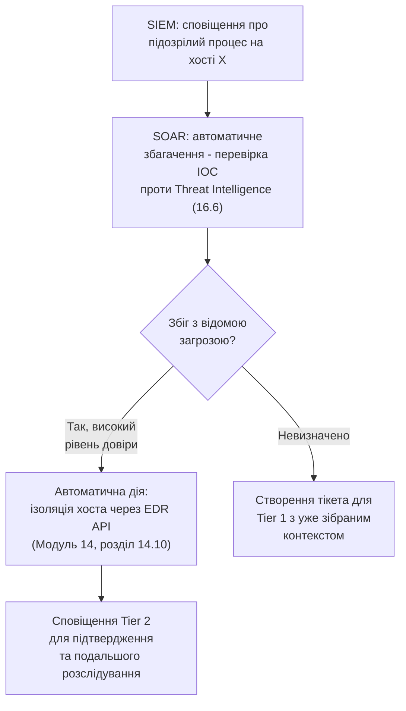

# 16.4. SOAR та автоматизація реагування

## Від виявлення до дії: наступний логічний крок

Розділ 16.3 завершився проблемою Alert Fatigue та обіцянкою часткового вирішення через автоматизацію. **SOAR (Security Orchestration, Automation, and Response)** — клас платформ, що доповнює SIEM саме в цьому вимірі: SIEM відповідає на запитання «що відбувається» (виявлення й кореляція), SOAR — на запитання «що робити далі» (автоматизована чи напівавтоматизована реакція).

## SIEM проти SOAR: не конкуренти, а послідовні етапи

| | SIEM | SOAR |
|---|---|---|
| Основна функція | Агрегація, нормалізація, кореляція журналів | Оркестрація дій у відповідь на виявлене |
| Вихід | Сповіщення (alert) | Виконана дія (заблокований IP, ізольований хост, створений тікет) |
| Аналогія з попередніми модулями | EDR-телеметрія (Модуль 14, розділ 14.10) як джерело сирих даних | IR Playbook (Модуль 07) як формалізований, автоматизований процес |

Типовий сучасний SOC використовує SOAR, **інтегрований** із SIEM: сповіщення від SIEM автоматично запускає SOAR-playbook, що виконує первинні кроки розслідування чи стримування ще до того, як аналітик Tier 1 фізично відкриє тікет.

## Playbook: автоматизований варіант IR Playbook

SOAR-playbook — по суті технічна реалізація логіки IR Playbook з Модуля 07, але виконувана автоматично чи напівавтоматично (з підтвердженням аналітика на критичних кроках), а не вручну людиною крок за кроком:

**Ключовий принцип, застосований і тут:** повністю автоматичні, незворотні дії (наприклад, автоматичне блокування облікового запису керівника компанії) виправдані лише за високого рівня довіри до сигналу; для менш однозначних випадків SOAR готує весь контекст (Human-in-the-Loop), але фінальне рішення про потенційно резонансну дію залишається за людиною — прямий паралель із принципом, що жодна автоматизація (Compliance as Code, Модуль 15, розділ 15.11) не замінює повністю людське судження в неоднозначних ситуаціях.

## Типові категорії автоматизованих дій

- **Збагачення (Enrichment)** — автоматичний запит до Threat Intelligence-платформ (розділ 16.6), баз репутації IP/доменів, внутрішнього CMDB (Configuration Management Database) для контексту про актив — рутинна, безпечна для повної автоматизації дія.
- **Стримування (Containment)** — ізоляція хоста в мережі, тимчасове блокування облікового запису, блокування IP-адреси на файрволі — дії з реальним операційним впливом, зазвичай з підтвердженням аналітика для перших випадків, з можливим переходом на повну автоматизацію для добре перевірених, високодовірених сценаріїв з часом.
- **Комунікація** — автоматичне створення тікета в системі управління інцидентами, сповіщення відповідальних осіб (власника активу з Модуля 13, розділ 13.3, чи власника ризику з розділу 13.7) через заздалегідь визначені канали.
- **Збір доказів (Forensic Collection)** — автоматичний знімок пам'яті чи диска підозрілого хоста для подальшого детального аналізу, перш ніж хост, можливо, буде переналаштований чи перезавантажений.

> **Міні-вправа 16.4.1:** SOAR-платформа налаштована на повністю автоматичну ізоляцію будь-якого хоста, якщо EDR виявляє процес із хешем, що збігається з відомим індикатором компрометації (розділ 16.6) з рівнем довіри 100%. Через технічну помилку в базі Threat Intelligence легітимний внутрішній інструмент компанії помилково отримує позначку «зловмисний» з високим рівнем довіри. Що станеться, і яка практична рекомендація щодо дизайну SOAR-playbooks це ілюструє?
>
> 

Відповідь

>
> SOAR автоматично ізолює хост (чи хости) з легітимним інструментом, спричиняючи операційний збій бізнес-процесу через хибне спрацювання - пряма аналогія з ризиком надто агресивного, невідтестованого hardening-контролю (Модуль 14, README, застереження про тестування в staging) чи автоматичного блокування CI/CD gate через хибне спрацювання сканера (Модуль 12, розділ 12.3). Практична рекомендація: навіть за високого номінального рівня довіри джерела Threat Intelligence, повністю незворотні, потенційно резонансні автоматичні дії (масова ізоляція виробничих хостів) варто супроводжувати додатковим запобіжником - наприклад, обмеженням кількості одночасно ізольованих хостів без підтвердження людини («circuit breaker» - якщо правило намагається ізолювати більше N хостів одночасно, зупинити автоматизацію й ескалювати людині для перевірки на предмет саме такого сценарію хибного спрацювання джерела даних).
> 

## Метрика ефективності SOAR: скорочення часу реагування

Головна вимірювана вигода SOAR — пряме скорочення метрик, розглянутих детальніше в розділі 16.7 (MTTD, MTTR): рутинні кроки збагачення й первинного стримування, що вручну займали б хвилини чи навіть години очікування доступності аналітика, виконуються SOAR за секунди, одразу після спрацювання SIEM-правила. Це не заміняє людську експертизу (розділ 16.2, Tier 2/3 все ще потрібні для складних випадків), а звільняє час аналітиків від рутинних, повторюваних дій на користь справді неоднозначних, таких, що вимагають людського судження.

---

**Попередній розділ:** [16.3. SIEM: архітектура та практика](03-siem-arkhitektura.md)
**Наступний розділ:** [16.5. Threat Hunting: методологія](05-threat-hunting.md)
**Назад до модуля:** [README модуля 16](README.md)
