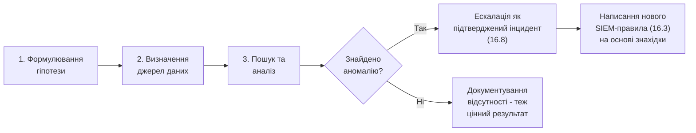

# 16.5. Threat Hunting: методологія

## Проактивний вимір, обіцяний у розділі 16.1

Розділи 16.2-16.4 описали здебільшого реактивний цикл: SIEM виявляє → аналітик (чи SOAR) реагує. **Threat Hunting** перевертає цю логіку: замість очікування сповіщення, досвідчений аналітик (типово Tier 3, розділ 16.2) активно шукає ознаки компрометації, **припускаючи, що зловмисник, можливо, вже перебуває в мережі й обходить існуючі правила детекції**. Це прямий концептуальний паралель із Red Team (Модуль 12, розділ 12.9): обидві практики виходять за межі того, що вже відомо й покрито автоматичними контролями.

## Чому Threat Hunting необхідний навіть за досконалого SIEM

Жодне SIEM-покриття не є вичерпним з двох фундаментальних причин:

1. **Правила детекції покривають лише відомі патерни.** SIEM Use Cases (розділ 16.3) будуються на основі вже задокументованих технік MITRE ATT&CK. Нова, ще не задокументована техніка (чи достатньо витончена варіація відомої, що обходить конкретне правило) технічно не спрацює жодного сповіщення — не тому, що атаки немає, а тому, що детектор для неї ще не написаний.
2. **Просунуті зловмисники активно тестують детекцію.** APT-групи (Модуль 07) часто мають ресурси для тестування власних інструментів проти популярних EDR/SIEM-рішень перед розгортанням у реальній атаці, цілеспрямовано уникаючи відомих сигнатур виявлення.

Threat Hunting заповнює саме цю прогалину: замість запитання «чи спрацювало правило», ставить запитання «якби я був зловмисником, як би я діяв, щоб залишитися непоміченим — і чи бачу я ознаки саме такої поведінки в даних, навіть без спрацювання жодного правила».

## Hypothesis-Driven Hunting: структурований підхід

Ефективне полювання не є безцільним переглядом журналів «навмання» — це структурований процес, що починається з конкретної, перевірюваної гіпотези:

**Джерела для формулювання гіпотез:**

- **MITRE ATT&CK-орієнтовані** — «Чи бачимо ми ознаки техніки T1055 (Process Injection) на критичних серверах, для якої в нас поки немає покриття SIEM (виявлена прогалина через Navigator gap analysis, Модуль 12, розділ 12.9)?»
- **Threat Intelligence-орієнтовані** — «CERT-UA щойно опублікував звіт про нову кампанію конкретної APT-групи з описом характерних TTP (розділ 16.6) — чи є в нашій мережі ознаки саме цих TTP, навіть якщо конкретні IOC з їхнього звіту в нас не спрацювали?»
- **Аномалія-орієнтовані** — «Чи є облікові записи сервісів, що автентифікуються з незвичних для їхньої нормальної поведінки хостів чи в незвичний час?»

> **Міні-вправа 16.5.1:** Сформулюйте власну гіпотезу для Threat Hunting-сесії, спираючись на техніку BYOVD (Bring Your Own Vulnerable Driver), уже згадану в Модулі 14 (розділ 14.4) у контексті обходу LSA Protection. Які джерела даних (з Модуля 14, розділи 14.8-14.10) знадобляться для перевірки цієї гіпотези?
>
> 

Відповідь

>
> Приклад гіпотези: «Чи завантажувалися на критичних Windows-хостах підписані, але відомо вразливі драйвери ядра (за списком CVE, пов'язаних із конкретними BYOVD-техніками), особливо якщо завантаження відбулося поза стандартним циклом оновлення драйверів (Модуль 12, розділ 12.5, Patch Management)?» Джерела даних: Sysmon Event ID 6 (Driver Loaded, Модуль 14, розділ 14.8) для списку всіх завантажених драйверів з хешами; зіставлення хешів проти бази відомих вразливих драйверів (аналог перевірки IOC, розділ 16.6); кореляція часу завантаження драйвера з іншою підозрілою активністю на тому самому хості в тому самому часовому вікні (техніка кореляції з розділу 16.3, застосована вручну аналітиком, а не автоматичним правилом).
> 

## Індикатори: IOC проти IOA

Розрізнення, важливе для практики полювання:

- **IOC (Indicator of Compromise)** — статичний артефакт конкретного інциденту: хеш файлу, IP-адреса командного сервера, ім'я домену. Легко перевіряється автоматично, але й легко змінюється зловмисником між кампаніями (новий хеш при перекомпіляції того самого малваре).
- **IOA (Indicator of Attack)** — поведінковий патерн, незалежний від конкретного артефакту: «процес, породжений офісним документом, встановлює мережеве з'єднання протягом секунд після відкриття файлу» (приклад із розділу 16.3.1). IOA стійкіші до зміни інструментів зловмисником, оскільки описують **поведінку**, а не конкретний технічний слід, який легко замінити.

Threat Hunting, зорієнтований переважно на IOA (поведінка), значно ефективніший за полювання, обмежене лише перевіркою відомих IOC — цю ж ідею формалізує Pyramid of Pain, детально розглянутий у наступному розділі (16.6).

## Результат полювання: не лише знайдений інцидент

Ключовий методологічний момент, часто недооцінений: **навіть якщо гіпотеза не підтвердилася** (аномалії не знайдено), результат полювання цінний — він документує, що конкретна ділянка інфраструктури була цілеспрямовано перевірена на конкретний патерн і виявилася чистою, підвищуючи впевненість у загальному стані захисту так само, як пентест з негативним результатом (Модуль 12, розділ 12.7) все ж дає корисну інформацію, а не є «марно витраченим часом». Кожна сесія полювання, незалежно від результату, найкраще завершується або підтвердженим інцидентом (розділ 16.8), або новим/покращеним SIEM-правилом (розділ 16.3), що автоматизує перевірку саме цієї гіпотези для майбутніх, регулярних циклів — Threat Hunting поступово «підживлює» автоматизовану детекцію новими прогалинами покриття, що закриваються.

---

**Попередній розділ:** [16.4. SOAR та автоматизація реагування](04-soar-avtomatyzatsiia.md)
**Наступний розділ:** [16.6. Cyber Threat Intelligence](06-cyber-threat-intelligence.md)
**Назад до модуля:** [README модуля 16](README.md)
