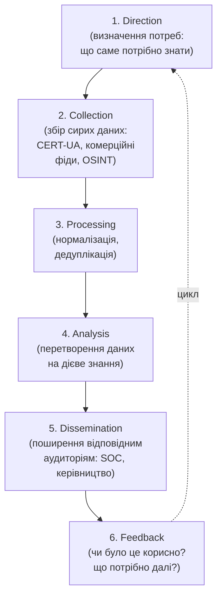

# 16.6. Cyber Threat Intelligence

## Звідки беруться гіпотези й індикатори

Розділи 16.3-16.5 неодноразово посилалися на «Threat Intelligence» як джерело контексту для збагачення SIEM, автоматизації SOAR і формулювання гіпотез Threat Hunting. Цей розділ розкриває **Cyber Threat Intelligence (CTI)** як окрему дисципліну — систематичний процес збору, обробки й аналізу інформації про загрози, що перетворює сирі дані про атаки на дієве знання (actionable intelligence) для SOC.

## Три рівні Threat Intelligence

CTI традиційно розділяють за аудиторією й горизонтом застосування:

- **Strategic (Стратегічний)** — високорівневий аналіз для керівництва: тренди атак у галузі, геополітичний контекст (наприклад, аналіз того, чому певні сектори української економіки становлять пріоритетну ціль для конкретних APT-груп, пов'язаних з війною) — прямо пов'язаний з GRC-звітністю керівництву (Модуль 15).
- **Operational (Операційний)** — інформація про конкретні кампанії й наміри конкретних груп зловмисників: які TTP використовує конкретна APT-група зараз, які галузі вона атакує — вхідні дані для Threat Hunting-гіпотез (розділ 16.5).
- **Tactical (Тактичний)** — конкретні технічні індикатори (IOC): хеші файлів, IP-адреси, домени — вхідні дані для автоматизованого збагачення SIEM/SOAR (розділи 16.3-16.4).

## Цикл CTI (Intelligence Cycle)



Цей цикл структурно ідентичний PDCA (Модуль 13, розділ 13.11; Модуль 15, розділ 15.2) — черговий приклад того, як один і той самий принцип безперервного вдосконалення проявляється в різних контекстах цього посібника. **Direction** визначає, що саме команда SOC потребує знати (наприклад, «які загрози найбільш релевантні для фінансового сектору в Україні зараз» — прямий запит до джерел на кшталт CERT-UA), а **Feedback** гарантує, що цикл не застигає на одноразовому зборі, а адаптується до змінних потреб.

## Джерела CTI

- **CERT-UA** — уже добре знайомий читачам цього посібника (Модулі 07, 12, 15) національний координаційний центр, що публікує звіти з конкретними TTP і IOC активних кампаній проти української інфраструктури.
- **Комерційні фіди Threat Intelligence** — платні підписки на бази індикаторів і аналітичні звіти від спеціалізованих постачальників.
- **Галузеві ISAC (Information Sharing and Analysis Centers)** — обмін інформацією про загрози між організаціями однієї галузі (згадувалося в Модулі 13, розділ 13.4, як джерело даних про загрози для оцінки ризику).
- **OSINT** — публічно доступні джерела: дослідницькі блоги вендорів безпеки, публікації на конференціях, аналіз зловмисного ПЗ дослідницькою спільнотою.
- **Внутрішня телеметрія** — власна історія інцидентів організації (Модуль 13, розділ 13.4) — найрелевантніше, хоч і найвужче джерело: що вже реально атакувало саме цю організацію.

## STIX/TAXII: стандартизований обмін

Щоб CTI-дані від різних джерел (CERT-UA, комерційні фіди, внутрішні знахідки) можна було автоматично обробляти й обмінюватися ними між організаціями, індустрія використовує стандартизовані формати:

- **STIX (Structured Threat Information Expression)** — стандартизована мова опису об'єктів кіберзагроз (індикатори, TTP, кампанії, зловмисні actor-и) у структурованому, машинозчитуваному форматі (JSON), що дозволяє автоматично імпортувати CTI-дані напряму в SIEM чи SOAR без ручного перепечатування з PDF-звіту.
- **TAXII (Trusted Automated Exchange of Intelligence Information)** — протокол транспортування STIX-об'єктів між системами (API для запиту й отримання оновлених індикаторів), аналогічно тому, як HTTP транспортує HTML — TAXII транспортує STIX.

**Практичний ефект стандартизації:** SOC-платформа може автоматично підписатися на TAXII-фід CERT-UA (чи комерційного постачальника) і отримувати нові STIX-індикатори в реальному часі, автоматично збагачуючи SIEM (розділ 16.3) без ручного введення кожного нового IOC аналітиком — той самий принцип автоматизації, що й Compliance as Code (Модуль 15, розділ 15.11), застосований до Threat Intelligence.

## Pyramid of Pain: чому не всі індикатори однаково цінні

**Pyramid of Pain** (концепція Девіда Бьянко) ранжує типи індикаторів за тим, наскільки складно зловміснику їх змінити у відповідь на виявлення — і, відповідно, наскільки цінне виявлення саме цього типу індикатора для довгострокового захисту:

```
        /\
       /TTP\          <- Найвищий рівень болю для зловмисника:
      /------\            зміна поведінки вимагає повністю
     /Tools   \           нових інструментів/методів
    /----------\
   /Network/Host \    <- Артефакти діяльності
  / Artifacts     \
 /------------------\
/ Domain Names       \  <- Змінити легко, але з певними
----------------------    затримками/витратами
  IP Addresses          <- Змінити відносно легко
----------------------
  Hash Values           <- Найнижчий рівень болю:
                            перекомпіляція міняє хеш миттєво
```

- **Hash Values (хеші файлів)** — найлегше змінити (одна перекомпіляція малваре генерує зовсім новий хеш); виявлення на основі лише хешів дає зловміснику тривіальний спосіб обійти детекцію.
- **IP-адреси, доменні імена** — трохи складніше змінити (потребує нової інфраструктури), але й це відносно швидко й дешево для зловмисника.
- **Артефакти мережі/хоста** — специфічні патерни в трафіку чи файловій системі, складніше змінити без модифікації самих інструментів.
- **Інструменти (Tools)** — виявлення на основі характеристик самого інструменту атаки (не просто його хешу, а поведінкових ознак) змушує зловмисника розробляти чи купувати нові інструменти.
- **TTP (Tactics, Techniques, Procedures)** — найвищий рівень: виявлення на основі фундаментальної поведінки атаки (техніки MITRE ATT&CK, Модуль 07) змушує зловмисника змінювати саму методологію атаки — найдорожча, найповільніша зміна для нього.

**Прямий практичний висновок для розділів 16.3-16.5:** SIEM-правила (16.3) і Threat Hunting-гіпотези (16.5), орієнтовані на верхівку піраміди (TTP, IOA замість IOC — концепція вже введена в розділі 16.5), значно стійкіші й довговічніші, ніж правила, що покладаються виключно на легко змінювані хеші чи IP-адреси. Це той самий принцип, що вже показав розділ 16.5: IOA цінніші за IOC саме тому, що займають вищий щабель Pyramid of Pain.

> **Міні-вправа 16.6.1:** SOC-команда витрачає весь бюджет часу на щоденне оновлення списку заблокованих хешів файлів з комерційного фіда Threat Intelligence, ігноруючи розробку поведінкових SIEM-правил на основі MITRE ATT&CK. Через Pyramid of Pain поясніть, чому ця стратегія малоефективна проти цілеспрямованого, а не масового, автоматизованого зловмисника.
>
> <details><summary>Відповідь</summary>
>
> Хеші файлів - найнижчий рівень Pyramid of Pain: цілеспрямований зловмисник (на відміну від масової, неперсоналізованої кампанії) тривіально змінює хеш через найменшу модифікацію коду чи повторну компіляцію, миттєво роблячи весь список заблокованих хешів застарілим для конкретної атаки проти цієї організації. Стратегія, зосереджена виключно на хешах, ефективна лише проти масових, неадаптивних загроз, які саме через свою масовість рідко цілеспрямовано модифікують кожен зразок під конкретну ціль. Проти цілеспрямованого зловмисника значно ефективніша інвестиція - у виявлення на рівні TTP/IOA (верхівка піраміди), що вимагає від зловмисника змінювати саму методологію атаки, а не просто один технічний артефакт - це й обґрунтовує пріоритет поведінкових SIEM-правил (розділ 16.3) і Threat Hunting, орієнтованого на TTP (розділ 16.5), над простим підтримуванням списків індикаторів.
> </details>

---

**Попередній розділ:** [16.5. Threat Hunting: методологія](05-threat-hunting.md)
**Наступний розділ:** [16.7. Метрики та зрілість SOC](07-metryky-ta-zrilist-soc.md)
**Назад до модуля:** [README модуля 16](README.md)
