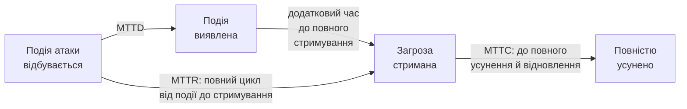

# 16.7. Метрики та зрілість SOC

## Від «ми відчуваємо, що працюємо добре» до вимірюваного доказу

Модуль 15 (розділ 15.9) показав, чому Click Rate сам по собі — неповна метрика без Report Rate. Той самий принцип застосовується до вимірювання ефективності SOC: без чітких, послідовно вимірюваних метрик неможливо об'єктивно відповісти на запитання «чи справді наш SOC ефективний», відрізнити реальне покращення від випадкового везіння (аналогічно проблемі, розглянутій у Модулі 13, розділ 13.11, щодо тренду кількості ризиків).

## Ключові часові метрики: MTTD, MTTR, MTTC

Три пов'язані, але концептуально різні метрики часу, що разом описують швидкість усього циклу реагування:

- **MTTD (Mean Time to Detect)** — середній час від моменту, коли атака фактично відбулася, до моменту, коли SOC її виявив (сповіщення SIEM спрацювало й було помічене, чи Threat Hunting знайшов аномалію). Прямо залежить від якості SIEM-покриття (розділ 16.3) і активності Threat Hunting (розділ 16.5).
- **MTTR (Mean Time to Respond/Remediate)** — середній час від виявлення до повного стримування чи усунення загрози. Термін використовується неоднозначно в галузі — важливо чітко визначити для конкретної організації, чи рахується MTTR до **первинного стримування** (наприклад, ізоляція хоста) чи до **повного усунення** кореневої причини.
- **MTTC (Mean Time to Contain)** — середній час саме до стримування (зупинки подальшого поширення), окрема, вужча метрика, яку деякі організації відстежують окремо від повного MTTR для точнішого вимірювання швидкості first response.

**Чому обидві половини (MTTD і MTTR) мають значення окремо:** організація з відмінним MTTD (виявляє атаки за хвилини), але жахливим MTTR (тижні на реагування через відсутність чітких Playbooks, розділ 16.4, чи брак персоналу Tier 2, розділ 16.2) все ще зазнає суттєвої шкоди — раннє виявлення без швидкого реагування має обмежену цінність. І навпаки, чудовий MTTR марний, якщо MTTD настільки повільний, що атака завершилася (наприклад, дані вже ексфільтровані) задовго до виявлення.

> **Міні-вправа 16.7.1:** Дві організації мають однаковий сумарний час «від атаки до повного усунення» (умовний MTTR у широкому сенсі) — 48 годин. Організація A: MTTD = 47 годин, стримування зайняло 1 годину після виявлення. Організація B: MTTD = 1 година, стримування зайняло 47 годин після виявлення. Чи однаково небезпечний цей однаковий сумарний час для обох організацій?
>
> 

Відповідь

>
> Ні, суттєво різний профіль ризику попри однаковий сумарний час. Організація A з MTTD = 47 годин означає, що зловмисник мав майже два повних дні непоміченого доступу до систем - достатньо часу для значного lateral movement (Модуль 12, розділ 12.8), ексфільтрації даних, розгортання додаткових backdoor-ів; коротке стримування після виявлення (1 година) не компенсує вже завданої шкоди за час до виявлення. Організація B, навпаки, виявила атаку майже одразу (MTTD = 1 година), що суттєво обмежує можливості зловмисника до моменту виявлення - хоча повільне стримування (47 годин) також проблематичне (можливість подальшого поширення вже виявленої загрози), початкова шкода, ймовірно, менша. Це прямо ілюструє, чому агрегований показник без розбиття на MTTD і MTTR окремо приховує суттєво різні операційні профілі ризику - той самий принцип, що вже показав розділ 13.11 Модуля 13 щодо оманливості агрегованих метрик без деталізації.
> 

## Метрики якості детекції

Окрім часу, важлива якість самого процесу виявлення:

| Метрика | Що показує |
|---|---|
| False Positive Rate | Частка сповіщень, що виявилися нешкідливими; висока частка веде до Alert Fatigue (розділ 16.3) |
| True Positive Rate (Detection Rate) | Частка реальних загроз, що були виявлені (складно виміряти напряму - оцінюється через BAS, Модуль 12, розділ 12.9, чи Red Team-вправи) |
| Coverage (MITRE ATT&CK) | Частка технік ATT&CK, для яких існує хоча б одне SIEM-правило (Модуль 12, розділ 12.9, gap analysis) |
| % інцидентів, виявлених проактивно (Threat Hunting) проти реактивно (SIEM alert) | Показує зрілість проактивного компонента SOC (розділ 16.5) |

## Модель зрілості SOC (SOC-CMM-подібний підхід)

За аналогією з NIST CSF Tiers (Модуль 15, розділ 15.5), зрілість SOC часто оцінюється за рівнями, що охоплюють усі три стовпи з розділу 16.1 (люди, процеси, технологія):

| Рівень | Характеристика |
|---|---|
| Initial (Початковий) | Реактивний, ad-hoc SOC без формалізованих процесів; MTTD/MTTR не вимірюються систематично |
| Managed (Керований) | Задокументовані Playbooks, базовий набір SIEM Use Cases, метрики відстежуються, але без систематичного аналізу трендів |
| Defined (Визначений) | Ярусна модель повністю впроваджена (розділ 16.2), SOAR інтегрований (розділ 16.4), регулярний Threat Hunting (розділ 16.5) |
| Quantitatively Managed (Кількісно керований) | Метрики використовуються для проактивного прийняття рішень (де інвестувати наступний бюджет), покриття MITRE ATT&CK систематично відстежується й закривається |
| Optimizing (Оптимізуючий) | Безперервне вдосконалення на основі даних, інтеграція передової CTI (розділ 16.6), проактивне випередження нових технік атак |

## Звітність для керівництва: зв'язок з Модулем 15

Метрики SOC — не лише внутрішній операційний інструмент, а прямий вхід у GRC-звітність (Модуль 15, розділ 15.1): рада директорів, що запитує «наскільки ми в безпеці», отримує змістовну відповідь саме через тренд MTTD/MTTR за квартал, покриття MITRE ATT&CK, і кількість підтверджених інцидентів проти хибних спрацювань — конкретні, вимірювані дані замість суб'єктивного відчуття «команда безпеки виглядає зайнятою».

---

**Попередній розділ:** [16.6. Cyber Threat Intelligence](06-cyber-threat-intelligence.md)
**Наступний розділ:** [16.8. Incident Response всередині SOC](08-incident-response-v-soc.md)
**Назад до модуля:** [README модуля 16](README.md)
